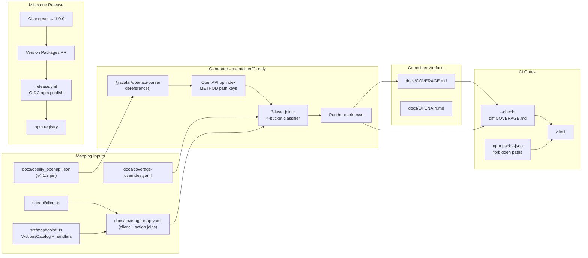

# Phase 23: OpenAPI Coverage & npm Release - Research

**Researched:** 2026-07-27
**Domain:** OpenAPI coverage mapping, committed gap reports, Changesets milestone release, npm OIDC trusted publishing, tarball allowlist verification
**Confidence:** HIGH

## Summary

Phase 23 closes v3.1 with two maintainer-facing capabilities: (1) a **three-layer coverage map** from Coolify OpenAPI operations → `src/api/client.ts` functions → MCP `tool.action` rows, materialized as committed `docs/COVERAGE.md` with CI drift enforcement; and (2) **milestone npm release** of `awesome-coolify-mcp@1.0.0` through the existing Changesets → Version Packages → `release.yml` OIDC path, plus CI verification that `npm pack --dry-run` excludes harness/planning/secrets paths.

The codebase already contains the heavy prerequisites: pinned OpenAPI artifacts (`docs/coolify_openapi.json` / `.yaml`, 136 operations, 419 internal `$ref`s), a centralized REST client (`src/api/client.ts`, ~69 path literals / 50 unique paths), 18 MCP tools with exported `*ActionsCatalog` constants (~115 actions), a working `release.yml` with `id-token: write`, and `scripts/changeset-emit-new-tag.mjs` + `tests/release-publish-gate.test.ts` for publish idempotency. Phase 23 adds the **generator**, **override merge**, **drift check**, **pack allowlist test**, **provenance doc** (`docs/OPENAPI.md`), and the **v3.1 Changeset** bump to `1.0.0`.

**Primary recommendation:** Ship `scripts/openapi-coverage.mjs` (dev-only) using `@scalar/openapi-parser` for dereferenced OpenAPI enumeration, a maintainable `docs/coverage-map.yaml` (or split client/action YAMLs) as the human-edited join layer, `docs/coverage-overrides.yaml` for deferred/out-of-scope OpenAPI keys, Vitest tests for generator + `npm pack --json` forbidden-path assertions, and a milestone Changeset — do **not** add a new publish workflow or implement gap-closing MCP tools in this phase.

## Architectural Responsibility Map

| Capability | Primary Tier | Secondary Tier | Rationale |
|------------|-------------|----------------|-----------|
| OpenAPI spec load + `$ref` resolve | Build / CI script (Node) | — | Maintainer/CI tooling; not runtime MCP |
| Three-layer coverage join + classification | Build / CI script | Maintainer-edited YAML maps | Generator reads code + specs; humans own overrides |
| Committed `docs/COVERAGE.md` | CDN / Static (git docs) | CI drift gate | Published as repo artifact; not npm tarball |
| `docs/coverage-overrides.yaml` | CDN / Static (git) | Generator | Versioned intentional deferrals |
| `docs/OPENAPI.md` provenance | CDN / Static (git) | — | Maintainer refresh instructions |
| Coverage drift CI check | CI (GitHub Actions) | `pnpm test` / dedicated script `--check` | Blocks stale report on mapping-input changes |
| Tarball allowlist verification | CI (`pnpm test`) | `npm pack --dry-run --json` | Proves consumer package surface |
| npm publish `1.0.0` | CI (`release.yml`) | npm registry (trusted publisher) | OIDC publish on Version Packages merge only |
| Gap-closing MCP implementations | — (out of phase) | Future phases | Report only; no new tools here |

<user_constraints>
## User Constraints (from CONTEXT.md)

### Coverage Mapping (OAPI-01)
- **D-01:** Coverage tooling maps **three layers**: OpenAPI `path` + HTTP method → `src/api/client.ts` function(s) → MCP tool action (e.g. `application.deploy`). Each row in the report represents one MCP action. — **Reversibility:** costly — report shape and generator logic depend on this schema.
- **D-02:** Multi-action tools (e.g. `application`, `service`, `database`) emit **one row per action**, not one row per tool. Action names align with flat-schema / `actionsCatalog` literals from Phase 19.

### Gap Report (OAPI-02)
- **D-03:** Primary artifact is **committed** `docs/COVERAGE.md`, regenerated by a maintainer/CI script. Not CI-only.
- **D-04:** Gap classification uses **four buckets**: `covered` | `deferred` | `out-of-scope` | `gap`. `gap` = real missing work; `deferred` / `out-of-scope` are intentional and must not fail CI as uncovered.
- **D-05:** Maintainer-maintained override file **`docs/coverage-overrides.yaml`** (or equivalent) lists OpenAPI operations (or stable keys) tagged `deferred` or `out-of-scope` with a short `reason`. Generator merges overrides into the report; versioned in git. Seed with known deferrals (e.g. SVC-04 service/DB runtime logs, `execute_command` absent per Spike 001).
- **D-06:** CI **blocks** PRs when `docs/COVERAGE.md` is stale relative to the generator output (same pattern as format/lint drift). Applies on feature PRs that touch mapping inputs (OpenAPI spec, client, tools, overrides).

### OpenAPI Spec & Provenance
- **D-07:** Commit **both** `docs/coolify_openapi.json` and `docs/coolify_openapi.yaml` as tracked artifacts (user preference over YAML-only).
- **D-08:** Pin spec to Coolify tag **`v4.1.2`** (matches live UAT / README “4.1.x” target). Document provenance in **`docs/OPENAPI.md`**: upstream URL, tag, fetch date, and how to refresh.
- **D-09:** Do not float on `v4.x` or `next` without an explicit phase decision to re-pin.

### npm Release (PUB-01)
- **D-10:** v3.1 milestone ships **`1.0.0`** (bump from current `0.5.0`). — **Reversibility:** one-way — published semver on npm.
- **D-11:** Release trigger follows existing **milestone model**: dedicated chore PR with Changeset(s) → merge **Version Packages** PR → `.github/workflows/release.yml` publishes via OIDC. No new `workflow_dispatch` publish workflow.
- **D-12:** Do not change the OIDC / `changeset:emit-tag` / `release.yml` contract unless a blocker is found; phase verifies trusted publishing works for `1.0.0`.

### Tarball Allowlist (PUB-02)
- **D-13:** CI verifies publish surface with **`npm pack --dry-run`** (or equivalent) plus assertions that forbidden paths are absent: `scripts/` (incl. UAT harness), `tests/`, `.planning/`, `.github/`, skills source trees, OpenAPI specs, and other non-`files` paths. Allowed tarball contents remain `package.json` `files`: `dist`, `.env.example`, `LICENSE`.
- **D-14:** `publint` alone is insufficient; pack dry-run is the gate (user chose 9a over publint-only).

### Claude's Discretion
- Exact script path/name (e.g. `scripts/openapi-coverage.mjs`) and npm script alias.
- Parser library (`@scalar/openapi-parser` per STACK vs existing `yaml` dep) as long as `$ref` resolution is robust.
- `docs/coverage-overrides.yaml` schema (flat list vs nested by tag/path).
- How layer-2 (`client.ts`) mapping is discovered (static registry vs grep/heuristic) — must be maintainable and tested.
- Whether `docs/COVERAGE.md` includes summary counts only or full tables (both acceptable if OAPI-02 met).
- Exact CI job name and which path filters trigger COVERAGE drift check.

### Deferred Ideas (OUT OF SCOPE)
- Implementing MCP tools to close every `gap` row — separate future phases/backlog.
- Auto-sync OpenAPI from Coolify `main` on schedule — manual re-pin + provenance update only.
- Per-phase npm publishes — remains milestone-scoped per CONTRIBUTING.
</user_constraints>

<phase_requirements>
## Phase Requirements

| ID | Description | Research Support |
|----|-------------|------------------|
| OAPI-01 | Maintainer can run coverage tooling that maps Coolify OpenAPI paths/ops to MCP/client surface | Three-layer generator: `@scalar/openapi-parser` dereference on committed JSON; client path registry; `*ActionsCatalog` + action→client YAML; `pnpm run openapi:coverage` script |
| OAPI-02 | Coverage tooling produces a gap report (committed artifact and/or CI output) | Committed `docs/COVERAGE.md` + `docs/coverage-overrides.yaml`; `--check` drift mode; path-filtered CI step on mapping inputs |
| PUB-01 | Maintainer-triggered Release workflow publishes `awesome-coolify-mcp` to npm (OIDC / trusted publishing) | Existing `release.yml` + Changesets; milestone Changeset to `1.0.0`; verify `id-token: write` + trusted publisher config for workflow filename `release.yml` |
| PUB-02 | Published tarball excludes UAT harness, secrets, and non-package paths (allowlist verified) | Vitest on `npm pack --dry-run --json`; forbidden-prefix assertions; complement existing `publint` CI step |
</phase_requirements>

## Standard Stack

### Core

| Library | Version | Purpose | Why Standard |
|---------|---------|---------|--------------|
| `@scalar/openapi-parser` | `0.28.10` [VERIFIED: npm registry] | Parse + `dereference()` OpenAPI 3.1 with 419 `$ref`s | Official Scalar parser; Context7 `/scalar/scalar` documents `dereference()` [CITED: github.com/scalar/scalar/packages/openapi-parser] |
| `@scalar/openapi-types` | `0.9.3` [VERIFIED: npm registry] | Typed `OpenAPI.Document` for generator | Peer types for parser [CITED: github.com/scalar/scalar] |
| `yaml` | `2.9.0` (installed) | Optional YAML ingest for refresh script | Already in `package.json`; use only for fetch/convert, not `$ref` resolution |
| `@changesets/cli` | `^2.31.1` (installed) | Milestone version bump + changelog | Existing release model [CITED: CONTRIBUTING.md § Milestone npm release] |
| Vitest | `^4.1.10` (installed) | Generator + pack allowlist tests | 1094 tests green; co-located pattern |

### Supporting

| Library | Version | Purpose | When to Use |
|---------|---------|---------|-------------|
| `publint` | `^0.3.0` (installed) | Package.json hygiene | Keep in CI; supplementary to pack gate per D-14 |
| Node `child_process` | built-in | Run `npm pack --dry-run --json` | Tarball file list in tests |

### Alternatives Considered

| Instead of | Could Use | Tradeoff |
|------------|-----------|----------|
| `@scalar/openapi-parser` | `yaml` parse only | **Reject** — 419 `$ref`s; hand-rolling dereference is fragile (STACK.md Pitfall) |
| `@scalar/openapi-parser` | `@apidevtools/swagger-parser` | Heavier CommonJS; Scalar already recommended in STACK.md |
| Explicit `coverage-map.yaml` | Full AST extraction from handlers | AST/heuristic breaks on orchestration (setup/recipe); YAML + tests is maintainable |
| New `workflow_dispatch` publish | Existing `release.yml` | CONTEXT D-11/D-12 forbid unless blocker |

**Installation (devDependencies):**

```bash
pnpm add -D @scalar/openapi-parser @scalar/openapi-types
```

**Version verification (2026-07-27):**

```bash
npm view @scalar/openapi-parser version   # 0.28.10
npm view @scalar/openapi-types version    # 0.9.3
npm view yaml version                     # 2.9.0
```

## Package Legitimacy Audit

| Package | Registry | Age | Downloads | Source Repo | Verdict | Disposition |
|---------|----------|-----|-----------|-------------|---------|-------------|
| `@scalar/openapi-parser` | npm | ~11 days (published 2026-07-16) | ~1.9M/wk | github.com/scalar/scalar | SUS | Flagged — planner adds `checkpoint:human-verify` before install; official Scalar monorepo, high downloads |
| `@scalar/openapi-types` | npm | ~11 days | ~4.1M/wk | github.com/scalar/scalar | SUS | Flagged — same; install alongside parser |
| `yaml` | npm | stable | ~180M/wk | github.com/eemeli/yaml | OK | Approved — already installed |

**Packages removed due to [SLOP] verdict:** none

**Packages flagged as suspicious [SUS]:** `@scalar/openapi-parser`, `@scalar/openapi-types` — seam flagged `too-new` despite official repo; human-verify before merge.

**Postinstall check:** both Scalar packages report `postinstall: null` (no risky scripts).

## Architecture Patterns

### System Architecture Diagram



### Recommended Project Structure

```
scripts/
├── openapi-coverage.mjs          # CLI: generate | --check
└── lib/
    ├── openapi-coverage-parse.mjs    # dereference + op index
    ├── openapi-coverage-join.mjs       # 3-layer join + buckets
    └── openapi-coverage-render.mjs     # COVERAGE.md template

docs/
├── coolify_openapi.json          # pinned v4.1.2 (D-07/D-08)
├── coolify_openapi.yaml
├── OPENAPI.md                    # provenance + refresh (D-08)
├── COVERAGE.md                   # generated report (D-03)
├── coverage-overrides.yaml       # deferred | out-of-scope (D-05)
└── coverage-map.yaml             # client fn + tool.action → openapi keys (discretion)

tests/
├── openapi-coverage.test.ts      # generator unit + snapshot/drift helpers
└── npm-pack-allowlist.test.ts    # PUB-02 forbidden paths

.github/workflows/
├── ci.yml                        # add coverage --check step (path-filtered)
└── release.yml                   # verify only; no change unless blocker (D-12)
```

### Pattern 1: OpenAPI operation index with dereference

**What:** Load committed JSON, dereference internal `$ref`s, enumerate stable keys `METHOD /path` (normalize Express-style `{uuid}` params).

**When to use:** Every generator run; single-file spec (no external URL refs in committed artifact).

**Example:**

```javascript
// Source: https://github.com/scalar/scalar/blob/main/packages/openapi-parser/README.md
import { readFileSync } from 'node:fs';
import { dereference } from '@scalar/openapi-parser';

const raw = readFileSync('docs/coolify_openapi.json', 'utf8');
const { schema, errors } = await dereference(raw);
if (errors?.length) throw new Error(`OpenAPI dereference failed: ${errors.length} errors`);

const operations = [];
for (const [path, item] of Object.entries(schema.paths ?? {})) {
  for (const method of ['get', 'post', 'put', 'patch', 'delete']) {
    if (item[method]) {
      operations.push({
        key: `${method.toUpperCase()} ${path}`,
        operationId: item[method].operationId,
        tags: item[method].tags?.[0],
      });
    }
  }
}
// Measured: 136 operations in current committed spec
```

### Pattern 2: MCP-action-centric report rows (D-01/D-02)

**What:** Primary row key = `tool.action` (e.g. `service.deploy`). Column cells list linked `client.ts` exports and OpenAPI keys. One row per `*ActionsCatalog` action (~115 total across 18 tools).

**When to use:** Always — matches Phase 19 catalog literals and README action inventory.

**Discovery helpers:**

| Layer | Recommended approach | Drift guard |
|-------|---------------------|-------------|
| Layer 3 (actions) | Parse `export const *ActionsCatalog` string literals from `src/mcp/tools/*.ts` | Test: every catalog action appears in `coverage-map.yaml` |
| Layer 2 (client) | **Explicit** `coverage-map.yaml` entries: `clientFunction → [openapi keys]` | Test: grep `client.ts` exports ⊆ map keys; map paths ⊆ dereferenced OpenAPI |
| Layer 1 (OpenAPI) | Auto from dereferenced spec | Overrides file for deferrals |

**Why not full handler AST tracing:** `setup`, `recipe`, `diagnose.scan`, and `emergency.*` orchestrate multiple client calls — static analysis yields false gaps. Explicit map + overrides is honest and testable (ponytail: known ceiling = manual map maintenance; upgrade = optional codemod later).

### Pattern 3: Four-bucket classification (D-04/D-05)

**What:** Each MCP-action row ends in exactly one bucket:

| Bucket | Meaning | CI fails? |
|--------|---------|-----------|
| `covered` | OpenAPI key(s) linked; client + action wired | No |
| `deferred` | Known future work (e.g. SVC-04 service/DB logs) | No |
| `out-of-scope` | Intentionally not REST-mapped (manifest, docs, setup orchestration) | No |
| `gap` | Should be covered; no override | **Yes** (warn or fail policy — recommend fail on `gap` count > 0 only when OpenAPI op is in v1 scope) |

**Override schema (recommended flat list):**

```yaml
# docs/coverage-overrides.yaml
overrides:
  - key: "GET /services/{uuid}/logs"      # stable METHOD + path
    bucket: deferred
    reason: "SVC-04 — Coolify 4.1.x has no service log endpoint (Phase 05)"
  - key: "execute_command"
    bucket: out-of-scope
    reason: "Absent from OpenAPI per Spike 001 — not in v4.x spec"
```

Also support **action-level** overrides for non-REST MCP actions:

```yaml
action_overrides:
  - action: manifest.sync
    bucket: out-of-scope
    reason: "Local workspace file only — no Coolify REST op"
```

### Pattern 4: Committed artifact drift check (D-06)

**What:** `node scripts/openapi-coverage.mjs --check` regenerates to temp file, byte-compares to `docs/COVERAGE.md`, exits non-zero on mismatch.

**CI placement:** Add step to `ci.yml` **lint-test-build** job (keeps required check unified), guarded by path filter:

```yaml
- name: OpenAPI coverage drift
  if: |
    contains(github.event.pull_request.changed_files, 'docs/coolify_openapi') ||
    contains(...) # client.ts, src/mcp/tools/, coverage-*.yaml, scripts/openapi-coverage*
  run: pnpm run openapi:coverage -- --check
```

**Simpler alternative (recommended):** always run `--check` in `pnpm test` via Vitest calling the check function — fast (<1s), no new workflow plumbing.

### Pattern 5: Tarball allowlist test (D-13/D-14)

**What:** After `pnpm run build`, run `npm pack --dry-run --json`, parse `files[].path`, assert:

- **Allowed (observed 2026-07-27):** `package.json`, `dist/**`, `.env.example`, `LICENSE`, `README.md`, `README.de.md` (npm always includes README/LICENSE even when omitted from `files`)
- **Forbidden prefixes:** `scripts/`, `tests/`, `.planning/`, `.github/`, `skills/`, `.cursor/`, `docs/coolify_openapi`, `docs/COVERAGE.md`, `.env` (no secrets)

**Example:**

```javascript
import { execFileSync } from 'node:child_process';

const json = JSON.parse(execFileSync('npm', ['pack', '--dry-run', '--json'], { encoding: 'utf8' }));
const paths = json[0].files.map((f) => f.path);
const forbidden = [/^scripts\//, /^tests\//, /^\.planning\//, /^\.github\//, /^skills\//, /^docs\/coolify_openapi/];
for (const p of paths) {
  if (forbidden.some((re) => re.test(p))) throw new Error(`Forbidden in tarball: ${p}`);
}
```

Measured current pack output: **7 files** — all allowed; no forbidden paths.

### Pattern 6: Milestone release (PUB-01, D-10/D-11)

**What:** Phase close PR adds Changeset fragment bumping `awesome-coolify-mcp` to `1.0.0`. Merge → Version Packages PR → merge → `release.yml`:

1. `changesets/action` runs `pnpm run changeset:emit-tag`
2. `changeset-emit-new-tag.mjs` creates `v1.0.0` tag + GitHub Release; prints `New tag: awesome-coolify-mcp@1.0.0` when not on npm
3. `npm publish` with OIDC (`permissions.id-token: write` already set)

**Do not change** unless verification finds blocker (D-12).

### Anti-Patterns to Avoid

- **Regex-only OpenAPI parsing:** 419 `$ref`s — use `dereference()` [CITED: STACK.md]
- **CI-only COVERAGE.md:** violates D-03
- **Treating `deferred` as CI failure:** violates D-04
- **Floating OpenAPI on `v4.x`:** violates D-08/D-09 and spike CONVENTIONS
- **publint-only publish surface check:** violates D-14
- **Implementing gap rows in Phase 23:** out of scope per CONTEXT
- **New `NPM_TOKEN` long-lived secret:** OIDC trusted publishing replaces this [CITED: docs.npmjs.com/trusted-publishers]

## Don't Hand-Roll

| Problem | Don't Build | Use Instead | Why |
|---------|-------------|-------------|-----|
| OpenAPI `$ref` resolution | Custom recursive `$ref` walker | `@scalar/openapi-parser` `dereference()` | 419 refs; edge cases in 3.1 schemas |
| Version bump + changelog | Manual `package.json` edit on main | `@changesets/cli` + Version Packages PR | Existing milestone model; audit trail |
| npm publish auth | Stored `NPM_TOKEN` | OIDC trusted publishing via `release.yml` | [CITED: docs.npmjs.com/trusted-publishers] |
| Tarball contents guess | Read `package.json` `files` only | `npm pack --dry-run --json` | README always included; catches leaks |
| Action inventory | Re-type action list | Parse `*ActionsCatalog` exports | Phase 19 source of truth; tests already grep catalogs |

**Key insight:** Phase 23 is **audit + ship** infrastructure — the MCP surface is already built in Phases 19–22; the generator documents it, CI enforces freshness, and Changesets publishes once.

## Common Pitfalls

### Pitfall 1: OpenAPI pin drift (v4.x vs v4.1.2)

**What goes wrong:** Coverage map includes endpoints not in production UAT (4.1.2) or misses backported fixes.

**Why it happens:** Upstream default branch is `v4.x` / `next`; spike CONVENTIONS require exact tag.

**How to avoid:** Fetch `https://raw.githubusercontent.com/coollabsio/coolify/v4.1.2/openapi.yaml`, convert to JSON, document in `docs/OPENAPI.md` (D-08). Current committed specs have **no embedded v4.1.2 marker** — refresh required in implementation.

**Warning signs:** Operation count diverges from UAT expectations; new paths appear without phase decision.

### Pitfall 2: One-to-many mapping collapse

**What goes wrong:** `application.create` maps to 5 POST `/applications/*` variants — single-row collapse hides partial coverage.

**Why it happens:** Coolify uses separate create endpoints per source type.

**How to avoid:** Row stays `application.create`; OpenAPI column lists **all** linked ops; bucket `covered` only if all required ops mapped. Partial → `gap` or split override with reason.

### Pitfall 3: Non-REST tools classified as `gap`

**What goes wrong:** `manifest.*`, `docs.search`, `setup.*`, `recipe.*`, `instance.*`, `meta.version` flagged as missing OpenAPI.

**Why it happens:** These are local/orchestration/CDN surfaces.

**How to avoid:** Seed `action_overrides` as `out-of-scope` with reasons; generator skips OpenAPI requirement for those rows.

### Pitfall 4: COVERAGE drift not wired to required CI

**What goes wrong:** Report rots; Kodiak merges stale `docs/COVERAGE.md`.

**Why it happens:** Drift check only in optional workflow.

**How to avoid:** Run `--check` inside `pnpm test` (required `Lint, Test & Build` job) or add explicit failing step to `ci.yml`.

### Pitfall 5: Trusted publisher misconfiguration

**What goes wrong:** `npm publish` fails on Version Packages merge with OIDC/auth error.

**Why it happens:** npmjs.com trusted publisher must list exact workflow filename `release.yml`, repo `clezcoding/awesome-coolify`, environment (if any).

**How to avoid:** Pre-flight checklist in phase verification; document in `CONTRIBUTING.md` if missing. Workflow already has `id-token: write` [verified: `.github/workflows/release.yml`].

### Pitfall 6: README in tarball false positive

**What goes wrong:** Allowlist test fails because `README.md` not in `package.json` `files`.

**Why it happens:** npm **always** packs README/LICENSE at package root.

**How to avoid:** Allowlist test asserts **forbidden** paths absent; allow README + dist + `.env.example` + `LICENSE` + `package.json`.

### Pitfall 7: GET+POST duplicate OpenAPI entries

**What goes wrong:** Double-counting `/deploy`, `/applications/{uuid}/start` as separate gaps.

**Why it happens:** Coolify accepts GET and POST on same path (Spike 001).

**How to avoid:** Client uses POST; map OpenAPI POST key as primary, note GET alias in report footnote.

## Code Examples

### Dereference OpenAPI (Scalar)

```javascript
// Source: https://github.com/scalar/scalar/blob/main/packages/openapi-parser/README.md
import { dereference } from '@scalar/openapi-parser';

const { schema, errors } = await dereference(specificationString);
```

### Parse ActionsCatalog for action list

```javascript
// Matches Phase 19 exports in src/mcp/tools/*.ts
import { readFileSync, readdirSync } from 'node:fs';

const catalogRe = /export const (\w+ActionsCatalog)\s*=\s*([\s\S]*?);/g;
const actionRe = /Actions:\s*([\s\S]*)/;
function parseCatalog(source) {
  const m = source.match(catalogRe);
  // Split on · then take token before (
}
```

### npm pack JSON inspection

```bash
pnpm run build
npm pack --dry-run --json
# Source: https://docs.npmjs.com/cli/v11/commands/npm-pack/ (--json, --dry-run)
```

### Release idempotency (existing)

```javascript
// scripts/lib/release-publish-gate.mjs — already tested
export function shouldAnnounceNewTag({ onNpm }) {
  return onNpm !== true;
}
```

## State of the Art

| Old Approach | Current Approach | When Changed | Impact |
|--------------|------------------|--------------|--------|
| Long-lived `NPM_TOKEN` in GitHub Secrets | OIDC trusted publishing | npm GA 2025-07 [CITED: github.blog/changelog/2025-07-31] | `release.yml` uses `id-token: write`; no token rotation |
| Per-phase npm publish | Milestone Changeset only | Quick fx9 2026-07-25 | Phase 23 publishes once at v3.1 close |
| Phase-level COVERAGE opt-outs | Central OpenAPI map | Phase 23 scope | Replaces deferred notes in phase COVERAGE.md files |
| `v4.x` OpenAPI float | Pin `v4.1.2` tag | Phase 23 D-08 | Matches UAT / STATE decisions |

**Deprecated/outdated:**

- Hand-maintained endpoint map only (Spike 001 `endpoint-map.md`) — supplement with generated `docs/COVERAGE.md`
- `publint` as sole publish gate — pack dry-run required (D-14)

## Assumptions Log

| # | Claim | Section | Risk if Wrong |
|---|-------|---------|---------------|
| A1 | Committed OpenAPI JSON is byte-close to Coolify `v4.1.2` tag | Pitfall 1 | Wrong gap classification; re-fetch required |
| A2 | npm trusted publisher for `release.yml` is configured on npmjs.com | Pattern 6 | Publish fails at milestone — manual npm dashboard step |
| A3 | `npm publish` without `--provenance` still works with trusted publishing (provenance automatic) | Standard Stack | May need `--provenance` flag if publish fails [CITED: docs.npmjs.com/generating-provenance-statements] |
| A4 | Single-file OpenAPI has no external URL `$ref`s requiring `@scalar/json-magic` bundle | Pattern 1 | If external refs exist, add bundle step |
| A5 | ~115 MCP actions / 136 OpenAPI ops / 50 unique client paths are current scale | Summary | Planner task sizing |

## Open Questions (RESOLVED)

1. **Exact `coverage-map.yaml` schema (flat vs nested)** — **RESOLVED: single file**
   - Decision: Use one `docs/coverage-map.yaml` with top-level `actions:` array (not split into `coverage-client-map.yaml` + `coverage-actions-map.yaml`).
   - Rationale: Fewer files, one review surface; join layer stays in discretion per D-01/D-02.

2. **CI failure policy on `gap` rows** — **RESOLVED: un-overridden `gap` fails `--check`**
   - Decision: `pnpm run openapi:coverage -- --check` exits non-zero when any row is classified `gap` without a matching override in `docs/coverage-overrides.yaml` (`deferred` / `out-of-scope` do not fail).
   - Rationale: Honest signal per D-04; backlog gaps must be explicitly overridden or fixed — advisory-only gap counts are out of scope.

3. **npm trusted publisher verification** — **RESOLVED: human checkpoint in Plan 23-04**
   - Decision: Blocking `checkpoint:human-verify` in `23-04-PLAN.md` (task 1) before milestone Changeset; npmjs.com Trusted Publisher for workflow `release.yml` is not verifiable from git (A2).
   - Rationale: PUB-01 publish path is correct in repo; dashboard config is maintainer gate before irreversible 1.0.0 ship.

## Environment Availability

| Dependency | Required By | Available | Version | Fallback |
|------------|------------|-----------|---------|----------|
| Node.js | build, test, generator | ✓ | v24.18.0 | — |
| pnpm | install, CI | ✓ | 11.15.1 | — |
| npm | pack test, publish | ✓ | 11.16.0 | — |
| gh CLI | release tagging (CI only) | ✓ | 2.91.0 | N/A locally for publish test |
| npm registry (read) | `npm view` idempotency | ✓ | — | Mock in tests (existing) |
| npm trusted publisher (write) | PUB-01 publish | ? | — | Manual npmjs.com config; blocker if missing |
| Coolify upstream (fetch) | OpenAPI refresh | ✓ (network) | v4.1.2 tag | Manual copy if GitHub down |

**Missing dependencies with no fallback:**

- npm trusted publisher dashboard config (if not already set for `release.yml`)

**Missing dependencies with fallback:**

- None for generator/pack tests (fully local)

## Validation Architecture

### Test Framework

| Property | Value |
|----------|-------|
| Framework | Vitest ^4.1.10 |
| Config file | `vitest.config.ts` |
| Quick run command | `pnpm test` |
| Full suite command | `pnpm test` (1094 tests, ~9s) |

### Phase Requirements → Test Map

| Req ID | Behavior | Test Type | Automated Command | File Exists? |
|--------|----------|-----------|-------------------|-------------|
| OAPI-01 | Generator lists OpenAPI ops + joins 3 layers | unit | `pnpm test tests/openapi-coverage.test.ts -x` | ❌ Wave 0 |
| OAPI-01 | Client map paths exist in dereferenced spec | unit | same | ❌ Wave 0 |
| OAPI-02 | `docs/COVERAGE.md` matches generator output | unit/integration | `pnpm test tests/openapi-coverage.test.ts -x` | ❌ Wave 0 |
| OAPI-02 | `--check` exits non-zero on stale report | unit | same | ❌ Wave 0 |
| PUB-01 | `shouldAnnounceNewTag` / `npmHasVersion` gates | unit | `pnpm test tests/release-publish-gate.test.ts -x` | ✅ |
| PUB-02 | Tarball excludes forbidden paths | unit | `pnpm test tests/npm-pack-allowlist.test.ts -x` | ❌ Wave 0 |
| PUB-02 | `publint` passes | unit | `pnpm run publint` (in CI) | ✅ |

### Sampling Rate

- **Per task commit:** `pnpm test` (or targeted `pnpm test tests/openapi-coverage.test.ts -x`)
- **Per wave merge:** `pnpm test` + `pnpm run lint`
- **Phase gate:** Full suite green before `/gsd-verify-work`; manual npm publish verification at milestone

### Wave 0 Gaps

- [ ] `scripts/openapi-coverage.mjs` — generator CLI
- [ ] `scripts/lib/openapi-coverage-*.mjs` — parse/join/render modules
- [ ] `docs/COVERAGE.md` — initial committed report
- [ ] `docs/coverage-overrides.yaml` — seed deferrals (SVC-04, execute_command, non-REST tools)
- [ ] `docs/coverage-map.yaml` — client/action join data
- [ ] `docs/OPENAPI.md` — v4.1.2 provenance
- [ ] `tests/openapi-coverage.test.ts` — OAPI-01/OAPI-02
- [ ] `tests/npm-pack-allowlist.test.ts` — PUB-02
- [ ] `package.json` script `openapi:coverage` — maintainer entry
- [ ] DevDeps: `@scalar/openapi-parser`, `@scalar/openapi-types` (after human-verify checkpoint)
- [ ] Changeset fragment for `1.0.0` — milestone close (may be final plan task, not Wave 0)

## Security Domain

### Applicable ASVS Categories

| ASVS Category | Applies | Standard Control |
|---------------|---------|------------------|
| V2 Authentication | No (tooling phase) | — |
| V3 Session Management | No | — |
| V4 Access Control | No | — |
| V5 Input Validation | Yes | Validate override YAML schema; reject path traversal in pack test |
| V6 Cryptography | Yes (publish) | OIDC trusted publishing — no long-lived npm tokens in CI |
| V10 Malicious Code | Yes | Package legitimacy gate on new deps; no postinstall scripts |
| V14 Configuration | Yes | Tarball must not leak `.planning/`, `scripts/`, secrets |

### Known Threat Patterns

| Pattern | STRIDE | Standard Mitigation |
|---------|--------|---------------------|
| Planning/secrets in npm tarball | Information Disclosure | `npm pack` forbidden-prefix test (D-13); `files` allowlist |
| Slopsquatted OpenAPI parser package | Tampering | Package legitimacy audit + human-verify for SUS Scalar pkgs |
| Stale coverage hiding missing auth paths | Repudiation | Committed report + CI drift (D-06) |
| Compromised publish token | Spoofing | OIDC trusted publisher scoped to `release.yml` [CITED: docs.npmjs.com/trusted-publishers] |
| OpenAPI spec supply-chain tampering | Tampering | Pin v4.1.2 tag + provenance doc; review on refresh |

## Project Constraints (from .cursor/rules/)

- **Ponytail / honey:** Minimum code — reuse `yaml`, existing Changesets/release scripts, Vitest; no new publish workflow.
- **gsd-ship-post:** Milestone Changeset via `--with-changeset`; default phase ship skips fragment.
- **Never `[ci skip]` on PR tip** — coverage/pack tests must run on required CI.
- **graphify:** Disabled in config — no graph queries for this phase.
- **Spike findings:** Use `Skill("spike-findings-awesome-coolify")` for implementation gotchas; Spike 001 for ABSENT endpoints.
- **Caveman/honey:** Technical artifacts English; user summary German.

## Sources

### Primary (HIGH confidence)

- Context7 `/scalar/scalar` — `@scalar/openapi-parser` `dereference()`, `filter()`, types
- `.planning/phases/23-openapi-coverage-npm-release/23-CONTEXT.md` — locked decisions D-01–D-14
- `.github/workflows/release.yml` — OIDC `id-token: write`, Changesets publish path
- `scripts/changeset-emit-new-tag.mjs`, `scripts/lib/release-publish-gate.mjs` — tag/publish idempotency
- `package.json` — `files` allowlist, version `0.5.0`
- Measured: `docs/coolify_openapi.json` → 136 operations; `npm pack --dry-run --json` → 7 files

### Secondary (MEDIUM confidence)

- [npm trusted publishers](https://docs.npmjs.com/trusted-publishers) — OIDC configuration requirements
- [npm generating provenance](https://docs.npmjs.com/generating-provenance-statements/) — `id-token: write`, GitHub-hosted runner
- [npm pack CLI](https://docs.npmjs.com/cli/v11/commands/npm-pack/) — `--dry-run`, `--json`
- `.planning/research/STACK.md`, `FEATURES.md` — OpenAPI parser + release workflow recommendations
- `.planning/spikes/001-coolify-api-surface/README.md` — absent `execute_command`, GET+POST aliases
- `CONTRIBUTING.md` § Milestone npm release — Changesets flow

### Tertiary (LOW confidence)

- npm trusted publisher already configured for this package on npmjs.com — not verifiable from repo (A2)

## Metadata

**Confidence breakdown:**

- Standard stack: **HIGH** — Scalar parser documented; existing release path verified in repo
- Architecture: **HIGH** — CONTEXT locks schema; codebase measurements confirm scale
- Pitfalls: **HIGH** — grounded in Spike 001, Phase 05 SVC-04, Phase 07 pack gate precedent
- Publish execution: **MEDIUM** — npm dashboard trusted publisher unverified in session

**Research date:** 2026-07-27  
**Valid until:** 2026-08-26 (stable tooling); re-verify Scalar package versions if >30 days
