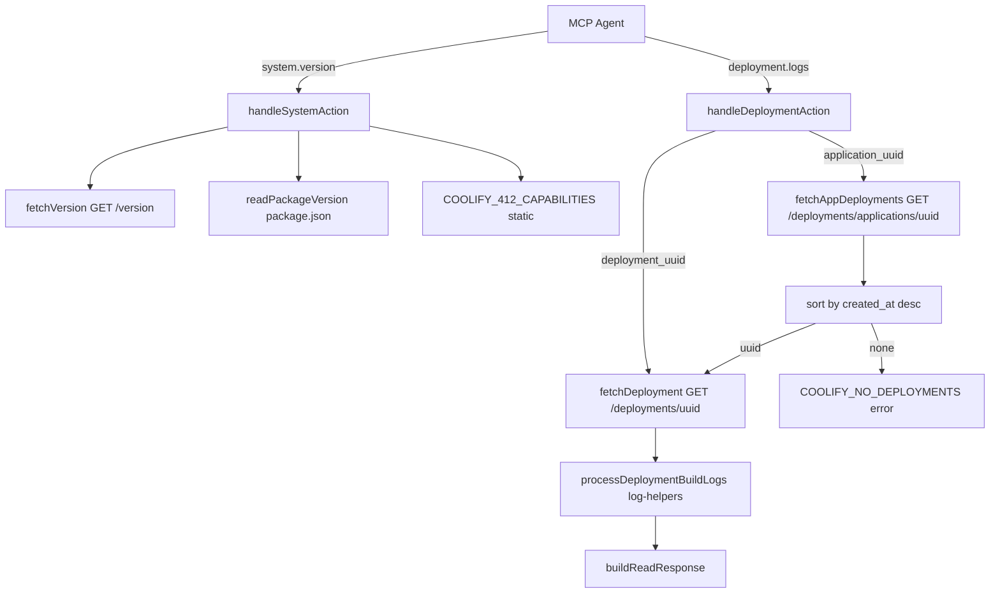

# Phase 24: Capabilities & Deployment Logs - Research

**Researched:** 2026-07-27
**Domain:** MCP capability discovery (`system.version`) + deployment build-log action (`deployment.logs`)
**Confidence:** HIGH

## Summary

Phase 24 extends two existing MCP surfaces with no new top-level tools and no new npm dependencies. `system.version` today returns only `{ version }` from `fetchVersion` (`src/mcp/tools/system.ts:158-171`); `meta.version` returns stale `MCP_VERSION = '0.1.0'` while `package.json` is `1.0.1` (`src/mcp/tools/meta.ts:5-27`). Build logs already work via `application.logs` + `deployment_uuid`, which calls `GET /deployments/{uuid}` and parses the inline `logs` string field (`src/mcp/tools/application.ts:1440-1510`, OpenAPI `ApplicationDeploymentQueue.logs` at `docs/coolify_openapi.json:16680-16682` [CITED: docs/coolify_openapi.json]).

**Primary recommendation:** Add a static `src/mcp/capabilities.ts` table + `readPackageVersion()` helper (read `package.json` adjacent to `dist/`), extend `system.version` response to `{ coolifyVersion, mcpVersion, serverName, capabilities }`, extract shared build-log processing from `handleApplicationLogs` into `log-helpers.ts`, and add `deployment.logs` as a fifth action on `deployment.ts` mirroring Phase 21 `watch` patterns.

<user_constraints>
## User Constraints (from CONTEXT.md)

### Locked Decisions

#### Capability flags (`system.version`)
- **D-01:** Capability payload is a flat map of keys to objects `{ supported: boolean, coolify_min_version: string, note?: string }` — not nested by domain, not bool-only. — **Reversibility:** costly — published agent contract for capability discovery.
- **D-02:** Flags come from a **static table** curated for Coolify **4.1.2** (no runtime OpenAPI diff, no semver-only gating as sole source). — **Reversibility:** reversible — table can grow when target Coolify version rises.
- **D-03:** Phase 24 required keys only: `application_logs`, `deployment_logs`, `deployment_watch`, `deploy_watch`. Do **not** include `diagnose` / `diagnose_logs` in this set. — **Reversibility:** reversible — keys can be added in later phases.
- **D-04:** `supported: false` is **soft guidance** — agents should skip the call; tools stay registered; no schema hard-block / capability gate inside Zod. — **Reversibility:** costly — hard-block later would change agent error surface.
- **D-05:** Package / milestone **target remains Coolify 4.1.2** (band `4.1.x`). Do **not** lower advertised min support to 4.0.0 without live UAT. Per-flag `coolify_min_version` may note API availability (e.g. app logs since 4.0.0) without changing the support claim. — **Reversibility:** reversible — docs/claim only until UAT exists.

#### Version response merge
- **D-06:** Extend `system.version` to return Coolify + MCP package + capabilities. Keep `meta.version` for backward compatibility (same package identity fields). — **Reversibility:** costly — dual surfaces until meta is retired later.
- **D-07:** Response field names: `{ coolifyVersion, mcpVersion, serverName, capabilities }` — rename away from bare `{ version }`. — **Reversibility:** one-way — breaks callers of `system.version` that expect `{ version }` (acceptable on 1.0.x with catalog/docs note).
- **D-08:** `mcpVersion` is read from `package.json` `version` (single source of truth). Fix stale `MCP_VERSION = '0.1.0'` in `meta.ts` via the same source. — **Reversibility:** reversible — source path can change.
- **D-09:** Document the `version` → `coolifyVersion` rename in actions catalog / tool descriptions (and short README note). No dual-field alias (`version` + `coolifyVersion`). — **Reversibility:** one-way — alias would soften break but was explicitly rejected.

#### `deployment.logs` surface
- **D-10:** Implement `deployment.logs` as a **new action on the existing `deployment` MCP tool** (same pattern as `watch`) — not a new top-level tool, not a mere alias. — **Reversibility:** costly — action catalog + agent habits.
- **D-11:** Keep `application.logs` + `deployment_uuid` build-log path for **backward compatibility**. Docs/catalog steer agents to `deployment.logs`. No soft-deprecate warning payload and no hard removal in this phase. — **Reversibility:** reversible — deprecate later if desired.
- **D-12:** `deployment.logs` is on-demand fetch; `deployment.watch` `include_logs` stays a capped snapshot — **separate** concerns. Do not route watch through logs; do not deprecate `include_logs` here. — **Reversibility:** reversible.
- **D-13:** Accept **either** `deployment_uuid` **or** `application_uuid` (mutually exclusive). When only `application_uuid`: resolve **newest deployment by timestamp regardless of status** (running/failed/finished). — **Reversibility:** costly — resolution policy becomes agent-visible behavior.
- **D-14:** If `application_uuid` is given and **no deployments exist**: return a **structured error** with recovery hints (deploy first / list deployments) — not a soft empty log body. — **Reversibility:** costly — error contract.

#### Log output contract
- **D-15:** Param parity with `application.logs` build path: `lines`, offset/skip, `include_hidden`, `type`, `format` (pretty|json; no table), `max_chars`, plus shared read/routing params as applicable. — **Reversibility:** costly — agent-facing schema.
- **D-16:** Empty / missing log content (when deployment exists): **soft OK** + empty list/string + hint — not an error. — **Reversibility:** reversible.
- **D-17:** Implementation reuse vs new helpers, and exact response envelope shape: **Claude's discretion at research** — prefer reusing `log-helpers` + parity with existing `application.logs` build path unless research finds a concrete reason not to.

#### Docs / prompts (Phase 24 scope)
- **D-18:** Update actions catalog + tool descriptions + a **short README note**. Touch `deploy` MCP prompt **only if needed** so agents discover `deployment.logs`. **`incident` prompt stays Phase 26.** No full incident/diagnose docs in this phase. — **Reversibility:** reversible.

### Claude's Discretion
- Exact helper extraction vs calling shared build-log parse path from `application` internals (`D-17`).
- Exact response envelope field names beyond required identity of resolved `deployment_uuid` when input was `application_uuid`.
- Exact static capability table `note` strings and precise `coolify_min_version` strings per key (must stay consistent with D-03 / D-05).
- Whether `meta.version` should also emit capabilities (default: **no** — capabilities live on `system.version` only unless research finds a strong compat need).

### Deferred Ideas (OUT OF SCOPE)
- OpenAPI multi-version archive (last N Coolify tags) + CI sync from `coollabsio/coolify` root `openapi.json`/`openapi.yaml` — for coverage diffs / future version-aware tooling, not runtime CAP-02.
- `incident` MCP prompt + diagnose.logs documentation — Phase 26.
- Application log follow / watch-style polling — Phase 25.
- Service/DB log capabilities (`service_logs`, etc.) — when Coolify 4.2.0+ is the supported target (v3.3 / SVC-04).
- Hard capability enforcement inside tool handlers — explicitly out; soft flags only (D-04).
- Retiring `meta.version` — keep for now (D-06).
</user_constraints>

<phase_requirements>
## Phase Requirements

| ID | Description | Research Support |
|----|-------------|------------------|
| CAP-01 | Agent reads Coolify server version and MCP package version via `system.version` | Extend `handleSystemAction` `version` case: `fetchVersion` → `coolifyVersion`, `readPackageVersion()` → `mcpVersion`, `MCP_SERVER_NAME` → `serverName` |
| CAP-02 | `system.version` returns capability flags for Coolify 4.1.2 features | Static `COOLIFY_412_CAPABILITIES` map (4 keys per D-03); attach as `capabilities` field; no runtime OpenAPI diff |
| OBS-01 | Agent fetches deployment build logs via `deployment.logs` by `deployment_uuid` without routing through `application.logs` | New `deployment.logs` action on `deploymentToolSchema`; shared build-log processor; `GET /deployments/{uuid}` via existing `fetchDeployment` |
</phase_requirements>

## Architectural Responsibility Map

| Capability | Primary Tier | Secondary Tier | Rationale |
|------------|-------------|----------------|-----------|
| Coolify version fetch | API / Backend (MCP handler) | Coolify REST `GET /version` | Version lives on Coolify server; MCP proxies |
| MCP package version | API / Backend (MCP handler) | Filesystem `package.json` | Local package metadata; no Coolify call |
| Capability flags | API / Backend (MCP handler) | — | Static MCP-side contract; not an OpenAPI endpoint |
| Deployment build logs | API / Backend (MCP handler) | Coolify REST `GET /deployments/{uuid}` | Logs embedded in deployment record `logs` field |
| Latest-deployment resolution | API / Backend (MCP handler) | Coolify REST `GET /deployments/applications/{uuid}` | List + sort in handler before log fetch |
| Agent discovery (catalog/docs) | MCP tool metadata | README / prompts | DX layer; no runtime logic |

**Primary recommendation:** All logic stays in MCP handler + utils tiers; no client-side/browser work; no new API client endpoints (reuse `fetchDeployment` / `fetchAppDeployments`).

## Standard Stack

### Core

| Library | Version | Purpose | Why Standard |
|---------|---------|---------|--------------|
| `zod` (v4) | existing (`zod/v4`) | Action schema + XOR refinements | Project-wide MCP action pattern |
| `vitest` | ^1.4.0 | Co-located unit tests | `.planning/codebase/TESTING.md` |
| Existing `log-helpers` | in-repo | Parse/slice/cap build logs | Phase 05 pipeline; proven in `application.test.ts` |
| Existing `fetchDeployment` / `fetchAppDeployments` | in-repo | Coolify API access | Already used by deployment + application tools |

### Supporting

| Library | Version | Purpose | When to Use |
|---------|---------|---------|-------------|
| `node:fs` + `import.meta.url` | Node built-in | Read `package.json` version at runtime | `mcpVersion` single source (D-08); `package.json` ships in npm tarball per `tests/npm-pack-allowlist.test.ts` |
| `buildReadResponse` | in-repo | Envelope + truncation | All read/log actions |

### Alternatives Considered

| Instead of | Could Use | Tradeoff |
|------------|-----------|----------|
| Static capability table | Runtime semver compare against `coolifyVersion` | Rejected per D-02/D-05 — unreliable for MCP-only features |
| New top-level `logs` tool | Action on `deployment` | Rejected per D-10; breaks domain-tool convention |
| `application.logs` alias only | Dedicated `deployment.logs` | Rejected per OBS-01; agents need deployment-domain discovery |
| tsup `define` inject version | Runtime `package.json` read | Both work; runtime read matches D-08 literally and auto-updates on `changeset version` without rebuild config change |

**Installation:** None — no new external packages.

**Version verification:** `package.json` version confirmed `1.0.1` via `npm` workspace read (2026-07-27).

## Package Legitimacy Audit

> Phase installs **no new external packages**. Audit skipped per protocol; table records disposition.

| Package | Registry | Verdict | Disposition |
|---------|----------|---------|-------------|
| — | — | — | No new installs |

**Packages removed due to [SLOP] verdict:** none
**Packages flagged as suspicious [SUS]:** none

## Project Constraints (from .cursor/rules/)

| Rule | Planner obligation |
|------|-------------------|
| **ponytail** | Reuse `log-helpers`, `fetchDeployment`, `createFlatActionSchema`; extract shared build-log path once; no new abstraction layers |
| **honey** | Minimal diff; no speculative capability keys beyond D-03 |
| **gsd-ship-labels** | Post-ship: `./scripts/gsd-ship-post.sh <pr>` |
| **graphify** | After code edits: `graphify update .` |
| **No stub tools** | Capability `supported: false` must not remove registered tools (D-04) |
| **Vitest `it.fails` Wave 0** | RED scaffolds use `it.fails` so husky pre-commit stays green (Phases 10–23 precedent) |
| **ESM `.js` imports** | Per `.planning/codebase/CONVENTIONS.md` |
| **Co-located tests** | `system.test.ts`, `deployment.test.ts`, `meta.test.ts` |

## Architecture Patterns

### System Architecture Diagram



### Recommended Project Structure

```
src/
├── mcp/
│   ├── capabilities.ts          # NEW — static COOLIFY_412_CAPABILITIES table
│   └── tools/
│       ├── system.ts            # extend version response
│       ├── meta.ts              # mcpVersion from readPackageVersion()
│       └── deployment.ts        # add logs action + handler
├── utils/
│   ├── package-version.ts       # NEW — readPackageVersion() cached
│   └── log-helpers.ts           # extend — processDeploymentBuildLogs()
```

### Pattern 1: Extended `system.version` response

**What:** Merge Coolify API version, package version, server name, and static capabilities in one call.
**When to use:** Agent startup / capability discovery (CAP-01, CAP-02).

```typescript
// Recommended shape (D-07)
export interface SystemVersionResult {
  coolifyVersion: string;
  mcpVersion: string;
  serverName: string;
  capabilities: Record<
    string,
    { supported: boolean; coolify_min_version: string; note?: string }
  >;
}

// version case in handleSystemAction
const versionData = await fetchVersion(...);
const coolifyVersion = extractVersionString(versionData);
return {
  coolifyVersion,
  mcpVersion: readPackageVersion(),
  serverName: MCP_SERVER_NAME,
  capabilities: COOLIFY_412_CAPABILITIES,
};
```

**Do not** add `capabilities` to `meta.version` — meta stays `{ mcpVersion, serverName }` only (D-06 discretion resolved: no strong compat need).

### Pattern 2: Static capability table (D-01–D-05)

**What:** Curated flat map; not computed from live OpenAPI.
**When to use:** Always returned from `system.version`.

```typescript
// src/mcp/capabilities.ts — recommended starter (notes/coolify_min_version adjustable)
export const COOLIFY_412_CAPABILITIES = {
  application_logs: {
    supported: true,
    coolify_min_version: '4.0.0',
    note: 'Runtime logs via application.logs + uuid (GET /applications/{uuid}/logs)',
  },
  deployment_logs: {
    supported: true,
    coolify_min_version: '4.1.0',
    note: 'Build logs via deployment.logs or GET /deployments/{uuid} logs field',
  },
  deployment_watch: {
    supported: true,
    coolify_min_version: '4.1.0',
    note: 'Bounded deploy polling via deployment.watch (MCP)',
  },
  deploy_watch: {
    supported: true,
    coolify_min_version: '4.1.0',
    note: 'Legacy sync polling via application.deploy wait:true (prefer deployment.watch)',
  },
} as const satisfies Record<
  string,
  { supported: boolean; coolify_min_version: string; note?: string }
>;
```

All four keys `supported: true` for the 4.1.2 target band. Do **not** add `diagnose` / `diagnose_logs` (D-03).

### Pattern 3: `deployment.logs` action (mirror `watch`)

**What:** Fifth action on existing `deployment` tool; flat schema via `createFlatActionSchema`.
**When to use:** OBS-01; preferred over `application.logs` + `deployment_uuid` for build logs.

```typescript
// Schema additions (follow deployment.watch pattern)
export const deploymentActionsCatalog =
  '... · logs(deployment_uuid|application_uuid, lines?, offset?, include_hidden?, type?, format?, max_chars?, instance?)';

// actionRequiredFields
logs: ['deployment_uuid' | 'application_uuid'] // enforced via superRefine XOR

// extraRefine: exactly one of deployment_uuid | application_uuid
// zodDefaultFields: include log param defaults (lines: 100, etc.)
```

**Handler flow:**
1. Resolve `deploymentUuid` — direct param or `resolveLatestDeploymentUuid(application_uuid, env)`.
2. `fetchDeployment(...)`.
3. `processDeploymentBuildLogs(deploymentUuid, record, logParams)` — shared with `application.logs` build path.
4. `buildReadResponse(...)`.

### Pattern 4: Latest deployment resolution (D-13)

**What:** Sort deployments by `created_at` descending; pick first regardless of `status`.
**When to use:** `application_uuid` without `deployment_uuid`.

```typescript
function resolveLatestDeploymentUuid(
  deployments: Record<string, unknown>[],
): string | null {
  if (deployments.length === 0) return null;
  const sorted = [...deployments].sort((a, b) => {
    const ta = Date.parse(String(a.created_at ?? '')) || 0;
    const tb = Date.parse(String(b.created_at ?? '')) || 0;
    return tb - ta; // newest first
  });
  const top = sorted[0];
  return String(top?.deployment_uuid ?? top?.id ?? '') || null;
}
```

**Critical:** `deployment.list` today passes API order through unchanged (`deployment.ts:200-205`). Log resolution **must** sort explicitly — mock data in `deployment.test.ts` has `dep-3` newest at index 2.

### Pattern 5: Shared build-log processor (D-17 resolution)

**What:** Extract lines 1440–1510 logic from `handleApplicationLogs` into `processDeploymentBuildLogs()` in `log-helpers.ts` (or adjacent `build-log-response.ts` if file grows).
**When to use:** Both `application.logs` (build path) and `deployment.logs`.

**Recommended response envelope** (parity with existing `application.logs` build path — `application.test.ts:1080-1084`):

```typescript
{
  deployment_uuid: string;       // resolved UUID (echo when resolved from application_uuid)
  status: string;
  logs_lines: string[];
  logs_truncated: boolean;
  total_lines: number;
  entries_total: number;
  entries_hidden: number;
  entries_shown: number;
  hint?: string;                 // D-16 empty-logs soft hint only
}
```

`application.logs` build handler becomes a thin wrapper: fetch + `processDeploymentBuildLogs`.

### Pattern 6: `readPackageVersion()` (D-08)

```typescript
// src/utils/package-version.ts
import { readFileSync } from 'node:fs';
import { dirname, resolve } from 'node:path';
import { fileURLToPath } from 'node:url';

let cached: string | undefined;

export function readPackageVersion(): string {
  if (cached) return cached;
  const pkgPath = resolve(
    dirname(fileURLToPath(import.meta.url)),
    '../package.json',
  );
  cached = JSON.parse(readFileSync(pkgPath, 'utf8')).version as string;
  return cached;
}
```

Works for dev (`src/` → tsup bundle) and npm (`dist/index.js` + root `package.json`) [VERIFIED: tests/npm-pack-allowlist.test.ts asserts `package.json` in tarball].

Replace `MCP_VERSION` constant in `meta.ts` with `readPackageVersion()`; export `MCP_SERVER_NAME` from `meta.ts` for reuse in `system.ts`.

### Anti-Patterns to Avoid

- **Routing `deployment.logs` through `handleApplicationAction`:** Violates OBS-01 intent; creates cross-tool coupling.
- **Routing `deployment.watch` through `deployment.logs`:** Violates D-12; watch `include_logs` uses `projectDeploymentFull` raw truncate, not JSON-array pipeline.
- **Runtime OpenAPI diff for capabilities:** Explicitly rejected (D-02).
- **Hard-blocking Zod when `supported: false`:** Violates D-04.
- **Dual `version` + `coolifyVersion` alias:** Rejected (D-09).
- **Assuming API deployment list order:** Must sort for D-13.

## Don't Hand-Roll

| Problem | Don't Build | Use Instead | Why |
|---------|-------------|-------------|-----|
| Build log JSON parse / filter / slice | Custom string hacks | `parseBuildLogEntries`, `sliceLogBlob`, `capLogOutput` | Hidden-entry filter, plain-string fallback, offset semantics already tested |
| Deployment fetch | New client method | `fetchDeployment` | OpenAPI `get-deployment-by-uuid` already mapped |
| Action schema boilerplate | Manual Zod objects | `createFlatActionSchema` + `sharedLogParamsSchema` | Matches deployment.watch / application.logs |
| Version string extraction | Duplicate parsing | Shared `extractCoolifyVersion(versionData)` helper (inline or util) | `system.version` and `system.verify` duplicate logic today |
| Capability semver engine | Full comparator | Static table + informational `coolify_min_version` | D-02/D-05 |

**Key insight:** Phase 24 is mostly wiring and extraction — the expensive log pipeline and API client already exist from Phases 05 and 21.

## Common Pitfalls

### Pitfall 1: Breaking `system.version` callers

**What goes wrong:** Tests/agents expect `{ version }`; CI fails.
**Why it happens:** D-07 intentional rename.
**How to avoid:** Update `system.test.ts:118-125`; document in `systemActionsCatalog`, README EN/DE short note (D-09).
**Warning signs:** `system.test.ts` assertion on `version` key.

### Pitfall 2: Stale `MCP_VERSION` after npm publish

**What goes wrong:** `meta.version` and `system.version` disagree with npm registry.
**Why it happens:** Hardcoded constant not updated since 0.1.0.
**How to avoid:** Single `readPackageVersion()` used by both `meta` and `system` (D-08).
**Warning signs:** `meta.test.ts` imports `MCP_VERSION` constant directly.

### Pitfall 3: Wrong “latest” deployment

**What goes wrong:** Agent gets logs from old finished deploy while new one is `in_progress`.
**Why it happens:** API list order not guaranteed; `deployment.list` doesn't sort.
**How to avoid:** Explicit `created_at` desc sort per D-13.
**Warning signs:** Test mock returns ascending timestamps; handler picks `dep-1` instead of `dep-3`.

### Pitfall 4: Empty deployments → soft empty logs

**What goes wrong:** Agent thinks deploy succeeded but no logs exist.
**Why it happens:** Confusing D-14 (no deployments) with D-16 (empty log body).
**How to avoid:** `fetchAppDeployments` → length 0 → structured error with hints (`application.deploy`, `deployment.list`); never return `logs_lines: []` for this case.
**Warning signs:** Missing `recoveryHints` on empty list path.

### Pitfall 5: `COOLIFY_403_SENSITIVE_REQUIRED` on empty string logs

**What goes wrong:** D-16 empty logs treated as permission error.
**Why it happens:** `typeof rec.logs !== 'string'` check in `application.ts:1449`.
**How to avoid:** Only error when `logs` property missing or non-string; `logs: ""` → soft OK + hint (existing typeof check already allows empty string).
**Warning signs:** Test expects error for `logs: ''`.

### Pitfall 6: Forgetting coverage map row

**What goes wrong:** `openapi-coverage` drift / missing OBS-01 traceability.
**How to avoid:** Add to `docs/coverage-map.yaml`:
```yaml
  - action: deployment.logs
    client: [fetchDeployment, fetchAppDeployments]
    openapi: ["GET /deployments/{uuid}", "GET /deployments/applications/{uuid}"]
```
Regenerate `docs/COVERAGE.md` (note: suite currently has 2 failing openapi-coverage tests from unstaged OpenAPI edits — fix in same phase or pre-existing).

### Pitfall 7: Deploy prompt still only mentions `application.logs`

**What goes wrong:** Agents miss `deployment.logs` despite OBS-01.
**How to avoid:** Update deploy prompt step 4 failure path to cite `deployment.logs` explicitly (D-18) — `prompts.ts:56` currently says generic "logs hint".

## Code Examples

### `processDeploymentBuildLogs` extraction target

```typescript
// Source: src/mcp/tools/application.ts:1440-1510 (build path)
// Move to src/utils/log-helpers.ts — signature sketch:
export function processDeploymentBuildLogs(
  deploymentUuid: string,
  rec: Record<string, unknown>,
  params: {
    lines: number;
    offset: number;
    include_hidden: boolean;
    type: 'stdout' | 'stderr' | 'all';
    max_chars: number;
  },
): {
  deployment_uuid: string;
  status: string;
  logs_lines: string[];
  logs_truncated: boolean;
  total_lines: number;
  entries_total: number;
  entries_hidden: number;
  entries_shown: number;
  hint?: string;
} {
  if (typeof rec.logs !== 'string') {
    throw new CoolifyApiError({ code: 'COOLIFY_403_SENSITIVE_REQUIRED', ... });
  }
  if (rec.logs.length === 0) {
    return {
      deployment_uuid: deploymentUuid,
      status: String(rec.status ?? 'unknown'),
      logs_lines: [],
      logs_truncated: false,
      total_lines: 0,
      entries_total: 0,
      entries_hidden: 0,
      entries_shown: 0,
      hint: 'Deployment exists but build logs are empty — build may still be running or logs were not retained.',
    };
  }
  // ... existing parseBuildLogEntries / sliceLogBlob / capLogOutput pipeline
}
```

### No-deployments structured error (D-14)

```typescript
throw new CoolifyApiError({
  code: 'COOLIFY_NO_DEPLOYMENTS',
  message: 'No deployments found for this application — deploy first or list deployments.',
  recoveryHints: [
    'Trigger a deploy: application({ action: "deploy", uuid: "<application_uuid>", wait: false })',
    'List deployments: deployment({ action: "list", application_uuid: "<application_uuid>" })',
  ],
  data: { application_uuid: parsed.application_uuid },
});
```

Add `COOLIFY_NO_DEPLOYMENTS` to `CoolifyErrorCode` union + `RECOVERY_HINTS` in `errors.ts` (follow `COOLIFY_DEPLOYMENT_FAILED` pattern).

## State of the Art

| Old Approach | Current Approach | When Changed | Impact |
|--------------|------------------|--------------|--------|
| `system.version` → `{ version }` | `{ coolifyVersion, mcpVersion, serverName, capabilities }` | Phase 24 (planned) | Breaking but accepted on 1.0.x |
| Build logs only via `application.logs` | Preferred `deployment.logs`; app path kept | Phase 24 (planned) | Domain-correct discovery |
| Hardcoded `MCP_VERSION = '0.1.0'` | `readPackageVersion()` | Phase 24 (planned) | Fixes CAP-01 accuracy |
| Capability discovery absent | Static 4.1.2 table on `system.version` | Phase 24 (planned) | Enables agent skip logic |

**Deprecated/outdated:**
- Relying on `system.version` field `version` — rename to `coolifyVersion` (D-07/D-09).
- Using `meta.version` for capability discovery — use `system.version` instead.

## Assumptions Log

| # | Claim | Section | Risk if Wrong |
|---|-------|---------|---------------|
| A1 | `package.json` remains in npm tarball at package root | Pattern 6 | `readPackageVersion()` fails on `npx` install |
| A2 | Coolify returns `logs` as JSON-encoded string array in deployment record | Pattern 5 | Parse fallback to plain string still works |
| A3 | `created_at` is reliable for newest-deployment sort | Pattern 4 | Wrong deploy selected; may need `updated_at` tie-break |
| A4 | All four capability keys are `supported: true` on 4.1.2 target | Pattern 2 | User may want `supported: false` for `deploy_watch` legacy |
| A5 | `meta.version` should NOT include capabilities | Pattern 1 | Dual discovery surfaces confuse agents |

**Planner action:** A4 is low risk — confirm with user only if recommending `deploy_watch: { supported: false }` as soft nudge toward `deployment.watch`.

## Open Questions

1. **Exact `COOLIFY_NO_DEPLOYMENTS` vs reuse `COOLIFY_404`**
   - What we know: D-14 requires structured error + recovery hints.
   - What's unclear: New error code vs generic 404 mapping.
   - Recommendation: New typed `COOLIFY_NO_DEPLOYMENTS` — clearer for agents than HTTP-shaped 404.

2. **Pre-existing openapi-coverage test failures**
   - What we know: 2 failures in `tests/openapi-coverage.test.ts` (unstaged `docs/coolify_openapi.json` edits in working tree).
   - Recommendation: Regenerate coverage artifacts in Phase 24 Wave 1 or separate commit before phase gate.

3. **`deploy` prompt depth**
   - What we know: D-18 says touch only if needed.
   - Recommendation: One-line addition on failure path referencing `deployment.logs` — meets discovery goal without prompt rewrite.

## Environment Availability

| Dependency | Required By | Available | Version | Fallback |
|------------|------------|-----------|---------|----------|
| Node.js | Build/test/MCP | ✓ | (host) | — |
| Vitest | Unit tests | ✓ | ^1.4.0 | — |
| Coolify 4.1.x instance | Live UAT (optional) | ✓ (project history) | 4.1.2 target | Mocked unit tests |
| New npm packages | — | N/A | — | — |

**Missing dependencies with no fallback:** none

**Missing dependencies with fallback:** none

## Validation Architecture

### Test Framework

| Property | Value |
|----------|-------|
| Framework | Vitest ^1.4.0 |
| Config file | `vitest.config.ts` |
| Quick run command | `npx vitest run src/mcp/tools/system.test.ts src/mcp/tools/deployment.test.ts src/mcp/tools/meta.test.ts -x` |
| Full suite command | `npm test` |

### Phase Requirements → Test Map

| Req ID | Behavior | Test Type | Automated Command | File Exists? |
|--------|----------|-----------|-------------------|-------------|
| CAP-01 | `system.version` returns `coolifyVersion` + `mcpVersion` + `serverName` | unit | `npx vitest run src/mcp/tools/system.test.ts -t "version" -x` | ✅ extend |
| CAP-02 | `system.version` returns 4 capability keys with object shape | unit | `npx vitest run src/mcp/tools/system.test.ts -t "capabilities" -x` | ❌ Wave 0 |
| CAP-01 | `mcpVersion` matches `package.json` | unit | `npx vitest run src/mcp/tools/meta.test.ts -x` | ✅ extend |
| OBS-01 | `deployment.logs` by `deployment_uuid` returns build log envelope | unit | `npx vitest run src/mcp/tools/deployment.test.ts -t "logs" -x` | ❌ Wave 0 |
| OBS-01 | XOR `deployment_uuid` / `application_uuid` schema | unit | `npx vitest run src/mcp/tools/deployment.test.ts -t "schema" -x` | ❌ Wave 0 |
| OBS-01 | `application_uuid` resolves newest deployment | unit | `npx vitest run src/mcp/tools/deployment.test.ts -t "latest" -x` | ❌ Wave 0 |
| D-14 | No deployments → structured error + hints | unit | `npx vitest run src/mcp/tools/deployment.test.ts -t "no deployments" -x` | ❌ Wave 0 |
| D-16 | Empty `logs: ""` → soft OK + hint | unit | `npx vitest run src/mcp/tools/deployment.test.ts -t "empty logs" -x` | ❌ Wave 0 |
| D-11 | `application.logs` build path regression | unit | `npx vitest run src/mcp/tools/application.test.ts -t "build logs" -x` | ✅ exists |
| OBS-01 | Coverage map includes `deployment.logs` | integration | `npx vitest run tests/openapi-coverage.test.ts -x` | ✅ extend |

### Sampling Rate

- **Per task commit:** `npx vitest run src/mcp/tools/system.test.ts src/mcp/tools/deployment.test.ts src/mcp/tools/meta.test.ts src/utils/log-helpers.test.ts -x`
- **Per wave merge:** `npm test`
- **Phase gate:** Full suite green before `/gsd-verify-work`

### Wave 0 Gaps

- [ ] `deployment.test.ts` — `describe('deployment logs')` with `it.fails` scaffolds (schema XOR, fetch by uuid, latest resolution, no-deployments error, empty logs hint, sensitive-required)
- [ ] `system.test.ts` — `it.fails` or updated tests for new version shape + capabilities object
- [ ] `meta.test.ts` — assert `mcpVersion === readPackageVersion()` not hardcoded constant
- [ ] `log-helpers.test.ts` — tests for extracted `processDeploymentBuildLogs` (optional if covered via deployment tests)
- [ ] `docs/coverage-map.yaml` — `deployment.logs` row
- [ ] `errors.test.ts` — `COOLIFY_NO_DEPLOYMENTS` recovery hints scaffold
- [ ] Regenerate `docs/COVERAGE.md` after coverage-map update

## Security Domain

### Applicable ASVS Categories

| ASVS Category | Applies | Standard Control |
|---------------|---------|------------------|
| V2 Authentication | no change | Existing bearer token on Coolify API |
| V3 Session Management | no | Stateless MCP |
| V4 Access Control | yes | `api.sensitive` required for build logs (`COOLIFY_403_SENSITIVE_REQUIRED`) |
| V5 Input Validation | yes | Zod `createFlatActionSchema` + XOR superRefine |
| V6 Cryptography | no | No new crypto |

### Known Threat Patterns

| Pattern | STRIDE | Standard Mitigation |
|---------|--------|---------------------|
| Build logs leak secrets in output | Information disclosure | Tool descriptions warn agents; no auto-redact in log content (Phase 05 precedent) |
| Token in version response | Information disclosure | Existing tests assert no token in JSON (`system.test.ts:88-97`) |
| Log injection via crafted API response | Tampering | Treat as trusted Coolify origin; cap via `max_chars` |
| Capability flags as security boundary | Elevation | D-04: soft guidance only — document not a hard gate |

## Sources

### Primary (HIGH confidence)

- Codebase: `src/mcp/tools/system.ts`, `meta.ts`, `deployment.ts`, `application.ts`, `log-helpers.ts`, `api/client.ts`
- Codebase tests: `system.test.ts`, `deployment.test.ts`, `application.test.ts` (build logs section)
- `docs/coolify_openapi.json` — `GET /deployments/{uuid}`, `ApplicationDeploymentQueue.logs`, `GET /applications/{uuid}/logs`
- `.planning/phases/24-capabilities-deployment-logs/24-CONTEXT.md` — locked decisions
- `tests/npm-pack-allowlist.test.ts` — `package.json` ships in tarball

### Secondary (MEDIUM confidence)

- `.planning/milestones/v3.1-phases/21-deploy-watch/21-CONTEXT.md` — deployment.watch action pattern
- `.planning/codebase/CONVENTIONS.md`, `TESTING.md` — project patterns

### Tertiary (LOW confidence)

- None requiring validation — implementation path fully determined by existing code

## Metadata

**Confidence breakdown:**
- Standard stack: HIGH — no new dependencies; reuse established utils/handlers
- Architecture: HIGH — CONTEXT decisions + existing Phase 05/21 patterns
- Pitfalls: HIGH — verified against current source and tests

**Research date:** 2026-07-27
**Valid until:** 2026-08-26 (stable MCP patterns; refresh if Coolify 4.2.0 target moves)
