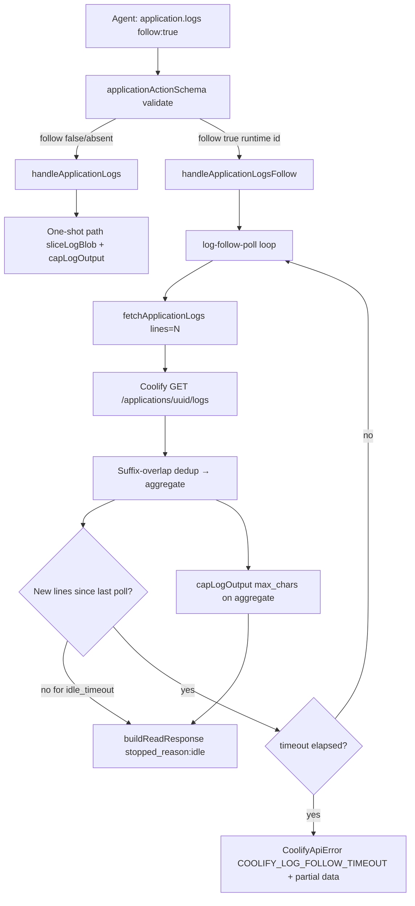

# Phase 25: Application Log Follow - Research

**Researched:** 2026-07-28
**Domain:** MCP-side bounded log tail polling on Coolify 4.1.2 snapshot API
**Confidence:** HIGH

## Summary

Phase 25 adds **watch-style follow** to the existing `application.logs` action via `follow:true`, polling `GET /applications/{uuid}/logs` until **timeout** or **idle** (no new deduped lines). Coolify exposes **no streaming endpoint** — follow is entirely MCP-side, same pattern as `deployment.watch` (Phase 21) but with log-dedup and idle-stop instead of deployment terminal status. [VERIFIED: `docs/coolify_openapi.json` — `/applications/{uuid}/logs` returns `{ logs: string }` with `lines` query only]

One-shot paths **must not change** (OBS-03): when `follow` is absent/false, `handleApplicationLogs` keeps today's runtime (`fetchApplicationLogs` + `sliceLogBlob` + `capLogOutput`) and build (`processDeploymentBuildLogs`) behavior byte-for-byte in contract. `follow:true` with `deployment_uuid` is a schema/handler **COOLIFY_422** reject (D-02).

Implementation should **extract a dedicated log-follow poll helper** (`src/utils/log-follow-poll.ts`) that **reuses the backoff/jitter math** from `deploy-watch-poll.ts` (export `nextDelayMs` + `sleep` or a tiny shared `poll-interval.ts` — do **not** bolt idle/dedup onto `pollDeploymentWithBackoff` itself). Handler early-returns to existing one-shot path when `!parsed.follow`.

**Primary recommendation:** Extend `applicationActionSchema` + `handleApplicationLogs` with follow params; add `application_logs_follow` capability; implement `followApplicationLogs()` poll loop with suffix-overlap dedup, idle timer, dual-signal timeout error (`COOLIFY_LOG_FOLLOW_TIMEOUT`), and golden one-shot regression tests.

<user_constraints>
## User Constraints (from CONTEXT.md)

### Locked Decisions

#### Follow surface (`application.logs`)
- **D-01:** Expose follow as **`follow:true` on existing `application.logs`** (not a separate action). — **Reversibility:** costly — agent-facing schema + catalog habits.
- **D-02:** `follow:true` + `deployment_uuid` → **`COOLIFY_422`** reject. Follow only with app runtime identity (`uuid` / `name` / `fqdn`). — **Reversibility:** costly — error contract.
- **D-03:** Without `follow` (absent/false): **exact current one-shot behavior** — no default/regression changes (OBS-03). — **Reversibility:** one-way if broken — OBS-03 success criterion.
- **D-04:** Document follow in actions catalog + tool description **and** via capability flag (D-17..D-19). Short catalog note that agents should check `system.version` capabilities.

#### Stop / terminal conditions
- **D-05:** Stop on **`timeout` OR idle** (no new lines for idle window). Do **not** poll app lifecycle status as a stop signal in this phase. — **Reversibility:** reversible — status-based stop can be added later.
- **D-06:** Default **`idle_timeout` = 60 seconds**. Agent may override via param. — **Reversibility:** costly — default is agent-visible behavior.
- **D-07:** On Coolify API errors during follow: **hard stop**, structured error, include **partial log aggregate so far**. — **Reversibility:** costly — error contract.
- **D-08:** Pattern-match / `until` / regex stop — **out of scope** Phase 25. — **Reversibility:** n/a (deferred).

#### Delta & response contract
- **D-09:** Return a **single aggregate** of new lines since follow start (dedupe across polls). No chunked MCP streaming. — **Reversibility:** costly — response shape agents depend on.
- **D-10:** On **timeout**: soft body (partial aggregate) **+** error flag / clear `stopped_reason: timeout` (Phase 21 dual-signal parity). — **Reversibility:** costly — agent contract.
- **D-11:** On **idle**: soft **success** + `stopped_reason: idle` (no error flag). — **Reversibility:** costly — distinguishes happy idle end from budget exhaustion.
- **D-12:** One **`max_chars` cap over the full aggregate** (`truncated: true` when hit). Not per-poll-only caps as the follow contract. — **Reversibility:** costly — token-safety contract.

#### Poll defaults & params
- **D-13:** Default **`timeout` = 120 seconds** when `follow:true` and agent omits timeout (shorter than `deployment.watch` 300s; idle often ends earlier). — **Reversibility:** costly — default agent-visible.
- **D-14:** Agent-visible params when following: **`timeout?`**, **`min_interval?`**, **`max_interval?`**, **`idle_timeout?`** (plus existing logs params as applicable). — **Reversibility:** costly — schema surface.
- **D-15:** Default intervals match watch parity: **min 3s**, **max 30s**, exponential backoff + jitter (reuse or sibling of watch poll helper). — **Reversibility:** reversible — math can tune later if defaults stay documented.
- **D-16:** **`lines`** still applies **per Coolify poll** (default 100); dedupe builds the aggregate. — **Reversibility:** costly — param semantics.

#### Capability flag
- **D-17:** Add new capability key **`application_logs_follow`** alongside existing `application_logs`. — **Reversibility:** costly — published capability map.
- **D-18:** `supported: true` for Coolify **4.1.2** target — follow is an **MCP** feature on the same logs API (not gated on nonexistent OpenAPI stream). — **Reversibility:** reversible — table entry.
- **D-19:** Soft guidance only (Phase 24 D-04 parity) — tools stay callable; no Zod hard-block on missing capability. — **Reversibility:** costly — hard-block later would change error surface.

#### Docs / coverage (Phase 25 scope)
- **D-20:** Update **actions catalog + tool description + short README EN/DE** note. — **Reversibility:** reversible.
- **D-21:** Leave **`incident` prompt untouched** — Phase 26 (PROMPT-01). — **Reversibility:** n/a.
- **D-22:** Update **coverage map / COVERAGE** for follow / OBS-02 row. — **Reversibility:** reversible.

### Claude's Discretion
- Exact default numeric `max_chars` for follow aggregate (reuse existing shared log default unless research finds a better follow-specific cap).
- Exact response envelope field names beyond required `stopped_reason` and dual-signal timeout semantics (D-10/D-11).
- Dedup algorithm details (line equality vs hash vs sliding window) — prefer simplest correct approach.
- Whether to reuse `deploy-watch-poll` abstractions vs a dedicated log-follow poll helper (prefer reuse/sibling; do not break watch).
- Exact `coolify_min_version` / `note` strings on `application_logs_follow`.
- Schema placement of follow-only params (`follow` false/absent must keep one-shot path identical — D-03).

### Deferred Ideas (OUT OF SCOPE)
- App lifecycle status as follow stop condition — later phase if needed
- `until` / regex pattern stop — later / diagnose flows
- MCP chunked streaming for follow — rejected for Phase 25
- Full `incident` prompt + `diagnose.logs` documentation — Phase 26
- Service/DB log follow — v3.3 / Coolify 4.2.0+ (SVC-04+)
</user_constraints>

<phase_requirements>
## Phase Requirements

| ID | Description | Research Support |
|----|-------------|------------------|
| OBS-02 | Agent can follow application logs with bounded polling (watch-style) until timeout or terminal condition | `follow:true` on `application.logs`; new `log-follow-poll.ts`; dedup aggregate; timeout + idle stop; capability `application_logs_follow` |
| OBS-03 | Existing `application.logs` runtime and build paths remain unchanged | Early return in `handleApplicationLogs` when `!follow`; golden tests for runtime uuid + build `deployment_uuid` paths; schema `zodDefaultFields` strips follow params from non-logs actions |
</phase_requirements>

## Architectural Responsibility Map

| Capability | Primary Tier | Secondary Tier | Rationale |
|------------|-------------|----------------|-----------|
| Log snapshot fetch | API client (`fetchApplicationLogs`) | — | Coolify REST is sole upstream; no browser/stream |
| Follow poll loop + dedup | MCP server utils (`log-follow-poll.ts`) | `handleApplicationLogs` | Long-running bounded work stays server-side like `deployment.watch` |
| Schema / validation | MCP tool layer (`application.ts`) | `shared-read-params.ts` | Flat action schema pattern; follow params action-gated |
| Capability discovery | `capabilities.ts` + `system.version` | README/catalog | Soft agent guidance (D-19) |
| One-shot log slice/cap | `log-helpers.ts` | — | Reuse `sliceLogBlob` / `capLogOutput` unchanged for non-follow |
| Error envelope + partial data | `errors.ts` + handler throw pattern | — | Mirror `COOLIFY_WATCH_TIMEOUT` dual-signal (D-10) |

## Standard Stack

### Core

| Library | Version | Purpose | Why Standard |
|---------|---------|---------|--------------|
| `awesome-coolify-mcp` (existing) | 1.0.1 | MCP server host | Phase extends in-repo patterns only |
| `zod` | ^4 (via `zod/v4`) | Follow param validation | Project-wide flat action schemas |
| `vitest` | ^1.4.0 | Unit + integration tests | Co-located `*.test.ts` convention |
| `ofetch` | ^1.5.1 | Coolify HTTP client | Already wraps `/applications/{uuid}/logs` |

### Supporting

| Library | Version | Purpose | When to Use |
|---------|---------|---------|-------------|
| `deploy-watch-poll.ts` backoff math | — | Interval backoff + 429 handling | Import/export shared interval helpers; do not couple deployment status checks |
| `log-helpers.ts` | — | Aggregate `max_chars` cap | Final cap on deduped blob (D-12) |

### Alternatives Considered

| Instead of | Could Use | Tradeoff |
|------------|-----------|----------|
| Dedicated `log-follow-poll.ts` | Extend `pollDeploymentWithBackoff` | Watch helper assumes deployment `status` terminal — wrong stop semantics for logs |
| Set-based line dedupe | Suffix-overlap dedupe | Set drops legitimate repeated log lines; overlap handles tail snapshots correctly |
| New top-level MCP tool | `follow:true` param (locked D-01) | Would break action-per-domain convention from Phases 5/21/24 |
| `COOLIFY_WATCH_TIMEOUT` reuse | `COOLIFY_LOG_FOLLOW_TIMEOUT` | Watch recovery hints reference `deployment.watch` — misleading for app logs |

**Installation:** None — no new dependencies.

**Version verification:** N/A (no new packages).

## Package Legitimacy Audit

> No external packages are introduced in this phase. Existing dependencies only.

| Package | Registry | Verdict | Disposition |
|---------|----------|---------|-------------|
| — | — | — | N/A |

**Packages removed due to [SLOP] verdict:** none
**Packages flagged as suspicious [SUS]:** none

## Architecture Patterns

### System Architecture Diagram



### Recommended Project Structure

```
src/
├── utils/
│   ├── deploy-watch-poll.ts      # export shared backoff helpers (small refactor)
│   ├── log-follow-poll.ts        # NEW: follow loop + dedup + idle
│   ├── log-follow-poll.test.ts   # NEW: fake timers, dedup, idle, timeout
│   └── log-helpers.ts            # unchanged; cap aggregate
├── mcp/
│   ├── capabilities.ts           # + application_logs_follow
│   └── tools/
│       ├── application.ts        # schema + handleApplicationLogs branch
│       ├── application.test.ts   # follow paths + OBS-03 golden
│       └── system.test.ts        # 5 capability keys
tests/integration/
    logs-service-db-flow.test.ts    # flip follow rejection → acceptance
docs/
    coverage-map.yaml, COVERAGE.md  # OBS-02 note
```

### Pattern 1: Action-gated flat schema (follow params)

**What:** Add `follow`, `idle_timeout`, `min_interval`, `max_interval` to `applicationActionSchema` shape; list them only under `logs` in `actionAllowedFields`. Use `zodDefaultFields` on `createFlatActionSchema` so phantom defaults are stripped from `deploy`/`get`/etc. (same pattern as `deployment.ts` watch defaults).

**When to use:** Any new optional params on a multi-action flat tool.

**Example:**

```typescript
// Pattern: deployment.ts watch defaults (src/mcp/tools/deployment.ts)
{
  timeout: 300,
  min_interval: 3,
  max_interval: 30,
  // ...
}

// application logs follow — different timeout default (D-13)
zodDefaultFields: {
  follow: false,
  timeout: 120,        // applies when follow:true; deploy wait keeps its own semantics
  idle_timeout: 60,
  min_interval: 3,
  max_interval: 30,
}
```

### Pattern 2: Dual-signal timeout (mirror Phase 21)

**What:** On follow budget exhaustion, throw `CoolifyApiError` with new code `COOLIFY_LOG_FOLLOW_TIMEOUT`, `data` containing partial `logs_lines`, `stopped_reason: 'timeout'`, `elapsed_seconds`, and recovery hint to re-call with same app id.

**When to use:** Timeout stop only (D-10). Idle stop returns normal OK (D-11).

**Example:**

```typescript
// Source: src/mcp/tools/deployment.ts handleDeploymentWatch timeout branch
throw new CoolifyApiError({
  code: 'COOLIFY_WATCH_TIMEOUT',
  message: `Deployment watch timed out after ${elapsedSeconds}s — ...`,
  recoveryHints: RECOVERY_HINTS.COOLIFY_WATCH_TIMEOUT,
  data: { deployment: summary, timed_out: true, elapsed_seconds: elapsedSeconds },
});
```

### Pattern 3: Suffix-overlap dedup across tail snapshots

**What:** Each poll fetches last `lines` lines as a string blob, split to `newLines[]`. Find longest `k` where `aggregate.slice(-k)` equals `newLines.slice(0, k)`; append `newLines.slice(k)`. If no overlap (log rotation), append all `newLines` not already at end of aggregate (fallback: append full `newLines` and rely on `max_chars` cap).

**When to use:** Every follow poll after the first.

**Example:**

```typescript
function appendDedupedLines(aggregate: string[], snapshot: string[]): string[] {
  if (aggregate.length === 0) return snapshot;
  const maxK = Math.min(aggregate.length, snapshot.length);
  for (let k = maxK; k > 0; k--) {
    let match = true;
    for (let i = 0; i < k; i++) {
      if (aggregate[aggregate.length - k + i] !== snapshot[i]) { match = false; break; }
    }
    if (match) return [...aggregate, ...snapshot.slice(k)];
  }
  return [...aggregate, ...snapshot];
}
```

### Anti-Patterns to Avoid

- **Routing follow through `pollDeploymentWithBackoff`:** Wrong terminal semantics; risks breaking watch tests.
- **Per-poll `max_chars` as the follow contract:** Violates D-12; cap once on full aggregate.
- **Set/hash dedupe on whole lines:** Drops repeated identical log lines (common in app logs).
- **Hard-blocking follow when capability false:** Violates D-19 / Phase 24 soft-flag pattern.
- **Changing `fetchApplicationLogs` signature for follow:** Keep client thin; poll loop lives in util/handler.
- **Editing `incident` prompt:** Phase 26 scope (D-21).

## Don't Hand-Roll

| Problem | Don't Build | Use Instead | Why |
|---------|-------------|-------------|-----|
| Exponential backoff + jitter | New math | Export/share `nextDelayMs` from `deploy-watch-poll.ts` | Proven in Phase 21; 429 Retry-After path exists |
| Log character cap | Custom truncator | `capLogOutput` / `truncateAndGuard` | Consistent `…[truncated]` suffix |
| HTTP errors | Ad-hoc strings | `CoolifyApiError` + `toStructuredError` | Partial aggregate in `data` on follow API failure (D-07) |
| App UUID resolution | New resolver | `resolveAppMutationUuid` | Existing ambiguity errors |
| Coolify log fetch | Raw fetch | `fetchApplicationLogs(url, token, uuid, lines)` | Tested client; passes `lines` query [VERIFIED: `src/api/client.ts`] |

**Key insight:** Follow is orchestration over an existing snapshot API — the complexity is dedup + stop conditions + agent contract, not HTTP.

## Common Pitfalls

### Pitfall 1: OBS-03 regression via schema defaults

**What goes wrong:** `follow` defaults or `timeout: 120` leaking into one-shot `logs` calls changes behavior or rejects unknown keys on other actions.

**Why it happens:** Flat schema shares `timeout` with `deploy` `wait:true`.

**How to avoid:** Branch at top of `handleApplicationLogs` on `parsed.follow === true`; use `actionAllowedFields.logs` + `zodDefaultFields`; add golden tests that omit `follow` and assert identical call args to `fetchApplicationLogs`.

**Warning signs:** `application.test.ts` one-shot tests start passing different `lines` to client; deploy wait timeout tests break.

### Pitfall 2: Duplicate lines or missed lines on overlap failure

**What goes wrong:** After container restart or log truncation, overlap=0 causes full snapshot append → duplicate bulk; or aggressive Set dedupe hides real repeats.

**Why it happens:** Coolify returns overlapping tail windows, not cursors.

**How to avoid:** Suffix-overlap primary; unit tests with overlapping snapshots; optional `poll_count` in response for debugging.

**Warning signs:** `total_lines` jumps by ~`lines` every poll when output is static.

### Pitfall 3: Idle never fires during slow trickle

**What goes wrong:** One new line every 30s resets idle clock indefinitely until timeout.

**Why it happens:** Idle is "no new **deduped** lines" — correct per D-05/D-06 but surprising in ops.

**How to avoid:** Document in catalog; default 60s idle + 120s timeout keeps sessions bounded.

**Warning signs:** Agents complain follow always hits timeout not idle.

### Pitfall 4: `follow` + `deployment_uuid` slips through

**What goes wrong:** Build-log path enters follow loop incorrectly.

**How to avoid:** `superRefine` in both `applicationLogsSchema` and `applicationActionSchema` `extraRefine` when `action==='logs'`.

**Warning signs:** `fetchDeployment` called in follow tests.

### Pitfall 5: Capability test drift

**What goes wrong:** `system.test.ts` still expects exactly four keys after adding `application_logs_follow`.

**How to avoid:** Update `CAPABILITY_KEYS` to five; snapshot note string.

**Warning signs:** Phase 25 CI fails on `system.version` test.

## Code Examples

### One-shot runtime path (unchanged — OBS-03 baseline)

```typescript
// Source: src/mcp/tools/application.ts handleApplicationLogs
const raw = await fetchApplicationLogs(env.COOLIFY_URL, env.COOLIFY_TOKEN, uuid, lines + offset, env.COOLIFY_VERIFY_SSL);
const logsStr = isRecord(raw) && typeof raw.logs === 'string' ? raw.logs : '';
const allLines = sliceLogBlob(logsStr, lines, offset);
const capped = capLogOutput(allLines.join('\n'), parsed.max_chars);
```

### Follow handler sketch

```typescript
// Source: pattern from deployment.ts + CONTEXT D-09..D-12
async function handleApplicationLogsFollow(parsed: LogsAction, env: EnvConfig) {
  const uuid = await resolveAppMutationUuid(parsed, env);
  const lines = parsed.lines ?? 100;
  const outcome = await followApplicationLogs({
    fetchSnapshot: () => fetchApplicationLogs(env.COOLIFY_URL, env.COOLIFY_TOKEN, uuid, lines, env.COOLIFY_VERIFY_SSL),
    timeoutMs: (parsed.timeout ?? 120) * 1000,
    idleTimeoutMs: (parsed.idle_timeout ?? 60) * 1000,
    minIntervalMs: (parsed.min_interval ?? 3) * 1000,
    maxIntervalMs: (parsed.max_interval ?? 30) * 1000,
    isRetryableRateLimit, // same as deployment.ts
  });
  const capped = capLogOutput(outcome.aggregate.join('\n'), parsed.max_chars);
  const body = {
    uuid,
    logs_lines: capped.text.split('\n').filter(Boolean),
    logs_truncated: capped.truncated,
    total_lines: outcome.aggregate.length,
    stopped_reason: outcome.stoppedReason,
    poll_count: outcome.pollCount,
  };
  if (outcome.stoppedReason === 'timeout') {
    throw new CoolifyApiError({
      code: 'COOLIFY_LOG_FOLLOW_TIMEOUT',
      message: `Application log follow timed out after ${outcome.elapsedSeconds}s.`,
      recoveryHints: RECOVERY_HINTS.COOLIFY_LOG_FOLLOW_TIMEOUT,
      data: { ...body, timed_out: true },
    });
  }
  return buildReadResponse(body, { format: parsed.format, max_chars: parsed.max_chars });
}
```

### Capability entry

```typescript
// Source: src/mcp/capabilities.ts pattern
application_logs_follow: {
  supported: true,
  coolify_min_version: '4.1.2',
  note: 'Bounded runtime log follow via application.logs follow:true (MCP polling on GET /applications/{uuid}/logs)',
},
```

## State of the Art

| Old Approach | Current Approach | When Changed | Impact |
|--------------|------------------|--------------|--------|
| `follow` rejected as unrecognized key | `follow:true` accepted on runtime path | Phase 25 | Flip tests in `application.test.ts` + integration |
| 4 capability keys | 5 keys (+ `application_logs_follow`) | Phase 25 | Update `system.test.ts` |
| One-shot only app runtime logs | One-shot + optional follow | Phase 25 | OBS-02; build path unchanged |

**Deprecated/outdated:**
- Integration test name `rejects follow:true per D-05` — D-05 in Phase 25 CONTEXT is idle/timeout stop semantics, not rejection; rename test when implementing.

## Assumptions Log

| # | Claim | Section | Risk if Wrong |
|---|-------|---------|---------------|
| A1 | Reuse `max_chars` default **20000** from `sharedLogParamsSchema` for follow aggregate | Discretion D-12 | Token-heavy follow responses if too large |
| A2 | New error code **`COOLIFY_LOG_FOLLOW_TIMEOUT`** (not reusing watch code) | Pattern 2 | Confusing recovery hints |
| A3 | `offset` applies only to one-shot path; ignored when `follow:true` | Not in CONTEXT | Agent confusion if offset silently affects follow |
| A4 | `include_hidden` / `type` ignored on runtime follow path (same as one-shot runtime) | Existing behavior | Low — already documented for runtime |
| A5 | Export backoff helpers from `deploy-watch-poll.ts` rather than duplicating | Discretion | Slight coupling; mitigated by tiny export surface |

## Open Questions (RESOLVED)

1. **`offset` during `follow:true`** — RESOLVED: Reject or ignore `offset` when `follow:true` via superRefine (Plan 25-02).

2. **Exact timeout field sharing with `deploy wait:true`** — RESOLVED: Default 120 only in logs+follow handler branch; deploy wait stays 300 (Plans 25-01/25-02).

3. **Coverage row shape for follow** — RESOLVED: Note column on `application.logs` row in coverage-map.yaml (Plan 25-03).

## Environment Availability

| Dependency | Required By | Available | Version | Fallback |
|------------|------------|-----------|---------|----------|
| Node.js | Build/test | ✓ | >=24 (engines) | — |
| Vitest | Unit/integration tests | ✓ | ^1.4.0 | `npm test` |
| Coolify 4.1.x instance | Live UAT / manual follow | ✓ (project UAT host) | 4.1.2 target | Unit tests with mocked fetch |
| `GET /applications/{uuid}/logs` | Runtime logs + follow | ✓ | OpenAPI pinned | None — core requirement |

**Missing dependencies with no fallback:** none for implementation (mocks suffice for CI).

**Missing dependencies with fallback:** Live Coolify for manual UAT only — optional per phase gate.

## Validation Architecture

### Test Framework

| Property | Value |
|----------|-------|
| Framework | Vitest ^1.4.0 |
| Config file | `vitest.config.ts` |
| Quick run command | `npx vitest run src/mcp/tools/application.test.ts src/utils/log-follow-poll.test.ts -x` |
| Full suite command | `npm test` |

### Phase Requirements → Test Map

| Req ID | Behavior | Test Type | Automated Command | File Exists? |
|--------|----------|-----------|-------------------|-------------|
| OBS-02 | `follow:true` aggregates deduped lines | unit | `npx vitest run src/utils/log-follow-poll.test.ts -x` | ❌ Wave 0 |
| OBS-02 | idle stop → OK + `stopped_reason: idle` | unit | `npx vitest run src/mcp/tools/application.test.ts -t idle -x` | ❌ Wave 0 |
| OBS-02 | timeout → dual-signal error + partial logs | unit | `npx vitest run src/mcp/tools/application.test.ts -t timeout -x` | ❌ Wave 0 |
| OBS-02 | `follow` + `deployment_uuid` → COOLIFY_422 | unit | `npx vitest run src/mcp/tools/application.test.ts -t deployment_uuid -x` | ❌ Wave 0 |
| OBS-02 | capability `application_logs_follow` | unit | `npx vitest run src/mcp/tools/system.test.ts -t capabilities -x` | ✅ (update) |
| OBS-03 | one-shot runtime unchanged | unit | `npx vitest run src/mcp/tools/application.test.ts -t runtime -x` | ✅ |
| OBS-03 | one-shot build unchanged | unit | `npx vitest run src/mcp/tools/application.test.ts -t build -x` | ✅ |
| OBS-03 | integration logs flow regression | integration | `npx vitest run tests/integration/logs-service-db-flow.test.ts -x` | ✅ (update) |

### Sampling Rate

- **Per task commit:** `npx vitest run <touched>.test.ts -x`
- **Per wave merge:** `npm test`
- **Phase gate:** Full suite green before `/gsd-verify-work`

### Wave 0 Gaps

- [ ] `src/utils/log-follow-poll.ts` + `log-follow-poll.test.ts` — dedup, idle, timeout, 429 backoff
- [ ] `COOLIFY_LOG_FOLLOW_TIMEOUT` in `errors.ts` + `RECOVERY_HINTS`
- [ ] Flip `applicationLogsSchema rejects follow` → acceptance tests
- [ ] Update `system.test.ts` five capability keys
- [ ] Integration test: `rejects follow:true` → happy-path or schema-accept

## Security Domain

### Applicable ASVS Categories

| ASVS Category | Applies | Standard Control |
|---------------|---------|-----------------|
| V2 Authentication | no | Existing bearer token on Coolify client |
| V3 Session Management | no | Stateless MCP |
| V4 Access Control | no change | Same Coolify token abilities as one-shot logs |
| V5 Input Validation | yes | Zod `.strict()` + superRefine XOR/follow guards |
| V6 Cryptography | no | — |

### Known Threat Patterns for MCP log follow

| Pattern | STRIDE | Standard Mitigation |
|---------|--------|---------------------|
| Unbounded MCP session / API storm | DoS | timeout + backoff + jitter (D-13/D-15); 429 Retry-After |
| Log injection via agent output | Tampering | No change — existing `buildReadResponse` formatting |
| Sensitive log exfiltration | Info disclosure | Same as Phase 5 — tool description warns; no new reveal surface |
| Partial log leak on error | Info disclosure | D-07 intentional — partial aggregate aids debugging; same trust model as watch timeout snapshot |

## Project Constraints (from .cursor/rules/)

- **Ponytail / YAGNI:** Shortest diff — sibling `log-follow-poll.ts`, no new npm deps, no streaming abstraction.
- **Honey:** Terse catalog strings; no boilerplate docs beyond D-20 README note.
- **GSD ship:** Run `./scripts/gsd-ship-post.sh` after PR create (phase PR).
- **Spike findings:** Action-based tools only; no stub/501 tools; Coolify 4.1.2 target.
- **Graphify:** Run `graphify update .` after code edits (AST-only).
- **No commit unless asked:** Executor commits per task/plan, not research agent unless `commit_docs` pipeline runs.

## Sources

### Primary (HIGH confidence)

- `docs/coolify_openapi.json` — `GET /applications/{uuid}/logs` snapshot contract
- `src/mcp/tools/application.ts` — current `handleApplicationLogs` one-shot paths
- `src/utils/deploy-watch-poll.ts` — backoff poll pattern (Phase 21)
- `src/mcp/tools/deployment.ts` — dual-signal timeout, 429 handling
- `.planning/phases/25-application-log-follow/25-CONTEXT.md` — locked decisions

### Secondary (MEDIUM confidence)

- `.planning/milestones/v3.1-phases/21-deploy-watch/21-CONTEXT.md` — watch timeout dual-signal precedent
- `.planning/phases/24-capabilities-deployment-logs/24-CONTEXT.md` — capability soft-flag pattern

### Tertiary (LOW confidence)

- None requiring validation — implementation is codebase-driven.

## Metadata

**Confidence breakdown:**
- Standard stack: HIGH — no new packages; patterns exist in Phases 21/24/05
- Architecture: HIGH — CONTEXT locks surface; code seams identified
- Pitfalls: MEDIUM — dedup edge cases on log rotation need unit tests

**Research date:** 2026-07-28
**Valid until:** 2026-08-28 (stable MCP/Coolify 4.1.x band)
