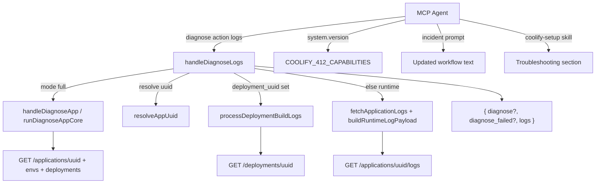

# Phase 26: Diagnose Logs & Incident DX - Research

**Researched:** 2026-07-28
**Domain:** MCP composite diagnose+log action, incident prompt DX, capability discovery, IDE skill docs
**Confidence:** HIGH

## Summary

Phase 26 adds **`diagnose.logs`** as a fifth action on the existing `diagnose` MCP tool — mirroring the Phase 21/24 pattern (`deployment.logs` on `deployment`, `follow:true` on `application.logs`). The handler composes **diagnose.app triage** (when `mode:full`) with a **bounded one-shot log tail** (runtime via `GET /applications/{uuid}/logs` or build via `deployment_uuid` + `processDeploymentBuildLogs`). It does **not** embed follow; agents use `application.logs` + `follow:true` separately. [VERIFIED: codebase — `src/mcp/tools/diagnose.ts`, `src/mcp/tools/application.ts`, `src/utils/log-helpers.ts`]

Downstream DX work updates the **`incident` MCP prompt** (replace separate `diagnose.app` + `application.logs` triage with `diagnose.logs mode:full`), adds **`diagnose_logs`** as the sixth `system.version` capability key, and inserts a short **App log troubleshooting** section in `skills/coolify-setup/SKILL.md` after the setup wizard flow. No new npm dependencies; no service/DB log surfaces. [VERIFIED: `.planning/phases/26-diagnose-logs-incident-dx/26-CONTEXT.md`]

**Primary recommendation:** Extend `diagnoseToolSchema` + `handleDiagnoseAction` with a `logs` action that orchestrates existing diagnose-app and log-fetch paths via shared helpers (extract runtime log payload builder from `application.ts` into `log-helpers.ts` to prevent OBS-03 drift), return nested `{ diagnose?, diagnose_failed?, logs }`, then update `incident` prompt, `diagnose_logs` capability, actions catalog, README EN/DE, coverage map, and `coolify-setup` skill.

<user_constraints>
## User Constraints (from CONTEXT.md)

### Locked Decisions

### `diagnose.logs` surface
- **D-01:** Implement as new action **`logs` on the existing `diagnose` MCP tool** (same pattern as `deployment.logs`) — not a top-level tool, not docs-only alias. — **Reversibility:** costly — action catalog + agent habits.
- **D-02:** Default log source is a bounded **runtime** one-shot tail via existing `application.logs` path (`lines` / `max_chars`). Do **not** embed `follow:true`. — **Reversibility:** costly — agent-facing semantics.
- **D-03:** Agent-selectable **`mode`**: `full` | `logs-only`. Default when omitted: **`full`**. — **Reversibility:** costly — schema + prompt defaults.
- **D-04:** App identifiers match `diagnose.app` (`query` | `uuid` | `name` | `domain`, at least one) plus log params and shared read/routing params as applicable. — **Reversibility:** costly — schema parity contract.
- **D-05:** Optional **`deployment_uuid`**: **XOR** with runtime — when set, fetch **build logs only** for that deployment (no runtime tail); parity with `application.logs` runtime-vs-build split. — **Reversibility:** costly — identity/log-source contract.

### Response envelope & errors
- **D-06:** Nested response **`{ diagnose?, logs }`** — omit `diagnose` when `mode:logs-only`. — **Reversibility:** costly — agent-facing envelope.
- **D-07:** When `mode:full` and diagnose half fails: **soft partial** + clear error flag; include `logs` if the log fetch still succeeds. — **Reversibility:** costly — error contract (differs from hard-fail-all).
- **D-08:** Empty / missing log content when app exists: **soft OK** + empty tail + hint (Phase 24 D-16 parity). — **Reversibility:** reversible.
- **D-09:** Cap / default numerics: **reuse `application.logs` defaults** for `lines` and `max_chars` — no diagnose-specific magic numbers. — **Reversibility:** reversible.

### `incident` prompt
- **D-10:** Primary triage step uses **`diagnose.logs` with `mode:full`** instead of separate `diagnose.app` + `application.logs`. — **Reversibility:** costly — prompt contract agents follow.
- **D-11:** Document **`deployment.logs`** as an explicit step only on build/deploy suspicion or after failed `deployment.watch` — not always. — **Reversibility:** reversible.
- **D-12:** Document application log **follow** after one-shot/`diagnose.logs` when a live symptom needs watch; agents should check capability **`application_logs_follow`**. — **Reversibility:** reversible.
- **D-13:** Explicit **app-only guardrail** in the prompt — no service/DB log steps; steer elsewhere for service/DB. — **Reversibility:** reversible.

### Capability + `coolify-setup` skill + docs
- **D-14:** Add capability key **`diagnose_logs`** to the static Coolify 4.1.2 table (`supported: true`, soft guidance only — Phase 24 D-04 parity). — **Reversibility:** costly — published capability map.
- **D-15:** `coolify-setup` gets a **short** “App log troubleshooting” section: capability check via `system.version` → `diagnose.logs` → follow / `deployment.logs` → links to `coolify-incident` / `coolify-deploy` / `coolify-diagnose`. Not a full incident runbook duplicate. — **Reversibility:** reversible.
- **D-16:** Place that section as its **own skill section** after setup/wire — do not mix into the setup wizard flow. — **Reversibility:** reversible.
- **D-17:** Also update **actions catalog** + short **README EN/DE** note (Phase 24/25 parity); coverage map row if research finds one needed. — **Reversibility:** reversible.

### Claude's Discretion
- Exact Zod param name for mode (`mode` vs `diagnose_mode`) — prefer `mode` if unambiguous in flat schema.
- Exact nested field shapes inside `diagnose` / `logs` (reuse existing diagnose.app and application.logs result shapes where practical).
- Exact soft-partial error code / flag field names for D-07.
- Exact `coolify_min_version` / `note` strings on `diagnose_logs`.
- Whether `diagnose` prompt also gets a one-line pointer to `diagnose.logs` (default: yes, brief — not a full rewrite of diagnose prompt).
- Coverage-map / COVERAGE.md row wording for DIAG-01.

### Deferred Ideas (OUT OF SCOPE)
- `diagnose.logs` for service/database — requires SVC-04/05; Coolify 4.2.0+ (REQUIREMENTS out of scope)
- Embedding follow inside `diagnose.logs` — rejected for Phase 26; use `application.logs` follow separately
- Full docs-site troubleshooting page — deferred (Phase 27 / docs milestone if needed)
- Branding / npm docs stale fix — Phase 27
</user_constraints>

<phase_requirements>
## Phase Requirements

| ID | Description | Research Support |
|----|-------------|------------------|
| DIAG-01 | Agent can call `diagnose.logs` for an application — combines app diagnose triage with a bounded log tail in one action | New `logs` action on `diagnose` tool; `mode:full` composes diagnose.app + log tail; nested `{ diagnose?, logs }` envelope; reuse log-helpers + diagnose.app projection |
| PROMPT-01 | `incident` MCP prompt documents `deployment.logs`, application log follow, and `diagnose.logs` (application-only; no service/DB log steps) | Rewrite `incident` prompt steps in `src/mcp/prompts.ts`; extend `tests/mcp/prompts.test.ts` assertions |
| SKILL-01 | `coolify-setup` skill documents app log troubleshooting, capability discovery via `system.version`, and links to incident/deploy/diagnose skills | New post-wizard section in `skills/coolify-setup/SKILL.md`; optional `skills-manifest.test.ts` assertion |
</phase_requirements>

## Architectural Responsibility Map

| Capability | Primary Tier | Secondary Tier | Rationale |
|------------|-------------|----------------|-----------|
| `diagnose.logs` composite handler | API / Backend (MCP server) | — | Orchestrates Coolify REST calls + projections; no client-side logic |
| Runtime log tail | API / Backend | Coolify `GET /applications/{uuid}/logs` | Snapshot fetch; bounded slice/cap in MCP |
| Build log tail (`deployment_uuid`) | API / Backend | Coolify `GET /deployments/{uuid}` | Reuses `processDeploymentBuildLogs` |
| Diagnose triage half | API / Backend | — | Reuses `handleDiagnoseApp` / `projectAppDiagnose` path |
| `diagnose_logs` capability flag | API / Backend (`system.version`) | — | Static guidance table; soft flag only (D-14) |
| `incident` prompt workflow | MCP prompts layer | — | Agent guidance text; no runtime execution |
| `coolify-setup` troubleshooting section | IDE skill docs | — | Onboarding reference; links to sibling skills |
| Log follow (out of band) | API / Backend (`application.logs`) | — | Documented in prompt/skill; not composed into `diagnose.logs` |

## Project Constraints (from .cursor/rules/)

| Rule | Constraint for Phase 26 |
|------|-------------------------|
| `ponytail.mdc` | Reuse existing handlers/helpers; extract shared runtime log builder instead of duplicating slice/cap logic; one runnable check per non-trivial path |
| `honey.mdc` | Minimal diff; no new dependencies; terse catalog/README notes |
| `gsd-ship-labels.mdc` | After `/gsd-ship`, run `./scripts/gsd-ship-post.sh <pr>` — no `[ci skip]` on PR tip |
| `spike-findings-awesome-coolify.mdc` | No stub tools; service/DB logs absent on Coolify 4.1.2 |
| `graphify.mdc` | Run `graphify update .` after code edits (graphify currently disabled in config) |
| `context7.mdc` | N/A — no new external library docs needed |
| `wigolo.mdc` | N/A — internal MCP patterns dominate |

## Standard Stack

### Core

| Library | Version | Purpose | Why Standard |
|---------|---------|---------|--------------|
| `zod` (v4 import path) | ^4.x via `zod/v4` | Action schema + validation | Existing flat-action pattern in all domain tools [VERIFIED: codebase] |
| `vitest` | ^4.1.10 | Co-located unit tests | Project test runner [VERIFIED: `package.json`] |
| `src/utils/log-helpers.ts` | (in-repo) | `sliceLogBlob`, `capLogOutput`, `processDeploymentBuildLogs` | Phase 24 extraction; build-log empty-hint pattern [VERIFIED: codebase] |
| `src/mcp/capabilities.ts` | (in-repo) | Static `COOLIFY_412_CAPABILITIES` table | Phase 24 capability discovery [VERIFIED: codebase] |

### Supporting

| Library | Version | Purpose | When to Use |
|---------|---------|---------|-------------|
| `createFlatActionSchema` | (in-repo) | Flat MCP tool schemas | Adding `logs` action to `diagnoseToolSchema` |
| `buildReadResponse` | (in-repo) | Uniform read envelope | All successful diagnose.logs responses |
| `wrapMcpError` / `CoolifyApiError` | (in-repo) | Structured errors | Hard failures (logs fetch, schema, auth) |

### Alternatives Considered

| Instead of | Could Use | Tradeoff |
|------------|-----------|----------|
| `logs` action on `diagnose` | Top-level `diagnose_logs` tool | Rejected per D-01 — breaks action-catalog habit |
| Call `handleApplicationAction` internally | Duplicate log fetch in `diagnose.ts` | Rejected — risks OBS-03 drift; extract shared helper instead |
| Embed `follow:true` in `diagnose.logs` | Separate `application.logs` follow | Rejected per D-02 — keeps one-shot vs watch semantics clean |

**Installation:** None — no new external packages.

**Version verification:** N/A (in-repo only).

## Package Legitimacy Audit

> Phase 26 installs **no new external packages**. No registry audit required.

| Package | Registry | Verdict | Disposition |
|---------|----------|---------|-------------|
| — | — | — | No new packages |

**Packages removed due to SLOP verdict:** none
**Packages flagged as suspicious [SUS]:** none

## Architecture Patterns

### System Architecture Diagram



### Recommended Project Structure

```
src/mcp/tools/diagnose.ts          # Add logs action schema + handleDiagnoseLogs
src/mcp/tools/diagnose.test.ts     # logs action unit tests (Wave 0 RED → GREEN)
src/utils/log-helpers.ts           # + buildRuntimeLogPayload (extract from application.ts)
src/mcp/capabilities.ts            # + diagnose_logs sixth key
src/mcp/tools/system.test.ts       # Update capability key count 5 → 6
src/mcp/prompts.ts                 # Rewrite incident; brief diagnose pointer
tests/mcp/prompts.test.ts          # incident prompt assertions
skills/coolify-setup/SKILL.md      # App log troubleshooting section (post-wizard)
docs/coverage-map.yaml             # + diagnose.logs row
docs/COVERAGE.md                   # Regenerated via openapi:coverage
README.md / README.de.md           # Short diagnose.logs + capability note
```

### Pattern 1: Action on existing domain tool (deployment.logs parity)

**What:** Add `logs` to `createFlatActionSchema(['app','server','scan','logs'], ...)` with action-specific allowed fields and `extraRefine` invariants.

**When to use:** Every new MCP surface in v3.2 (Phases 21/24/25/26).

**Example:**

```typescript
// Source: src/mcp/tools/deployment.ts (deployment.logs pattern)
export const diagnoseToolSchema = createFlatActionSchema(
  ['app', 'server', 'scan', 'logs'],
  {
    // shared + logs-only: mode, deployment_uuid, sharedLogParamsSchema fields, offset
    mode: z.enum(['full', 'logs-only']).optional().default('full'),
    deployment_uuid: z.string().optional(),
    // query, uuid, name, domain, limit (app only), shared read params...
  },
  {
    logs: ['query', 'uuid', 'name', 'domain', 'mode', 'deployment_uuid', 'lines', 'offset', 'include_hidden', 'type', 'format', 'max_chars', 'reveal', 'instance'],
    // app/server/scan unchanged
  },
  undefined,
  (data, ctx) => {
    if (data.action === 'logs') {
      // at least one app identifier (D-04)
      // deployment_uuid XOR runtime identifiers (D-05) — mirror application.logs superRefine
      // reject follow:* params if agent passes them
      // reject format table if used
    }
  },
  { mode: 'full', lines: 100, offset: 0, include_hidden: false, type: 'all', max_chars: 20000 },
);
```

[VERIFIED: codebase — `src/mcp/tools/deployment.ts:169-210`, `src/mcp/tools/application.ts:222-259`]

### Pattern 2: Composite handler with soft-partial diagnose failure

**What:** Run diagnose and logs fetches independently; on `mode:full`, catch diagnose errors and still return logs when fetchable.

**When to use:** D-07 soft partial — differs from `wrapMcpError` hard-fail default.

**Example:**

```typescript
// Source: Phase 26 D-06/D-07 + deployment empty-logs soft OK (Phase 24)
async function handleDiagnoseLogs(parsed, env) {
  const resolution = await resolveAppUuid(parsed, env);
  // handle zero/multi match like handleDiagnoseApp

  let diagnose: DiagnoseAppData | undefined;
  let diagnose_failed: { code: string; message: string } | undefined;

  if (parsed.mode !== 'logs-only') {
    try {
      const appResult = await runDiagnoseAppCore(parsed, env, resolution.uuid);
      diagnose = appResult;
    } catch (err) {
      const envelope = toStructuredError(err);
      diagnose_failed = { code: envelope.code, message: envelope.message };
    }
  }

  const logs = parsed.deployment_uuid
    ? await fetchBuildLogPayload(parsed.deployment_uuid, parsed, env)
    : await fetchRuntimeLogPayload(resolution.uuid, parsed, env);

  if (!logs.logs_lines.length && !parsed.deployment_uuid) {
    logs.hint = EMPTY_RUNTIME_LOGS_HINT; // D-08 — diagnose.logs adds hint; OBS-03 safe
  }

  return buildReadResponse(
    { ...(diagnose ? { diagnose } : {}), ...(diagnose_failed ? { diagnose_failed } : {}), logs },
    { format: parsed.format, max_chars: parsed.max_chars },
  );
}
```

**Recommended field names (discretion resolved):** `mode` (not `diagnose_mode`); `diagnose_failed` sibling object (not top-level `isError`); `logs` reuses runtime `{ uuid, logs_lines, logs_truncated, total_lines, hint? }` or build `DeploymentBuildLogResult` shape unchanged.

[VERIFIED: codebase — `src/mcp/tools/deployment.test.ts:736-754` empty build logs; Phase 26 CONTEXT D-06/D-07/D-08]

### Pattern 3: Extract runtime log payload builder (OBS-03 guard)

**What:** Move runtime one-shot slice/cap from `handleApplicationLogs` into `log-helpers.ts` as `buildRuntimeLogPayload(uuid, logsStr, params)`.

**When to use:** Any second caller of runtime log tail (`application.logs`, `diagnose.logs`).

**Example:**

```typescript
// Source: src/mcp/tools/application.ts:1663-1679 (extract verbatim logic)
export function buildRuntimeLogPayload(
  uuid: string,
  logsStr: string,
  params: { lines: number; offset: number; max_chars: number },
) {
  const allLines = sliceLogBlob(logsStr, params.lines, params.offset);
  const capped = capLogOutput(allLines.join('\n'), params.max_chars);
  const cappedLines = capped.text.split('\n').filter((l) => l.length > 0);
  return {
    uuid,
    logs_lines: cappedLines,
    logs_truncated: capped.truncated,
    total_lines: allLines.length,
  };
}
```

[VERIFIED: codebase — `src/mcp/tools/application.ts:1624-1679`]

### Pattern 4: Sixth capability key (Phase 24/25 parity)

**What:** Add `diagnose_logs` to `COOLIFY_412_CAPABILITIES`; update `system.test.ts` key list from 5 → 6.

**When to use:** Any new agent-discoverable MCP feature.

**Example:**

```typescript
// Source: src/mcp/capabilities.ts
diagnose_logs: {
  supported: true,
  coolify_min_version: '4.1.2',
  note: 'One-shot app diagnose + bounded log tail via diagnose.logs (MCP composite; not a Coolify REST endpoint)',
},
```

[VERIFIED: codebase — `src/mcp/capabilities.ts`, `src/mcp/tools/system.test.ts:140-156`]

### Pattern 5: Incident prompt rewrite (PROMPT-01)

**What:** Replace steps 2–3 in `incident` prompt with `diagnose.logs mode:full`; add conditional `deployment.logs`, `application.logs follow:true`, and app-only guardrail.

**When to use:** PROMPT-01 success criterion.

**Example workflow (assistant content):**

```
1. Resolve application UUID ...
2. Triage + logs in one call:
   diagnose({ action: "logs", mode: "full", uuid: "<uuid>" })
3. If live symptom persists, follow runtime logs (check capabilities.application_logs_follow):
   application({ action: "logs", uuid: "<uuid>", follow: true })
4. On build/deploy suspicion or failed deployment.watch, fetch build logs:
   deployment({ action: "logs", deployment_uuid: "<uuid>" })
   App-only: do not attempt service/DB log tools — unavailable on Coolify 4.1.2.
5. Non-destructive restart ...
6. Emergency redeploy with confirm gate ...
```

[VERIFIED: codebase — `src/mcp/prompts.ts:179-196`; Phase 25 deferred incident to Phase 26]

### Anti-Patterns to Avoid

- **Calling `handleApplicationAction` from diagnose:** Cross-tool coupling; use shared log-helpers + diagnose internals instead.
- **Duplicating runtime slice/cap in diagnose.ts:** OBS-03 regression risk on default numerics or empty handling.
- **Embedding `follow:true` in diagnose.logs:** Rejected per D-02; breaks watch vs one-shot contract.
- **Hard-failing whole action when diagnose half fails but logs succeed:** Violates D-07.
- **Adding service/DB log steps to incident prompt:** Out of scope; Coolify 4.1.2 has no endpoints [VERIFIED: `.planning/REQUIREMENTS.md` Out of Scope].
- **Zod hard-block on `diagnose_logs` capability:** Phase 24 D-04 soft guidance only.

## Don't Hand-Roll

| Problem | Don't Build | Use Instead | Why |
|---------|-------------|-------------|-----|
| Log line slicing/capping | Custom string math | `sliceLogBlob` + `capLogOutput` | Tail-of-tail semantics documented; tested |
| Build log JSON-array pipeline | Ad-hoc parse | `processDeploymentBuildLogs` | Hidden-entry filter, sensitive gate, empty hint |
| App UUID resolution for diagnose | New resolver | `resolveAppUuid` in `diagnose.ts` | Matches diagnose.app identifier contract (domain not fqdn) |
| Diagnose projection | New projector | `projectAppDiagnose` + `generateHints` | Consistent triage shape with `diagnose.app` |
| Capability discovery | Runtime probing | `COOLIFY_412_CAPABILITIES` static table | Phase 24 pattern; version-gated notes |
| Composite error envelope | Ad-hoc strings | `buildReadResponse` + `diagnose_failed` object | Agents parse structured fields |

**Key insight:** Phase 26 is **composition + DX**, not new Coolify API integration. The planner should budget extraction/refactor tasks before the composite handler.

## Common Pitfalls

### Pitfall 1: OBS-03 regression via duplicated log defaults

**What goes wrong:** `diagnose.logs` uses different default `lines`/`max_chars` than `application.logs`, or changes runtime fetch `lines + offset` API call semantics.

**Why it happens:** Copy-paste handler logic instead of shared helper.

**How to avoid:** Extract `buildRuntimeLogPayload`; import `sharedLogParamsSchema` defaults (`lines: 100`, `max_chars: 20000`) [VERIFIED: `src/mcp/tools/shared-read-params.ts:218-232`].

**Warning signs:** Golden `application.logs` tests fail; `diagnose.logs` tests show different `fetchApplicationLogs` third-arg values.

### Pitfall 2: Identifier mismatch (`domain` vs `fqdn`)

**What goes wrong:** `diagnose.logs` accepts `fqdn` or rejects `domain`, breaking parity with `diagnose.app`.

**Why it happens:** Reusing `application.logs` schema fields verbatim.

**How to avoid:** Use diagnose.app identifier set: `query|uuid|name|domain` (D-04) [VERIFIED: `src/mcp/tools/diagnose.ts:49-50,95-98`].

### Pitfall 3: XOR contract confusion on `deployment_uuid`

**What goes wrong:** Agent passes both runtime identifiers and `deployment_uuid`; handler returns both tails or throws unexpectedly.

**Why it happens:** Missing superRefine; differs from `application.logs` XOR.

**How to avoid:** When `deployment_uuid` set → build logs only, no runtime tail (D-05). Still require app identifiers for diagnose half in `mode:full`. Schema should reject `deployment_uuid` + ambiguous multi-match, not silently ignore runtime.

### Pitfall 4: Soft partial mis-implemented as top-level error

**What goes wrong:** Diagnose failure sets `isError: true` and agents never see logs half.

**Why it happens:** Reusing `wrapMcpError` for inner diagnose catch.

**How to avoid:** Only the outer handler uses `wrapMcpError` for total failures; diagnose half failures populate `diagnose_failed` inside successful `buildReadResponse` (D-07).

### Pitfall 5: Forgetting capability test cardinality

**What goes wrong:** `system.test.ts` still expects exactly five keys; CI fails after adding `diagnose_logs`.

**Why it happens:** Phase 25 established five-key test; Phase 26 adds sixth.

**How to avoid:** Update `CAPABILITY_KEYS` array and catalog string in same commit as `capabilities.ts` [VERIFIED: `src/mcp/tools/system.test.ts:140-156`].

### Pitfall 6: Incident prompt test drift

**What goes wrong:** `prompts.test.ts` still asserts separate `diagnose.app` + `application.logs` as primary triage.

**Why it happens:** Prompt updated but test not.

**How to avoid:** Extend incident test to expect `diagnose.logs`, `deployment.logs`, `follow`, app-only guardrail; keep restart/emergency assertions [VERIFIED: `tests/mcp/prompts.test.ts:104-116`].

### Pitfall 7: Skill section placement inside wizard flow

**What goes wrong:** Troubleshooting steps mixed into preflight/wire steps confuse onboarding.

**Why it happens:** D-15/D-16 ignored.

**How to avoid:** New `## App log troubleshooting` section after `## Example calls` or end of file — not inside `## Workflow` numbered steps.

## Code Examples

### diagnose.logs call (agent-facing)

```typescript
// Runtime triage + tail (default mode:full)
diagnose({ action: "logs", uuid: "app-uuid-1" })

// Logs only (skip diagnose projection)
diagnose({ action: "logs", mode: "logs-only", name: "my-app" })

// Build logs for specific deployment (no runtime tail)
diagnose({ action: "logs", mode: "full", uuid: "app-uuid-1", deployment_uuid: "dep-uuid-1" })
```

### Capability check before follow

```typescript
const { capabilities } = await system({ action: "version" });
if (capabilities.diagnose_logs?.supported) {
  await diagnose({ action: "logs", uuid: "app-uuid-1" });
}
if (capabilities.application_logs_follow?.supported) {
  await application({ action: "logs", uuid: "app-uuid-1", follow: true });
}
```

[VERIFIED: codebase — capability pattern from README.md:732; Phase 24 soft flags]

### Empty runtime logs soft OK (diagnose.logs responsibility)

```typescript
const EMPTY_RUNTIME_LOGS_HINT =
  'Application exists but runtime logs are empty — container may be idle or logs not yet available.';
// Attach to logs object when logs_lines.length === 0 (D-08)
```

[VERIFIED: codebase — build empty pattern `src/utils/log-helpers.ts:36-37,101-112`; runtime hint is new for diagnose.logs per D-08]

## State of the Art

| Old Approach | Current Approach | When Changed | Impact |
|--------------|------------------|--------------|--------|
| Separate `diagnose.app` + `application.logs` in incident prompt | `diagnose.logs mode:full` one-shot | Phase 26 (planned) | Fewer agent round-trips |
| Four capability keys | Five (Phase 25 `application_logs_follow`) | Phase 25 shipped | `system.test.ts` five-key assertion |
| Five capability keys | Six (`diagnose_logs`) | Phase 26 (planned) | Update tests + README |
| No setup skill troubleshooting | Short post-wizard section | Phase 26 (planned) | SKILL-01 |

**Deprecated/outdated:**
- Incident prompt steps 2–3 as separate diagnose + logs calls — replaced per D-10.
- Expecting `diagnose_logs` in Phase 24 capability set — explicitly deferred until Phase 26 [VERIFIED: `.planning/phases/24-capabilities-deployment-logs/24-CONTEXT.md` D-03].

## Assumptions Log

| # | Claim | Section | Risk if Wrong |
|---|-------|---------|---------------|
| A1 | `mode` param name is unambiguous in flat diagnose schema (no collision with other tools) | Pattern 1 | Low — only `logs` action uses it |
| A2 | `diagnose_failed` is acceptable agent-facing field name | Pattern 2 | Medium — planner may alias to `_meta.diagnose_error` if preferred |
| A3 | App identifiers required even when `deployment_uuid` selects build logs | Pattern 1 / Pitfall 3 | Medium — if build-only without app id is desired, discuss-phase must amend D-04/D-05 |
| A4 | Runtime empty logs need new hint string (application.logs one-shot currently has no hint) | Pitfall / Code Examples | Low — D-08 scoped to diagnose.logs; OBS-03 preserved |
| A5 | `coolify-setup` skill test optional (not required by existing manifest tests) | Validation | Low — only D-15 content; manifest tests don't cover troubleshooting yet |

**If assumptions A2/A3 need user confirmation:** Planner can add `checkpoint:human-verify` on envelope field names and `deployment_uuid`-only calls.

## Open Questions (RESOLVED)

1. **Should `coolify-incident` skill mirror prompt rewrite in the same phase?** — **RESOLVED (planner discretion)**
   - What we know: SKILL-01 scopes `coolify-setup` only; `coolify-incident/SKILL.md` still documents separate diagnose + logs steps [VERIFIED: `skills/coolify-incident/SKILL.md:22-32`].
   - **Planner decision:** Update `incident` MCP prompt in Plan 26-02 (required per PROMPT-01/D-10). Do **not** sync `coolify-incident` skill in Phase 26 — out of locked CONTEXT scope; optional follow-up outside this phase. Discretion default from CONTEXT: prompt-only parity.

2. **Coverage override for `diagnose.logs`?** — **RESOLVED (planner decision)**
   - What we know: `docs/coverage-map.yaml` has `diagnose.app|server|scan` rows; no `diagnose.logs` yet [VERIFIED: grep].
   - **Planner decision:** Add `diagnose.logs` row in Plan 26-00 Wave 0 with `client: [fetchApplication, fetchApplicationEnvs, fetchAppDeployments, fetchApplicationLogs, fetchDeployment]` and matching OpenAPI GET paths per `26-PATTERNS.md`. Regenerate `docs/COVERAGE.md` via `npm run openapi:coverage` in Plan 26-02 when prompt/capability docs land (D-17).

## Environment Availability

Step 2.6: **SKIPPED** — no new external dependencies. Existing toolchain sufficient:

| Dependency | Required By | Available | Version | Fallback |
|------------|------------|-----------|---------|----------|
| Node.js | build/test | ✓ | >=24 per `package.json` engines | — |
| vitest | unit tests | ✓ | ^4.1.10 | — |
| Coolify 4.1.2 API | log/diagnose endpoints | ✓ (target) | 4.1.2 | — |

## Validation Architecture

### Test Framework

| Property | Value |
|----------|-------|
| Framework | Vitest ^4.1.10 |
| Config file | `vitest.config.ts` |
| Quick run command | `npx vitest run src/mcp/tools/diagnose.test.ts -t logs -x` |
| Full suite command | `npm test` |

### Phase Requirements → Test Map

| Req ID | Behavior | Test Type | Automated Command | File Exists? |
|--------|----------|-----------|-------------------|-------------|
| DIAG-01 | `diagnose.logs` mode:full returns nested diagnose + logs | unit | `npx vitest run src/mcp/tools/diagnose.test.ts -t "logs" -x` | ❌ Wave 0 |
| DIAG-01 | mode:logs-only omits diagnose | unit | same | ❌ Wave 0 |
| DIAG-01 | deployment_uuid → build logs only (XOR) | unit | same | ❌ Wave 0 |
| DIAG-01 | diagnose failure soft partial + logs present | unit | same | ❌ Wave 0 |
| DIAG-01 | empty runtime logs soft OK + hint | unit | same | ❌ Wave 0 |
| DIAG-01 | defaults lines=100 max_chars=20000 | unit | same | ❌ Wave 0 |
| PROMPT-01 | incident prompt cites diagnose.logs, deployment.logs, follow, app-only | unit | `npx vitest run tests/mcp/prompts.test.ts -t incident -x` | ✅ extend |
| SKILL-01 | coolify-setup documents system.version + diagnose.logs + skill links | unit/manual | `npx vitest run src/skills/skills-manifest.test.ts -x` (+ new assertion optional) | ✅ extend optional |
| D-14 | sixth capability key diagnose_logs | unit | `npx vitest run src/mcp/tools/system.test.ts -t capabilities -x` | ✅ extend |
| OBS-03 | application.logs golden paths unchanged | regression | `npx vitest run src/mcp/tools/application.test.ts -t "runtime logs" -x` | ✅ exists |

### Sampling Rate

- **Per task commit:** `npx vitest run src/mcp/tools/diagnose.test.ts -t logs -x`
- **Per wave merge:** `npm test`
- **Phase gate:** Full suite green before `/gsd-verify-work`

### Wave 0 Gaps

- [ ] `src/mcp/tools/diagnose.test.ts` — `it.fails` scaffolds for `action: 'logs'` (husky-green RED per Phase 24/25 pattern)
- [ ] `tests/mcp/prompts.test.ts` — incident prompt assertions for PROMPT-01 (may start as failing expectations)
- [ ] `src/mcp/tools/system.test.ts` — update capability key count 5 → 6
- [ ] `docs/coverage-map.yaml` — `diagnose.logs` row
- [ ] `src/utils/log-helpers.ts` — `buildRuntimeLogPayload` extraction (enables DIAG-01 without OBS-03 drift)
- [ ] Optional: `src/skills/skills-manifest.test.ts` — coolify-setup troubleshooting section assertion

## Security Domain

### Applicable ASVS Categories

| ASVS Category | Applies | Standard Control |
|---------------|---------|------------------|
| V2 Authentication | no | Existing MCP env token model unchanged |
| V3 Session Management | no | — |
| V4 Access Control | no | Read-only compose action |
| V5 Input Validation | yes | Zod `createFlatActionSchema` + superRefine XOR/mode rules |
| V6 Cryptography | no | — |

### Known Threat Patterns for MCP log/diagnose stack

| Pattern | STRIDE | Standard Mitigation |
|---------|--------|---------------------|
| Log injection / oversized responses | Denial of Service | `max_chars` cap + `lines` bounds (reuse defaults D-09) |
| Sensitive build log exposure | Information Disclosure | `COOLIFY_403_SENSITIVE_REQUIRED` via `processDeploymentBuildLogs` |
| Instance routing confusion | Spoofing | `parseWithInstanceRouting` + `resolveRoutingEnv` |
| Partial env token leak | Information Disclosure | Existing `sanitizeFullProjection` / no token in version output |

## Sources

### Primary (HIGH confidence)

- `src/mcp/tools/diagnose.ts` — diagnose.app resolution, schema patterns
- `src/mcp/tools/application.ts` — runtime/build log handlers, defaults, XOR
- `src/mcp/tools/deployment.ts` — deployment.logs action pattern
- `src/mcp/capabilities.ts` — capability table shape
- `src/mcp/prompts.ts` — current incident/diagnose prompts
- `src/utils/log-helpers.ts` — slice/cap/build processing
- `.planning/phases/26-diagnose-logs-incident-dx/26-CONTEXT.md` — locked decisions

### Secondary (MEDIUM confidence)

- `.planning/phases/25-application-log-follow/25-RESEARCH.md` — follow/follow deferral patterns
- `.planning/phases/24-capabilities-deployment-logs/24-RESEARCH.md` — capability + deployment.logs patterns
- `tests/mcp/prompts.test.ts` — prompt regression expectations
- `docs/COVERAGE.md` — existing action coverage rows

### Tertiary (LOW confidence)

- None requiring validation — scope is internal composition atop verified Phase 24/25 surfaces

## Metadata

**Confidence breakdown:**
- Standard stack: HIGH — no new packages; patterns proven in Phases 21/24/25
- Architecture: HIGH — CONTEXT decisions exhaustive; codebase assets identified
- Pitfalls: HIGH — OBS-03 and XOR contracts are the main regression vectors

**Research date:** 2026-07-28
**Valid until:** 2026-08-28 (stable MCP composition; 30-day window)
