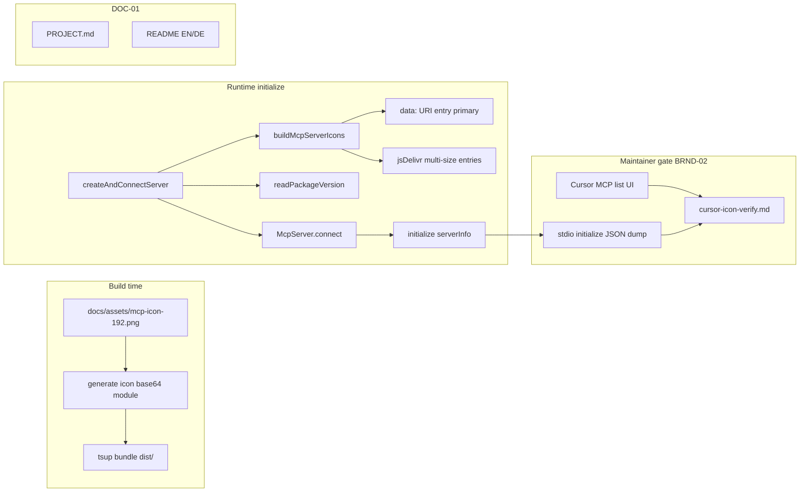

# Phase 27: Branding & Docs Stale Fix - Research

**Researched:** 2026-07-28
**Domain:** MCP `serverInfo` branding (icons + version), maintainer Cursor re-verify, public docs version parity
**Confidence:** HIGH

## Summary

Phase 27 schließt drei zusammenhängende Schulden aus v3.2: (1) **BRND-01** erweitert `initialize`/`serverInfo.icons` um spec-konforme Workarounds — **data-URI-Eintrag plus multi-size CDN-PNG-Einträge** (nicht entweder-oder); (2) **BRND-02** dokumentiert Maintainer-Re-Verify für **lokales `dist/`** und **`npx awesome-coolify-mcp`** in der bestehenden `docs/assets/cursor-icon-verify.md`, mit Akzeptanz einer **Cursor-Client-Limitation** falls die UI weiterhin den Buchstaben-Fallback zeigt; (3) **DOC-01** entfernt veraltete „pending Version Packages“-Formulierung und spiegelt npm **`1.0.1` shipped** wider, inkl. **`server.ts` version-Drift** (`0.1.0` hardcoded vs `package.json` `1.0.1`).

Kritischer Implementierungsbefund: **`npm pack` enthält keine `docs/assets/`** — `files` allowlist ist nur `dist`, `.env.example`, `LICENSE` (`package.json`). Runtime-`readFileSync` auf `docs/assets/mcp-icon-192.png` funktioniert im Repo/`dist/`-Dev-Pfad, **nicht** zuverlässig unter `npx awesome-coolify-mcp`. Data-URI muss daher **in `dist` eingebettet** werden (Build-Zeit-Generierung oder kleines generiertes Modul), während CDN-URLs den npm-Pfad ohne lokale Assets abdecken.

MCP-Spec/SDK bestätigen: `Icon.src` darf **HTTP(S) oder `data:` Base64** sein; `sizes` ist `string[]` (z. B. `48x48`, `192x192`, `any`); optional `theme: 'light' | 'dark'` [CITED: modelcontextprotocol/typescript-sdk spec.types Icon]. SDK-Test `mcp.icons.test.ts` zeigt multi-entry `icons` verbatim in `initialize` → `serverInfo.icons` [CITED: github.com/modelcontextprotocol/typescript-sdk].

**Primary recommendation:** Neues schmales `src/mcp/server-icons.ts` (oder gleichwertig) mit `buildMcpServerIcons()` — data URI aus **build-time embedded base64** (~42 KB für `mcp-icon-192.png`), plus jsDelivr multi-size CDN-Einträge; `createAndConnectServer` nutzt `readPackageVersion()` für `version`; Tests + `cursor-icon-verify.md` aktualisieren; DOC-01 via gezieltem Grep auf `pending Version Packages` / `0.1.0` in public surfaces.

<user_constraints>
## User Constraints (from CONTEXT.md)

### Locked Decisions

#### Icon workarounds (BRND-01)
- **D-01:** Advertise **both** a **data URI** icon entry **and** **multi-size CDN PNG** entries in `serverInfo.icons` (not data-URI-only, not CDN-only). — **Reversibility:** costly — published initialize payload / client display contract.
- **D-02:** Intent is **data URI as primary** branding signal; CDN remains in play as additional multi-size entries unless research/SDK/Cursor behavior shows a better ordering. Exact entry order and whether every CDN size stays are Claude's discretion after checking SDK + client behavior (user locked "you decide" on CDN primacy). — **Reversibility:** reversible.
- **D-03:** Experiment budget: try up to **four** icon variants (e.g. entry order, sizes, theme, data-only vs mixed). After four attempts without Cursor UI render, **stop** — do not leave the phase open until Cursor renders. — **Reversibility:** reversible.

#### Re-verify gate (BRND-02)
- **D-04:** Maintainer re-verify **both** paths: Cursor pointing at local **`dist/`** and **`npx awesome-coolify-mcp`**. — **Reversibility:** costly — BRND-02 success criterion.
- **D-05:** If Cursor MCP list still shows the generic letter fallback: phase **passes** with **documented client limitation** plus evidence (screenshot + initialize dump) — same outcome class as Phase 16 D-09, refreshed for v3.2 workarounds. — **Reversibility:** reversible.
- **D-06:** Update existing **`docs/assets/cursor-icon-verify.md`** (do not invent a parallel v3.2-only doc). Include outcomes/screenshots for both verify paths. — **Reversibility:** reversible.

#### Docs & version parity (DOC-01)
- **D-07:** Fix stale "pending Version Packages" / pre-ship wording and reflect npm **`1.0.1` shipped** across **public surfaces**: `.planning/PROJECT.md`, `README.md`, `README.de.md`, `docs/**/*.md`, `CONTRIBUTING.md` as applicable. — **Reversibility:** reversible.
- **D-08:** Also fix hard-coded MCP server version drift (`src/mcp/server.ts` still advertises `0.1.0`) so initialize/`McpServer` version aligns with **`package.json` (`1.0.1`)** — prefer existing `readPackageVersion` pattern from `meta.ts` if research confirms it. — **Reversibility:** costly — published `serverInfo.version`.
- **D-09:** **Do not** rewrite historical `CHANGELOG.md` release entries or `.planning/` milestone archives that correctly describe past `1.0.0` / Version Packages events. — **Reversibility:** one-way — would falsify release history.

### Claude's Discretion
- Exact `icons[]` ordering (data URI first vs CDN first) after SDK/Cursor probes (D-02).
- Which multi-size set to ship (e.g. 48×48 + 192×192) and whether to generate/export additional PNGs from Hex Robot Helper assets.
- How to embed data URI (build-time read of `mcp-icon-192.png` vs checked-in constant) — prefer maintainable approach, avoid huge diffs if avoidable.
- Exact four experiment variants to try within D-03 budget.
- Whether `meta.version` / other surfaces already use `readPackageVersion` and need only `server.ts` (or tests that assert `0.1.0`) updated.
- Wording for README branding section updates after workarounds land.

### Deferred Ideas (OUT OF SCOPE)
- Fixing Cursor IDE itself so MCP list icons always render — host product issue
- Rewriting CHANGELOG / `.planning/` historical "1.0.0 / Version Packages" narrative
- Service/DB log branding or docs (out of milestone scope)
- Full README→docs migration of every section (Phase 16 deferred idea; still out)
</user_constraints>

<phase_requirements>
## Phase Requirements

| ID | Description | Research Support |
|----|-------------|------------------|
| BRND-01 | MCP `initialize` advertises icons via spec-compliant workarounds (data URI and/or multi-size PNG entries) | MCP `Icon.src` supports `data:` URIs + HTTPS; multi-entry `icons[]` with `mimeType`/`sizes`/`theme`; embed data URI at build for npm path; CDN multi-size from existing `docs/assets/` |
| BRND-02 | Maintainer re-verify gate documents outcome for Cursor dev (`dist/`) and npm (`npx awesome-coolify-mcp`) paths; client limitation accepted if UI still omits custom icon | Refresh `cursor-icon-verify.md` template; stdio initialize dump procedure; Phase 16 D-09 precedent + forum evidence |
| DOC-01 | PROJECT.md and README EN/DE reflect npm `1.0.1` shipped state (no stale "pending Version Packages" wording) | Primary stale hit: `.planning/PROJECT.md` L5; `server.ts` `0.1.0`; `cursor-icon-verify.md` sample JSON; grep-driven sweep of public docs |
</phase_requirements>

## Architectural Responsibility Map

| Capability | Primary Tier | Secondary Tier | Rationale |
|------------|-------------|----------------|-----------|
| `serverInfo.icons` + `version` | MCP Server (`src/mcp/server.ts`) | Build script (`scripts/` or tsup hook) | Initialize payload owned by `McpServer` constructor; data URI needs build-time embed for npm |
| Icon asset source of truth | Static assets (`docs/assets/`) | jsDelivr CDN | Repo hosts PNGs; npm consumers fetch CDN, not local `docs/` |
| Maintainer UI verify | Maintainer manual (Cursor IDE) | `docs/assets/cursor-icon-verify.md` | Not automatable in CI; evidence doc is deliverable |
| Public version wording | Docs (PROJECT, README, docs/) | — | DOC-01 is copy/edit, no runtime |
| `meta.version` / `system.version` mcpVersion | Already correct (`readPackageVersion`) | — | Phase 24 shipped; only `server.ts` handshake version lags |

## Standard Stack

### Core

| Library | Version | Purpose | Why Standard |
|---------|---------|---------|--------------|
| `@modelcontextprotocol/server` | `^2.0.0-beta.4` (installed `2.0.0-beta.5`) | `McpServer` + `icons` on `Implementation` | Already project dependency; passes icons to `initialize` |
| `readPackageVersion` (`src/utils/package-version.ts`) | in-repo | Single `package.json` version source | Phase 24 pattern; works from `dist/` and npm |
| Node `fs` + `path` | Node ≥24 | Build-time PNG → base64 module | No new image dependency; ponytail |

### Supporting

| Library | Version | Purpose | When to Use |
|---------|---------|---------|-------------|
| `vitest` | `^4.1.10` | Branding regression tests | Assert `icons[]` shape + version parity |
| `tsup` | `^8.5.1` | Bundle `dist/index.js` | Hook build to generate icon data before bundle |

### Alternatives Considered

| Instead of | Could Use | Tradeoff |
|------------|-----------|----------|
| Build-time base64 module | Checked-in 42 KB string in `server.ts` | Works but noisy diff; violates D-02 “avoid huge diffs” |
| Runtime `readFileSync(docs/assets/...)` | — | **Fails on npm** — assets not in tarball |
| Image lib (sharp) for 48×48 export | Existing `favicon-32.png` / `mcp-icon-192.png` | YAGNI unless Cursor probe needs exact 48×48 |

**Installation:** Keine neuen npm-Pakete.

**Version verification:** `@modelcontextprotocol/server@2.0.0-beta.5` via `node -e "require('./node_modules/@modelcontextprotocol/server/package.json').version"` [VERIFIED: npm registry].

## Package Legitimacy Audit

> Phase installiert **keine** neuen externen Pakete.

| Package | Registry | Verdict | Disposition |
|---------|----------|---------|-------------|
| — | — | — | N/A |

**Packages removed due to [SLOP] verdict:** none  
**Packages flagged as suspicious [SUS]:** none

## Architecture Patterns

### System Architecture Diagram



### Recommended Project Structure

```
src/
├── mcp/
│   ├── server.ts              # McpServer ctor: version + icons wire-up
│   ├── server-icons.ts        # buildMcpServerIcons() — data URI + CDN entries
│   ├── mcp-icon-data.ts       # generated base64 (build script) OR inline export
│   └── server.test.ts         # BRND assertions (extend for data URI + multi-size)
├── utils/
│   └── package-version.ts     # reuse for server.ts version (D-08)
docs/assets/
├── mcp-icon-192.png           # primary icon source (~31 KB)
├── favicon-32.png             # optional CDN 32×32 entry (~1 KB)
├── cursor-icon-verify.md      # BRND-02 evidence (refresh, don't fork)
scripts/
└── generate-mcp-icon-data.mjs # optional: PNG → TS constant pre-tsup
```

### Pattern 1: Dual icons[] (data URI + CDN multi-size)

**What:** `icons` array with ≥2 entries: embedded `data:image/png;base64,...` first (D-02 primary), plus 1–2 jsDelivr PNG URLs with explicit `sizes`.

**When to use:** Always — locked D-01.

**Example:**

```typescript
// Source: modelcontextprotocol/typescript-sdk mcp.icons.test.ts + spec Icon interface
import { readPackageVersion } from '../utils/package-version.js';
import { MCP_ICON_192_BASE64 } from './mcp-icon-data.js';

const CDN = 'https://cdn.jsdelivr.net/gh/clezcoding/awesome-coolify@main/docs/assets';

export function buildMcpServerIcons() {
  return [
    {
      src: `data:image/png;base64,${MCP_ICON_192_BASE64}`,
      mimeType: 'image/png',
      sizes: ['192x192'],
    },
    {
      src: `${CDN}/favicon-32.png`,
      mimeType: 'image/png',
      sizes: ['32x32'],
    },
    {
      src: `${CDN}/mcp-icon-192.png`,
      mimeType: 'image/png',
      sizes: ['192x192'],
    },
  ];
}

// server.ts
const server = new McpServer({
  name: 'awesome-coolify-mcp',
  version: readPackageVersion(),
  title: 'Awesome Coolify',
  description: '...', // package.json verbatim
  websiteUrl: 'https://github.com/clezcoding/awesome-coolify',
  icons: buildMcpServerIcons(),
});
```

### Pattern 2: Build-time base64 embed (npm-safe)

**What:** Pre-tsup script reads `docs/assets/mcp-icon-192.png`, writes `src/mcp/mcp-icon-data.ts` exporting one string constant (~42 KB data URI payload).

**When to use:** Required for `npx` path — `docs/` not in npm tarball.

**Example:**

```javascript
// scripts/generate-mcp-icon-data.mjs
import { readFileSync, writeFileSync } from 'node:fs';
const b64 = readFileSync('docs/assets/mcp-icon-192.png').toString('base64');
writeFileSync(
  'src/mcp/mcp-icon-data.ts',
  `// Auto-generated — do not edit\nexport const MCP_ICON_192_BASE64 = ${JSON.stringify(b64)};\n`,
);
```

Wire: `"build": "node scripts/generate-mcp-icon-data.mjs && tsup"` (or `prebuild`).

### Pattern 3: Four experiment variants (D-03 budget)

| # | Variant | Change | Stop condition |
|---|---------|--------|----------------|
| V1 | Baseline+ | data URI first + single CDN 192 (current CDN kept) | Default ship candidate |
| V2 | Multi-size CDN | V1 + `favicon-32` CDN entry (`32x32`) | If V1 UI fails |
| V3 | Order swap | CDN entries first, data URI last | If client prefers remote fetch |
| V4 | Theme hint | Add `theme: 'dark'` on data URI entry (same PNG) | Last attempt before client-limitation doc |

After V4 without Cursor render → **stop**; document client limitation per D-05 (do not block phase).

### Pattern 4: Initialize assertion test (SDK-aligned)

**What:** In-process `InMemoryTransport` + `initialize` → assert `serverInfo.icons` length/shape (mirrors SDK `mcp.icons.test.ts`).

**When to use:** Automated BRND-01 gate; complements source-regex tests in `server.test.ts`.

### Anti-Patterns to Avoid

- **Runtime-only filesystem icon read for data URI:** breaks `npx awesome-coolify-mcp` (no `docs/` in pack).
- **data-URI-only or CDN-only:** violates locked D-01.
- **New parallel verify doc:** violates D-06.
- **CHANGELOG / milestone archive rewrites:** violates D-09.
- **Hardcoded `version: '0.1.0'`:** violates D-08; `meta.version` already correct.

## Don't Hand-Roll

| Problem | Don't Build | Use Instead | Why |
|---------|-------------|-------------|-----|
| Package version in initialize | Hardcoded semver string | `readPackageVersion()` | Phase 24 single source; dist+npm path-safe |
| PNG → base64 | Custom image codec | Node `readFileSync` + `toString('base64')` at build | stdlib sufficient |
| MCP initialize wire format | Custom JSON-RPC | `McpServer` constructor `icons` field | SDK passes through verbatim |
| Cursor icon render fix | IDE patches | Document client limitation + evidence | Out of scope per deferred |
| Image resize pipeline | sharp/jimp for 48×48 | Existing `favicon-32.png` + `mcp-icon-192.png` with honest `sizes` | YAGNI unless probe requires 48×48 asset |

**Key insight:** Branding phase is wire-format + docs — reuse SDK and existing assets; npm packaging constraint drives build-time embed, not a new runtime subsystem.

## Common Pitfalls

### Pitfall 1: npm path ohne lokale Assets

**What goes wrong:** Data URI built via `readFileSync('docs/assets/...')` at runtime — works locally, empty/error under `npx`.

**Why it happens:** `package.json` `files` excludes `docs/`.

**How to avoid:** Build-time base64 module committed or generated pre-tsup; CDN entries for remote fallback.

**Warning signs:** `npx` initialize dump missing data URI or throws on startup.

### Pitfall 2: initialize `version` vs `meta.version` Drift

**What goes wrong:** `meta.version` returns `1.0.1`, `serverInfo.version` still `0.1.0`.

**Why it happens:** Phase 16 left handshake version literal; Phase 24 fixed meta/system only.

**How to avoid:** `version: readPackageVersion()` in `McpServer` ctor; update `cursor-icon-verify.md` sample JSON.

**Warning signs:** Grep `0.1.0` in `src/mcp/server.ts` or verify doc.

### Pitfall 3: BRND tests zu eng (nur jsDelivr)

**What goes wrong:** `server.test.ts` asserts single CDN URL — fails when data URI added.

**Why it happens:** Phase 16 tests locked CDN-only shape.

**How to avoid:** Assert `icons` contains `data:image/png;base64,` prefix AND jsDelivr URL(s); keep mimeType/sizes checks.

### Pitfall 4: Experiment-Budget überschreiten

**What goes wrong:** Endless Cursor icon chasing blocks v3.2 close.

**Why it happens:** Phase 16 already proved client limitation.

**How to avoid:** Max 4 variants (D-03); then D-05 pass with evidence.

### Pitfall 5: DOC-01 Scope creep

**What goes wrong:** Rewriting all README tool counts (17→18) or CHANGELOG history.

**Why it happens:** Broad “docs stale” interpretation.

**How to avoid:** D-07 targets **pending Version Packages / pre-ship** + **1.0.1 shipped**; D-09 forbids CHANGELOG/archive rewrites. README tool-count drift (17 vs 18) is **adjacent** — fix only if touched for branding section (discretion), not required for DOC-01 literal.

## Code Examples

### readPackageVersion (existing)

```typescript
// src/utils/package-version.ts — reuse for server.ts (D-08)
export function readPackageVersion(): string {
  if (cached) return cached;
  cached = JSON.parse(readFileSync(packageJsonPath(), 'utf8')).version as string;
  return cached;
}
```

### MCP Icon type (spec)

```typescript
// Source: modelcontextprotocol/typescript-sdk spec.types Icon
export interface Icon {
  src: string; // HTTP/HTTPS or data: URI with Base64
  mimeType?: string;
  sizes?: string[]; // e.g. "48x48", "any"
  theme?: 'light' | 'dark';
}
```

### Maintainer initialize dump (BRND-02)

```bash
# Local dist path — after npm run build
node -e "
const { spawn } = require('node:child_process');
const cp = spawn('node', ['dist/index.js'], { stdio: ['pipe','pipe','inherit'] });
let buf = '';
cp.stdout.on('data', d => { buf += d; if (buf.includes('serverInfo')) { console.log(buf); cp.kill(); }});
cp.stdin.write(JSON.stringify({jsonrpc:'2.0',id:1,method:'initialize',params:{protocolVersion:'2024-11-05',capabilities:{},clientInfo:{name:'verify',version:'1.0.0'}}})+'\n');
"

# npm path
npx --yes awesome-coolify-mcp@1.0.1  # same stdio probe after connect
```

*(Exact one-liner may use existing MCP client or Inspector — planner picks smallest runnable check.)*

## State of the Art

| Old Approach | Current Approach | When Changed | Impact |
|--------------|------------------|--------------|--------|
| Single jsDelivr 192×192 CDN icon | data URI + multi-size CDN entries | Phase 27 (planned) | BRND-01 workarounds |
| `version: '0.1.0'` in server.ts | `readPackageVersion()` | Phase 24 for meta; Phase 27 for server.ts | D-08 parity |
| Phase 16 D-09 client limitation | Refresh with v3.2 experiments | Phase 27 | BRND-02 evidence |

**Deprecated/outdated:**
- Assuming Cursor MCP list always renders custom icons — documented client limitation since Phase 16.

## Assumptions Log

| # | Claim | Section | Risk if Wrong |
|---|-------|---------|---------------|
| A1 | Cursor still won't render custom icons after data URI + multi-size (forum Mar 2026) | BRND-02 | Low — phase passes via D-05 anyway |
| A2 | `favicon-32.png` acceptable as small CDN size entry vs exact 48×48 | Pattern 3 V2 | Low — spec allows any WxH in `sizes` |
| A3 | ~42 KB base64 in bundle acceptable for MCP stdio | Pattern 2 | Low — initialize payload only |

## Open Questions (RESOLVED)

1. **README tool counts (17 vs 18) in DOC-01 scope?** → **RESOLVED: Out of DOC-01 scope** unless branding section touched. README/cloud.md tool-count drift (16–17 vs 18) is adjacent only — Plan **27-03** fixes locked stale Version Packages / 1.0.1 wording; broad tool-count refresh deferred unless already editing README `### 🎨 Branding` (27-03 prohibition enforces).

2. **Commit generated `mcp-icon-data.ts` or gitignore + generate in CI?** → **RESOLVED: Commit generated file via build hook.** Plan **27-01** tracer wires `node scripts/generate-mcp-icon-data.mjs` into `package.json` `build` before tsup; executor runs `npm run build` then **commits** `src/mcp/mcp-icon-data.ts` so vitest/husky see the constant without CI-only generation.

## Environment Availability

| Dependency | Required By | Available | Version | Fallback |
|------------|------------|-----------|---------|----------|
| Node.js | build, test, MCP server | ✓ | ≥24 (project engines) | — |
| pnpm/npm | build, test | ✓ | pnpm 11 / npm | npm ok |
| Cursor IDE | BRND-02 manual verify | ✓ [ASSUMED] | — | Document procedure; human checkpoint |
| jsDelivr CDN | CDN icon entries | ✓ (HTTP 200 per Phase 16) | — | data URI still ships |
| `npx awesome-coolify-mcp` | BRND-02 npm path | ✓ | 1.0.1 on registry [ASSUMED] | Pin `@1.0.1` in verify doc |

**Missing dependencies with no fallback:**
- None for implementation; Cursor UI verify is manual-only by design.

## Validation Architecture

### Test Framework

| Property | Value |
|----------|-------|
| Framework | vitest `^4.1.10` |
| Config file | `vitest.config.ts` |
| Quick run command | `npm test -- src/mcp/server.test.ts -x` |
| Full suite command | `npm test` |

### Phase Requirements → Test Map

| Req ID | Behavior | Test Type | Automated Command | File Exists? |
|--------|----------|-----------|-------------------|-------------|
| BRND-01 | `icons[]` has data URI + CDN entries | unit (source/initialize) | `npm test -- src/mcp/server.test.ts -x` | ✅ extend |
| BRND-01 | initialize `serverInfo.icons` shape | unit (optional) | `npm test -- src/mcp/server-icons.test.ts -x` | ❌ Wave 0 |
| BRND-02 | Verify doc updated | manual | Maintainer checklist in `cursor-icon-verify.md` | ✅ |
| DOC-01 | No `pending Version Packages` in PROJECT opener | unit/grep | `npm test` + rg gate in test or plan verify | ❌ optional Wave 0 |
| D-08 | `serverInfo.version` === `readPackageVersion()` | unit | extend `server.test.ts` | ✅ extend |

### Sampling Rate

- **Per task commit:** `npm test -- src/mcp/server.test.ts -x`
- **Per wave merge:** `npm test`
- **Phase gate:** Full suite green before `/gsd-verify-work`

### Wave 0 Gaps

- [ ] Extend `src/mcp/server.test.ts` — data URI prefix + multi-size CDN assertions (replace CDN-only BRND-03 checks) — **Plan 27-00 RED**
- [ ] `src/mcp/server-icons.test.ts` — `buildMcpServerIcons()` unit RED scaffolds — **Plan 27-00**
- [ ] `tests/integration/doc-version-parity.test.ts` — PROJECT opener stale-string RED gate — **Plan 27-00**
- [ ] Optional initialize integration test via `InMemoryTransport` (SDK pattern) — discretion, not blocking
- [ ] `scripts/generate-mcp-icon-data.mjs` + `package.json` build script wire-up — **Plan 27-01** (not Wave 0)
- [ ] DOC-01: `.planning/PROJECT.md` L5 stale opener fix — **Plan 27-03** (flip doc-version-parity GREEN)

## Security Domain

### Applicable ASVS Categories

| ASVS Category | Applies | Standard Control |
|---------------|---------|------------------|
| V2 Authentication | no | — |
| V3 Session Management | no | — |
| V4 Access Control | no | — |
| V5 Input Validation | no (metadata only) | icons are server-originated constants |
| V6 Cryptography | no | base64 embed is not encryption |

### Known Threat Patterns for MCP branding

| Pattern | STRIDE | Standard Mitigation |
|---------|--------|---------------------|
| Malicious SVG in icons | Tampering | Use PNG only (locked assets); spec warns on SVG |
| Untrusted remote icon URL | Spoofing | jsDelivr from own repo path only; data URI self-sourced |
| Oversized initialize payload | DoS | ~42 KB icon acceptable; avoid 788 KB `favicon-512` in data URI |

## Project Constraints (from .cursor/rules/)

- **Ponytail / YAGNI:** Min diff; reuse `readPackageVersion`; no new deps; build-time embed over 42 KB hand-typed constant in `server.ts`.
- **Honey:** Terse plans; no speculative README full migration (deferred).
- **gsd-ship-labels:** Phase ship → `./scripts/gsd-ship-post.sh <pr>` (no per-phase npm release; milestone-only Changesets).
- **spike-findings:** Implementation gotchas → `Skill("spike-findings-awesome-coolify")` if executor hits Coolify-specific issues (unlikely this phase).
- **graphify:** Run `graphify update .` after code edits (AST-only).
- **context7 / wigolo:** Prefer for library docs and web evidence.
- **No new MCP tools** (locked in CONTEXT domain).
- **README EN/DE parity:** If branding section edited, run `tests/integration/docs-parity.test.ts`.

## Sources

### Primary (HIGH confidence)

- [CITED: modelcontextprotocol/typescript-sdk spec.types Icon] — `src` HTTP/data URI; `sizes[]`; `theme`
- [CITED: github.com/modelcontextprotocol/typescript-sdk mcp.icons.test.ts] — multi-entry icons in initialize
- In-repo: `src/mcp/server.ts`, `src/utils/package-version.ts`, `package.json` `files` allowlist
- In-repo: `docs/assets/cursor-icon-verify.md` (Phase 16 D-09)

### Secondary (MEDIUM confidence)

- [CITED: forum.cursor.com/t/cant-get-mcp-icons-to-work-in-cursor-ide/153939] — client may omit icon UI
- Phase 16 CONTEXT D-05/D-06/D-09 — jsDelivr CDN, dedicated mcp-icon-192, client limitation precedent

### Tertiary (LOW confidence)

- [ASSUMED] Cursor behavior unchanged since Mar 2026 forum thread — validate in BRND-02 gate

## Metadata

**Confidence breakdown:**
- Standard stack: HIGH — in-repo patterns + MCP spec/SDK cited
- Architecture: HIGH — npm packaging constraint verified in `package.json`
- Pitfalls: HIGH — Phase 16 + Phase 24 precedents

**Research date:** 2026-07-28  
**Valid until:** 2026-08-28 (stable MCP spec; Cursor UI may change faster — re-verify at BRND-02)
