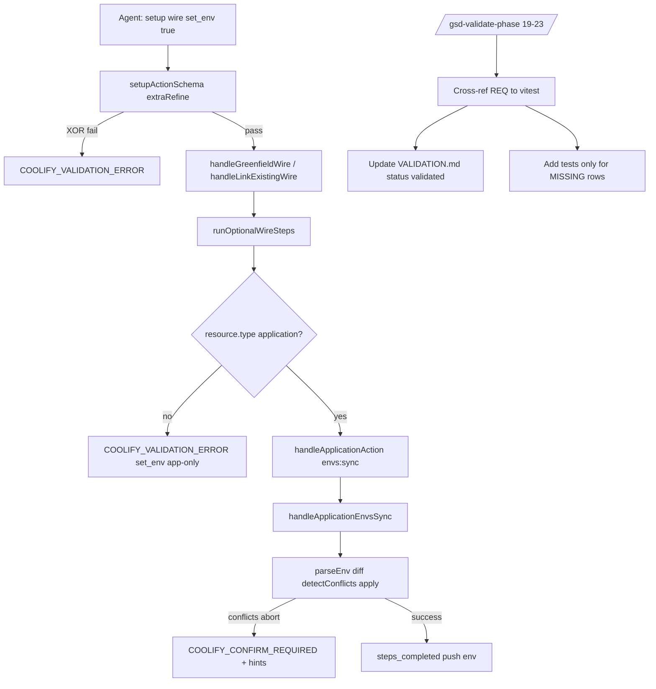

# Phase 23.1: Address tech debt: set_env + Nyquist validation - Research

**Researched:** 2026-07-27
**Domain:** MCP setup wizard env sync delegation + Nyquist validation reconciliation (Phases 19–23)
**Confidence:** HIGH

<user_constraints>
## User Constraints (from CONTEXT.md)

### Locked Decisions

#### set_env — Env source & schema
- **D-01:** When `set_env: true`, require exactly one of `env_file` (local path) or `env_content` (inline `.env` text) on `setup.wire` — same mutual-exclusion contract as `application` `envs:sync`. No auto-detect of workspace `.env` without explicit param. — **Reversibility:** costly — published flat schema + skill/docs contract.
- **D-02:** Add `env_file` and `env_content` to `setupActionSchema` wire fields and `setupActionsCatalog` wire action required/optional field lists (required when `set_env: true`; omitted when `set_env` false/off).

#### set_env — Modes & link-existing
- **D-03:** `set_env` runs in **both** `greenfield` and `link-existing` when `application_uuid` is known — fixes WR-07 (optional flags accepted on link-existing but never executed). Reuse `assertLinkExistingOptionalFlags` guard (already requires `application_uuid` for optional post-wire flags). — **Reversibility:** costly — behavior change vs current greenfield-only implementation.

#### set_env — Safety & apply policy
- **D-04:** When `set_env: true`, apply env sync directly (not dry-run-only) with **`confirm: true` implicit** — user/agent already opted in via flag; no extra soft-pause round for confirm. — **Reversibility:** one-way — safety contract for setup apply path.
- **D-05:** Default **`conflict_policy: 'abort'`** on setup-initiated env sync — on remote/local value conflicts, stop and surface conflict payload + recovery hints; do not silently overwrite or keep remote. Agent must ask human and retry with explicit policy if needed. — **Reversibility:** costly — default behavior for setup path.
- **D-06:** Delegate implementation to existing `handleApplicationAction` `envs:sync` (or shared internal helper extracted from it) — do not duplicate Coolify env API calls in `setup.ts`. Pass `uuid: application_uuid`, resolved env source, `dry_run: false`, `confirm: true`, `conflict_policy: 'abort'` unless planner adds optional override param (default locked to abort).

#### set_env — Step reporting
- **D-07:** Push `'env'` to `steps_completed` only after successful `envs:sync` apply — never on no-op or validation skip (aligns with WR-06 fix spirit for domains, but WR-06 itself is deferred per D-12).

#### Nyquist — Scope
- **D-08:** Run full Nyquist reconciliation for **all five v3.1 phases: 19, 20, 21, 22, 23** — not a subset. Milestone-close gate. — **Reversibility:** costly — milestone ship criteria.

#### Nyquist — Depth & coverage
- **D-09:** Use **`/gsd-validate-phase {N}`** per phase (19 through 23) — fill per-task verification maps, set `status: validated`, and `nyquist_compliant: true` only when earned. — **Reversibility:** costly — validation artifacts across five phase dirs.
- **D-10:** **100% REQ-row coverage** — every requirement ID mapped in each phase's VALIDATION.md must have an existing automated test (green) or a new test added in this phase; no documented gaps, no "pending" rows at close. Includes known gaps such as Phase 19 prompt tests and Phase 22 `set_env` tests. — **Reversibility:** one-way — ship gate quality bar.

#### Scope boundary
- **D-11:** **Strict scope:** only `set_env` implementation + Nyquist 19–23. Defer all other v3.1-MILESTONE-AUDIT tech-debt items (see Deferred Ideas). — **Reversibility:** reversible — backlog items unchanged.

### Claude's Discretion
- Exact Zod field names (`env_file` / `env_content` vs shorter aliases) — must match `application` `envs:sync` names.
- Whether to extract a shared `syncApplicationEnv(...)` helper vs inline `handleApplicationAction` call from setup.
- Plan wave split (set_env first vs Nyquist-first vs interleaved).
- Optional `prune` exposure on setup wire (default off; not discussed — omit unless planner finds REQ tie-in).
- Order of `/gsd-validate-phase` runs (19→23 sequential recommended).

### Deferred Ideas (OUT OF SCOPE)
- **WR-06** — `include_domains: true` marks step complete without domains when list empty
- **D-03 CLI** — `src/cli/setup-wizard.ts` deferred wrapper
- **Phase 19 nits** — logs max_chars WR-03, description `\n` spacing WR-04, manifest recovery WR-05
- **Phase 20** — README list-types row, optional createPublicApplication test
- **Phase 21** — timeout payload edge cases (info-only)
- **Phase 23** — Version Packages npm @1.0.0 publish, 57 OpenAPI gap backlog
- **Auto-detect `.env`** — user chose explicit params only (D-01)
</user_constraints>

<phase_requirements>
## Phase Requirements

| ID | Description | Research Support |
|----|-------------|------------------|
| SETUP-02 | Setup wizard wires Coolify project/environment/server linkage and updates workspace manifest | `set_env` completes optional env path on setup wire; delegate to `application` `envs:sync`; schema + tests in `setup.test.ts`; docs/skills update for `env_file`/`env_content` when `set_env: true` |
| DX-01..04, RECIPE-*, WATCH-*, SETUP-01/03, SKILL-*, OAPI-*, PUB-* | v3.1 reqs owned by Phases 19–23 | Nyquist reconciliation via `/gsd-validate-phase` 19→23; flip draft `*-VALIDATION.md` rows from pending to green; add missing tests only where REQ rows still lack automated coverage (D-10) |
</phase_requirements>

## Summary

Phase 23.1 closes two milestone-close blockers before `/gsd-complete-milestone v3.1`. First, **`setup.wire(set_env:true)`** is a documented ponytail no-op at `setup.ts:737–740`: it pushes `'env'` to `steps_completed` without calling env sync. The fix is a thin delegation to the existing Phase 12 `handleApplicationEnvsSync` pipeline via `handleApplicationAction({ action: 'envs:sync', ... })`, plus schema fields `env_file`/`env_content` and an `extraRefine` XOR gate matching `application.ts:754–763`. Second, **Nyquist validation** for Phases 19–23 is artifact debt: all five `*-VALIDATION.md` files remain `status: draft` with pending per-task rows, while the implementation test suite is already green (**1104 tests**, verified 2026-07-27). Reconciliation is primarily `/gsd-validate-phase` cross-reference + map updates, plus new `set_env` tests for Phase 22/SETUP-02 coverage.

Link-existing optional steps already route through `runOptionalWireSteps` (WR-07 fixed); `set_env` will run in both modes when an application resource UUID is known. Guard `resource.type === 'application'` before sync — `create-one-click` greenfield yields `type: 'service'`, and `envs:sync` is app-only per Phase 12 D-09 [VERIFIED: codebase grep `application.ts` envs:sync handler].

**Primary recommendation:** Wave 1 — implement `set_env` delegation + `setup.test.ts` coverage; Wave 2 — run `/gsd-validate-phase 19` through `23` sequentially, adding tests only for REQ rows still MISSING after cross-reference; Wave 3 — update `docs/en/setup.md` + `skills/coolify-setup/SKILL.md` with explicit env params.

## Architectural Responsibility Map

| Capability | Primary Tier | Secondary Tier | Rationale |
|------------|-------------|----------------|-----------|
| Setup wire orchestration | API / Backend (MCP tool handler) | — | `setup.ts` owns step machine, manifest, gh preflight |
| Env parse/diff/apply | API / Backend (`application` tool) | — | Phase 12 smart-sync engine; setup must not duplicate |
| Schema XOR validation | API / Backend (Zod `extraRefine`) | — | Flat schema contract at MCP boundary |
| Nyquist REQ→test mapping | Build / CI (vitest + VALIDATION.md) | — | Artifact reconciliation, not runtime |
| Human conflict resolution | Agent + human | API error payload | `COOLIFY_CONFIRM_REQUIRED` + `conflict_policy` hints on abort |

## Standard Stack

### Core

| Library | Version | Purpose | Why Standard |
|---------|---------|---------|--------------|
| vitest | ^4.1.10 [VERIFIED: npm registry] | Unit/integration tests | Project test runner; 1104 tests green |
| zod | ^4.4.3 [VERIFIED: npm registry] | Flat action schemas + `extraRefine` | Used by `createFlatActionSchema` across all tools |
| `@modelcontextprotocol/server` | ^2.0.0-beta.4 [VERIFIED: package.json] | MCP tool registration | Existing setup tool host |

### Supporting

| Library | Version | Purpose | When to Use |
|---------|---------|---------|-------------|
| `createFlatActionSchema` | internal | Action routing + field allowlists | All setup schema changes |
| `handleApplicationAction` | internal | `envs:sync` delegation | set_env apply path (D-06) |
| `/gsd-validate-phase` workflow | GSD | Nyquist reconciliation | Phases 19–23 (D-08, D-09) |

### Alternatives Considered

| Instead of | Could Use | Tradeoff |
|------------|-----------|----------|
| Inline `handleApplicationAction` call | Extract `syncApplicationEnv()` helper | Helper only if reused >1 caller; single call site favors inline (discretion D-06) |
| Manual VALIDATION.md edits | `/gsd-validate-phase` only | Workflow spawns `gsd-nyquist-auditor`, commits tests separately — required for D-09 |
| Auto-detect `.env` | Explicit `env_file`/`env_content` | Rejected by D-01 |

**Installation:** No new packages. Existing devDeps sufficient.

**Version verification:**

```bash
npm view vitest version   # 4.1.10
npm view zod version      # 4.4.3
npm test                  # 1104 passed (2026-07-27)
```

## Package Legitimacy Audit

> Phase installs **no new external packages**. Audit covers existing stack only.

| Package | Registry | Age | Downloads | Source Repo | Verdict | Disposition |
|---------|----------|-----|-----------|-------------|---------|-------------|
| vitest | npm | current | ~82M/wk | github.com/vitest-dev/vitest | OK (seam flagged SUS "too-new" — false positive on patch release) | Approved — already in devDeps |
| zod | npm | mature | ~240M/wk | github.com/colinhacks/zod | OK | Approved |

**Packages removed due to [SLOP] verdict:** none
**Packages flagged as suspicious [SUS]:** none actionable (no new installs)

## Architecture Patterns

### System Architecture Diagram



### Recommended Project Structure

```
src/mcp/tools/
├── setup.ts              # schema + runOptionalWireSteps set_env delegation
├── setup.test.ts         # new set_env describe block
├── application.ts        # envs:sync (unchanged handler; reuse)
└── shared-read-params.ts # createFlatActionSchema extraRefine hook

.planning/phases/
├── 19-dx-schemas-mcp-prompts/19-VALIDATION.md   # reconcile draft → validated
├── 20-recipes-service-list-types/20-VALIDATION.md
├── 21-deploy-watch/21-VALIDATION.md
├── 22-setup-wizard-ide-skills/22-VALIDATION.md
└── 23-openapi-coverage-npm-release/23-VALIDATION.md

docs/en/setup.md          # document env_file/env_content when set_env
skills/coolify-setup/SKILL.md
```

### Pattern 1: Schema-level XOR when flag enabled

**What:** Use `createFlatActionSchema` 5th-parameter `extraRefine` to require `env_file` XOR `env_content` when `set_env === true` on `wire`/`resume`.

**When to use:** Conditional required fields that depend on a boolean flag (same pattern as `application.ts` `envs:sync` superRefine).

**Example:**

```typescript
// Mirror application.ts:754-763 — Source: src/mcp/tools/application.ts
(data, ctx) => {
  if ((data.action === 'wire' || data.action === 'resume') && data.set_env === true) {
    const hasFile = typeof data.env_file === 'string' && data.env_file.length > 0;
    const hasContent = typeof data.env_content === 'string' && data.env_content.length > 0;
    if (hasFile === hasContent) {
      ctx.addIssue({
        code: 'custom',
        message:
          'Exactly one of env_file (local path) or env_content (inline .env text) is required when set_env:true',
        params: { code: 'COOLIFY_VALIDATION_ERROR' },
      });
    }
  }
}
```

### Pattern 2: Delegate apply to existing handler

**What:** Call `handleApplicationAction` with locked apply params; propagate errors via `rethrowHandlerError`.

**When to use:** Any setup optional step that maps 1:1 to an existing application/deployment action (mirrors `deploy_and_watch` at `setup.ts:742–777`).

**Example:**

```typescript
// Source: setup.ts deploy_and_watch pattern + application envs:sync contract
const syncResult = await handleApplicationAction(
  {
    action: 'envs:sync',
    uuid: resource.uuid,
    ...(parsed.env_file ? { env_file: parsed.env_file } : { env_content: parsed.env_content }),
    dry_run: false,
    confirm: true,
    conflict_policy: 'abort',
    instance: parsed.instance,
  },
  env,
);
if (isApplicationErrorResult(syncResult)) {
  rethrowHandlerError(syncResult);
}
stepsCompleted.push('env'); // D-07: only after success
```

### Pattern 3: Nyquist validate-phase reconciliation

**What:** For each phase 19–23, run `/gsd-validate-phase {N}`: read PLAN/SUMMARY, cross-ref requirements to vitest files, spawn `gsd-nyquist-auditor` for MISSING rows, update `*-VALIDATION.md` frontmatter to `status: validated` and `nyquist_compliant: true` when earned.

**When to use:** Milestone-close when `workflow.nyquist_validation: true` and audit shows `not_validated_phases: [19,20,21,22,23]`.

### Anti-Patterns to Avoid

- **False progress on `env` step:** Current no-op pushes `'env'` before sync — violates D-07 and mirrors deferred WR-06 domains bug.
- **Duplicating env API calls in setup.ts:** Violates D-06; Phase 12 rollback/conflict logic would diverge.
- **set_env on service resources:** `create-one-click` greenfield creates `type: 'service'` — `envs:sync` is application-only; throw validation error, do not no-op silently.
- **Skipping validate-phase workflow:** Manual VALIDATION.md edits without running tests leave D-10 unmet.
- **Batch Nyquist without per-phase commits:** Workflow commits test files separately from VALIDATION.md docs.

## Don't Hand-Roll

| Problem | Don't Build | Use Instead | Why |
|---------|-------------|-------------|-----|
| .env parse/diff/conflict/apply | Custom sync in setup.ts | `handleApplicationEnvsSync` via `handleApplicationAction` | Rollback, masking, conflict_policy, 1 MiB bounds already implemented |
| XOR env source validation | Ad-hoc runtime checks only | `extraRefine` on `setupActionSchema` | Fail before wire side-effects; matches application contract |
| REQ→test gap analysis | Planner guesswork | `/gsd-validate-phase` + `gsd-nyquist-auditor` | Spawns tests, updates maps, enforces sampling continuity |
| Nyquist frontmatter | Hand-set `nyquist_compliant: true` without audit | validate-phase Step 6 only when gaps resolved | Phase 19 already has stale `nyquist_compliant: true` in draft — must reconcile |

**Key insight:** Setup is an orchestrator; env sync is a domain action. The ponytail no-op exists because schema params were never added — not because sync logic is missing.

## Common Pitfalls

### Pitfall 1: set_env on non-application greenfield

**What goes wrong:** Greenfield `create-one-click` produces `resource.type === 'service'`; calling `envs:sync` would fail or mis-apply.

**Why it happens:** Optional steps run after any recipe type.

**How to avoid:** Guard `resource.type === 'application'` (mirror `deploy_and_watch` guard at `setup.ts:742`).

**Warning signs:** Test passes with mocked application handler but live one-click wire fails.

### Pitfall 2: Marking env step complete on validation failure

**What goes wrong:** Today `steps_completed` includes `'env'` even when sync never ran (lines 737–739).

**Why it happens:** Placeholder until params ship.

**How to avoid:** Push `'env'` only after successful `handleApplicationAction` return (D-07).

**Warning signs:** `steps_remaining` empty while remote env unchanged.

### Pitfall 3: Stale VALIDATION.md blocks milestone close

**What goes wrong:** Phase 19 lists `tests/mcp/prompts.test.ts` as ❌ missing; file exists with 6 passing tests.

**Why it happens:** Plans seed draft VALIDATION.md; `/gsd-validate-phase` never run post-ship.

**How to avoid:** Run validate-phase per phase; update File Exists + Status columns from live `npx vitest run`.

**Warning signs:** `status: draft` + all rows `⬜ pending` despite green CI.

### Pitfall 4: link-existing set_env without application_uuid

**What goes wrong:** Optional flags accepted but no resource to sync.

**Why it happens:** Missing UUID on link-existing wire.

**How to avoid:** Existing `assertLinkExistingOptionalFlags` (D-03) — verify test coverage in Phase 23.1.

### Pitfall 5: Conflict overwrite without human gate

**What goes wrong:** Setup path silently overwrites remote env values.

**Why it happens:** Omitting `conflict_policy: 'abort'` or using default overwrite.

**How to avoid:** Pass `conflict_policy: 'abort'` explicitly (D-05); surface `COOLIFY_CONFIRM_REQUIRED` payload to agent.

## Code Examples

### Application envs:sync XOR + confirm gate (reuse contract)

```typescript
// Source: src/mcp/tools/application.ts:754-773
if (data.action === 'envs:sync') {
  const hasFile = typeof data.env_file === 'string' && data.env_file.length > 0;
  const hasContent = typeof data.env_content === 'string' && data.env_content.length > 0;
  if (hasFile === hasContent) {
    ctx.addIssue({ /* COOLIFY_VALIDATION_ERROR */ });
  }
  const needsConfirm = data.dry_run === false || data.prune === true;
  if (needsConfirm && data.confirm !== true) {
    ctx.addIssue({ /* COOLIFY_CONFIRM_REQUIRED */ });
  }
}
```

### setup.test.ts mock pattern for set_env (extend existing)

```typescript
// Source: src/mcp/tools/setup.test.ts — deploy_and_watch block pattern
vi.mocked(handleApplicationAction).mockResolvedValue({
  data: { dry_run: false, added: [], updated: [{ key: 'FOO' }] },
});

await handleSetupAction({
  action: 'wire',
  mode: 'link-existing',
  application_uuid: APP_UUID,
  project_uuid: PROJECT_UUID,
  environment_uuid: ENV_UUID,
  server_uuid: SERVER_UUID,
  skip_gh: true,
  set_env: true,
  env_content: 'FOO=bar',
}, testEnv);

expect(handleApplicationAction).toHaveBeenCalledWith(
  expect.objectContaining({
    action: 'envs:sync',
    uuid: APP_UUID,
    env_content: 'FOO=bar',
    dry_run: false,
    confirm: true,
    conflict_policy: 'abort',
  }),
  testEnv,
);
expect(result.data.steps_completed).toContain('env');
```

### validate-phase frontmatter target

```yaml
# Source: $HOME/.cursor/gsd-core/workflows/validate-phase.md §6
status: validated
nyquist_compliant: true
wave_0_complete: true
```

## State of the Art

| Old Approach | Current Approach | When Changed | Impact |
|--------------|------------------|--------------|--------|
| setup set_env no-op | Delegate to application envs:sync | Phase 23.1 (planned) | Closes SETUP-02 optional env path + audit integration warning |
| Nyquist draft VALIDATION.md | validate-phase reconciliation | Phase 23.1 (planned) | Milestone ship gate |
| Link-existing optional flags ignored | `runOptionalWireSteps` for both modes | Phase 22 post-review | set_env runs on link-existing when `application_uuid` present |

**Deprecated/outdated:**
- `runOptionalGreenfieldSteps` naming in CONTEXT — codebase uses unified `runOptionalWireSteps` for both modes [VERIFIED: setup.ts:701].

## Assumptions Log

| # | Claim | Section | Risk if Wrong |
|---|-------|---------|---------------|
| A1 | `create-one-click` greenfield must reject `set_env:true` (service resource) | Pitfall 1 | Silent failure or wrong API surface |
| A2 | Phase 19–23 tests are substantially complete; Nyquist work is mostly artifact refresh | Summary | Underestimate if auditor finds MISSING REQ rows |
| A3 | No new npm packages required | Standard Stack | Low — confirmed no new deps |
| A4 | `pnpm test` and `npm test` both resolve to vitest run | Validation Architecture | Doc drift only — package.json uses `vitest run` |

## Open Questions

1. **Extract `syncApplicationEnv` helper?**
   - What we know: Single call site in `runOptionalWireSteps`; `deploy_and_watch` inlines handler calls.
   - Recommendation: Inline unless second caller appears (matches discretion + ponytail ladder).

2. **Wave ordering: set_env vs Nyquist first?**
   - What we know: set_env tests are net-new; Nyquist 22 row needs set_env coverage.
   - Recommendation: set_env implementation + tests first, then validate-phase 19→23 (22 benefits from new tests).

3. **Phase 19 frontmatter `nyquist_compliant: true` while `status: draft`?**
   - What we know: Seeded optimistically; audit marks NOT-VALIDATED.
   - Recommendation: validate-phase resets frontmatter from earned state only.

## Environment Availability

| Dependency | Required By | Available | Version | Fallback |
|------------|------------|-----------|---------|----------|
| Node.js | vitest, MCP build | ✓ | >=24 (engines) | — |
| npm/pnpm | test scripts | ✓ | npm test works | `pnpm test` equivalent |
| vitest | All automated verify | ✓ | 4.1.10 | — |
| gh CLI | SETUP-01 live only | not probed | — | Mocked in unit tests |
| Coolify API | Live env sync | not required for phase | — | Mock `handleApplicationAction` |

**Missing dependencies with no fallback:** none for Phase 23.1 unit scope.

**Missing dependencies with fallback:** Live Coolify + gh remain manual-only per existing VALIDATION.md tables.

## Validation Architecture

### Test Framework

| Property | Value |
|----------|-------|
| Framework | Vitest ^4.1.10 |
| Config file | `vitest.config.ts` |
| Quick run command | `npx vitest run src/mcp/tools/setup.test.ts -x` |
| Full suite command | `npm test` (1104 tests, ~9s) |

### Phase Requirements → Test Map

| Req ID | Behavior | Test Type | Automated Command | File Exists? |
|--------|----------|-----------|-------------------|-------------|
| SETUP-02 (set_env path) | setup wire delegates envs:sync with XOR params | unit | `npx vitest run src/mcp/tools/setup.test.ts -t set_env` | ❌ Wave 0 (add in 23.1) |
| SETUP-02 (manifest/linkage) | existing wire tests | unit | `npx vitest run src/mcp/tools/setup.test.ts` | ✅ |
| DX-01..04 (Phase 19) | schemas + prompts | unit | `npx vitest run tests/mcp/prompts.test.ts tests/mcp/server.test.ts` | ✅ (VALIDATION.md stale) |
| RECIPE-01..04 (Phase 20) | recipes + list-types | unit | `npx vitest run src/mcp/tools/recipe.test.ts src/mcp/tools/service.test.ts` | ✅ |
| WATCH-01..02 (Phase 21) | deploy watch | unit | `npx vitest run src/utils/deploy-watch-poll.test.ts src/mcp/tools/deployment.test.ts` | ✅ |
| SETUP-01/03, SKILL-01/02 (Phase 22) | setup + skills | unit | `npx vitest run src/mcp/tools/setup.test.ts src/skills/skills-manifest.test.ts` | ✅ (+ set_env gap) |
| OAPI-01/02, PUB-01/02 (Phase 23) | coverage + npm pack | unit | `npx vitest run tests/openapi-coverage.test.ts tests/npm-pack-allowlist.test.ts` | ✅ |

### Sampling Rate

- **Per task commit:** `npx vitest run src/mcp/tools/setup.test.ts -x` (set_env wave) or targeted file from VALIDATION map
- **Per wave merge:** `npm test`
- **Phase gate:** Full suite green + all five phases `status: validated` + `nyquist_compliant: true`

### Wave 0 Gaps

- [ ] `src/mcp/tools/setup.test.ts` — `describe('set_env')` with greenfield + link-existing + XOR validation + conflict abort + non-application rejection
- [ ] `setup.ts` — `env_file`/`env_content` schema fields + `extraRefine` + delegation (implementation wave, not test-only)
- [ ] Five `*-VALIDATION.md` — reconcile via `/gsd-validate-phase 19` … `23` (not hand-edited pending rows)

### Nyquist Reconciliation Inventory (current vs required)

| Phase | VALIDATION status | Tests on disk | Known stale rows | 23.1 action |
|-------|-------------------|---------------|------------------|-------------|
| 19 | draft | prompts.test.ts ✅ (6 tests) | PROMPT-* marked ❌ missing | validate-phase; flip REQ rows green |
| 20 | draft | recipe + service tests ✅ (140 combined with related) | All tasks ⬜ pending | validate-phase |
| 21 | draft | deploy-watch-poll + deployment ✅ | All tasks ⬜ pending | validate-phase |
| 22 | draft | setup + gh-preflight + skills ✅ | set_env untested | implement set_env + validate-phase |
| 23 | draft | openapi + npm-pack ✅ | Checkpoint rows (human verify) | validate-phase; keep manual-only for npm dashboard |

## Security Domain

### Applicable ASVS Categories

| ASVS Category | Applies | Standard Control |
|---------------|---------|-----------------|
| V2 Authentication | no | N/A — uses existing COOLIFY_TOKEN |
| V3 Session Management | no | N/A |
| V4 Access Control | partial | Instance routing unchanged |
| V5 Input Validation | yes | Zod XOR + env key validation via `parseEnvFileDetailed` |
| V6 Cryptography | no | N/A |

### Known Threat Patterns

| Pattern | STRIDE | Standard Mitigation |
|---------|--------|---------------------|
| Path traversal via `env_file` | Tampering | Reuse `readBoundedEnvFile` allowlist (`application.ts:2246+`) |
| Secret leakage in sync diff | Information disclosure | `maskEnvRecord` / sanitize in disposition (Phase 12) |
| Unauthorized env overwrite | Tampering | `confirm: true` + default `conflict_policy: 'abort'` (D-04, D-05) |
| Agent bypassing human on conflicts | Elevation | Propagate `COOLIFY_CONFIRM_REQUIRED` — do not swallow in setup |

## Project Constraints (from .cursor/rules/)

- **Ponytail / honey:** Minimum diff — delegate to existing `envs:sync`; no new abstractions unless earned.
- **Spike findings:** Implementation gotchas → `Skill("spike-findings-awesome-coolify")` before touching Coolify API edges.
- **GSD ship labels:** After phase PR, run `./scripts/gsd-ship-post.sh <pr-number>` (automerge + label hygiene).
- **Graphify:** Run `graphify update .` after modifying `src/mcp/tools/setup.ts`.
- **No `[ci skip]` on PR tips:** Required checks must run on HEAD.
- **Commit policy:** Research commit via `gsd_run query commit` when `commit_docs: true`.

## Sources

### Primary (HIGH confidence)

- `src/mcp/tools/setup.ts` — set_env no-op lines 737–740, `runOptionalWireSteps`, link-existing optional path
- `src/mcp/tools/application.ts` — `envs:sync` schema + `handleApplicationEnvsSync`
- `src/mcp/tools/setup.test.ts` — existing mock patterns; no set_env coverage
- `.planning/v3.1-MILESTONE-AUDIT.md` — Nyquist NOT-VALIDATED table, set_env integration warning
- `.planning/phases/23.1-address-tech-debt-set-env-nyquist-validation/23.1-CONTEXT.md` — locked D-01–D-11
- `$HOME/.cursor/gsd-core/workflows/validate-phase.md` — validate-phase procedure
- `npm test` run 2026-07-27 — 1104 tests passed

### Secondary (MEDIUM confidence)

- `.planning/phases/19–23/*-VALIDATION.md` — draft per-task maps (stale vs live tests)
- `docs/en/setup.md` — documents `set_env` flag; needs `env_file`/`env_content` params when shipped
- `skills/coolify-setup/SKILL.md` — same doc update surface

### Tertiary (LOW confidence)

- None material — implementation paths verified in repo

## Metadata

**Confidence breakdown:**
- Standard stack: HIGH — no new packages; vitest/zod verified on registry and in CI
- Architecture: HIGH — delegation pattern matches existing `deploy_and_watch` in same function
- Pitfalls: HIGH — no-op and app-only sync verified in source

**Research date:** 2026-07-27
**Valid until:** 2026-08-27 (stable MCP patterns; validate-phase workflow stable)
