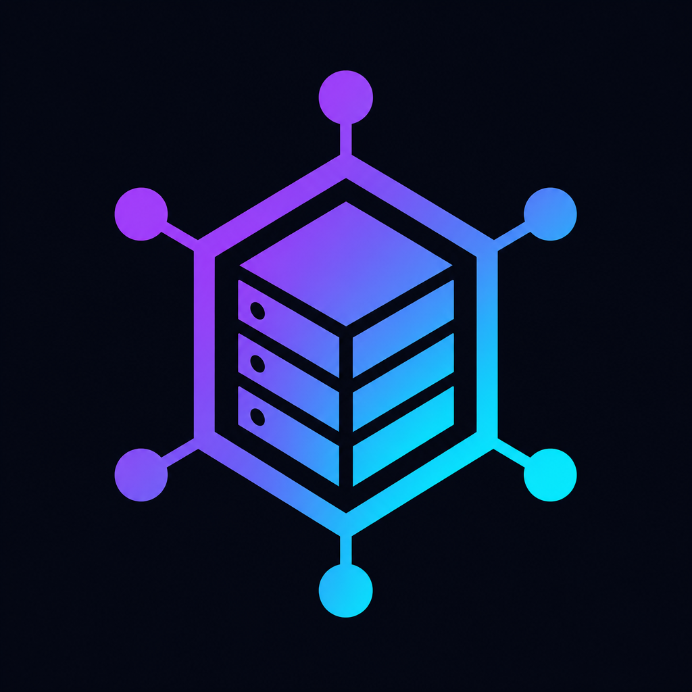
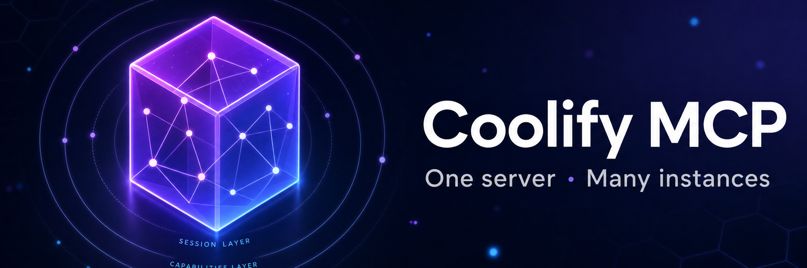
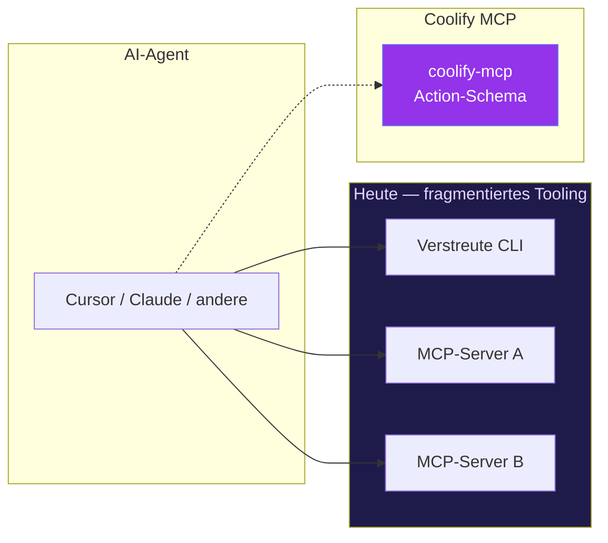
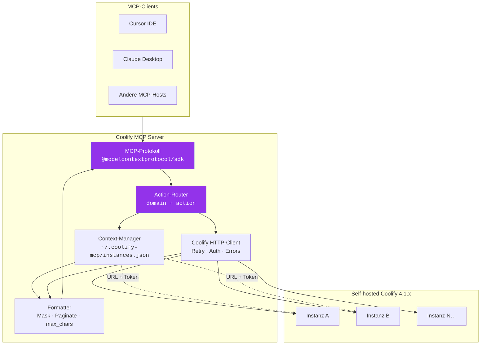
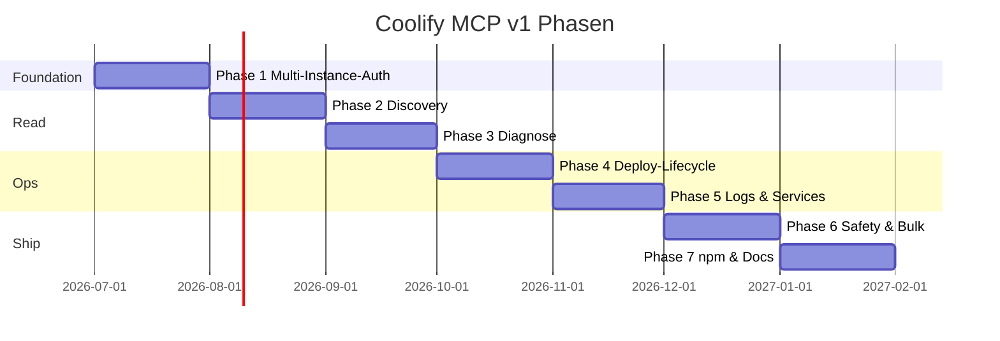

<!-- Generated by docs/readme — run: npm run build --prefix docs/readme -->
<div align="center">

<a href="README.md">🌐 English</a>

<picture>
  <source media="(prefers-color-scheme: dark)" srcset="assets/logo.png">
  
</picture>

# Coolify MCP Server

[](https://github.com/clezcoding/awesome-coolify-mcp)
[](https://github.com/clezcoding/awesome-coolify-mcp)
[](https://github.com/clezcoding/awesome-coolify-mcp)
[](https://github.com/clezcoding/awesome-coolify-mcp)
[](https://github.com/clezcoding/awesome-coolify-mcp)
[](https://github.com/clezcoding/awesome-coolify-mcp)

<br/>

<h3>Ein MCP-Server. Mehrere Coolify-Instanzen. Keine Workarounds.</h3>

<p>
  <a href="https://github.com/clezcoding/awesome-coolify-mcp"><strong>GitHub</strong></a> ·
  <a href="#schnellstart"><strong>Schnellstart</strong></a> ·
  <a href="mcp_features.md"><strong>Feature-Katalog</strong></a> ·
  <a href=".planning/ROADMAP.md"><strong>Roadmap</strong></a>
</p>

<p><sub>[Schnellstart](#schnellstart) · [Features](#features) · [Architektur](#architektur) · [Roadmap](#roadmap) · [Mitwirken](#mitwirken)</sub></p>



</div>

---

## Navigation

| | |
|:--|:--|
| **Repository** | [clezcoding/awesome-coolify-mcp](https://github.com/clezcoding/awesome-coolify-mcp) |
| **npm package** | `@clezcoding/coolify-mcp` — *kommt bald* |
| **Coolify API** | 4.1.x (self-hosted) |
| **Status** | Planung — v1 in aktiver Entwicklung |
| **Sprachen** | [Deutsch](README.de.md) · [English](README.md) |

<details>
<summary><strong>Inhaltsverzeichnis</strong></summary>

- [Auf einen Blick](#auf-einen-blick)
- [Warum Coolify MCP?](#warum-coolify-mcp)
- [Schnellstart](#schnellstart)
- [Features](#features)
- [Architektur](#architektur)
- [Tool-Schema](#tool-schema)
- [Multi-Instance](#multi-instance)
- [Sicherheit](#sicherheit)
- [Roadmap](#roadmap)
- [Entwicklungsstatus](#entwicklungsstatus)
- [Mitwirken](#mitwirken)

</details>

---

## Auf einen Blick

<table>
<tr>
<td width="55%" valign="top">

### Was du bekommst

- **Ein MCP-Server** für alle Coolify-Ops-Workflows
- **Multi-Instance** über eine zentrale `~/.coolify-mcp/instances.json`
- **Action-basierte Tools** — ~10 Domänen statt 60+ Endpunkte
- **Agent-first DX** — strukturierte Errors, Recovery-Hints, Payload-Caps
- **Nur self-hosted** — Coolify API **4.1.x**

</td>
<td width="45%" valign="top" align="center">


**Das ist Prism** — der neue Operator deines Agents.<br/>
<sub>Sie redet mit Coolify, damit dein Agent es nicht muss.</sub>

</td>
</tr>
</table>

| Meilenstein | Umfang | Ziel |
|-------------|--------|------|
| **v1** | Deploy, Logs, Diagnose, Multi-Instance, Safety-Gates | Ops-MVP |
| **v2** | Volle CRUD-Parität, Teams, Cloud-Tokens, Backups | Feature-Parität |

> [!TIP]
> Gebaut **zuerst für Agents**, dann für Menschen. Jede Response strukturiert, jeder Fehler reparierbar, jedes Secret standardmäßig maskiert.


---

## Warum Coolify MCP?

Drei überlappende Tools. Ein verwirrter Agent. Wartungs-Albtraum.



| Problem heute | Coolify MCP Antwort |
|---------------|---------------------|
| 60+ MCP-Einzeltools | Domänen-Tools + `action`-Parameter |
| Multi-Instance pro Config-Eintrag | Zentrale `instances.json` + Switch |
| Unstrukturierte API-Fehler | `COOLIFY_*` Codes + Recovery-Hints |
| Secrets leaken in den Kontext | Default-Maskierung, `reveal` opt-in |
| Destructive Ops ohne Guardrails | `confirm: true` Pflicht |
| Drei Docs, drei Schemas | Ein README, eine Wahrheit |

> [!IMPORTANT]
> **Design-Prinzip:** optimiere auf *Agent-Recovery* und *Kontext-Effizienz*, nicht auf API-Endpunkt-Parität am Tag eins.


---

## Schnellstart

> [!NOTE]
> npm-Paket noch nicht veröffentlicht. Lokales Dev / `npm link` bis Phase 7.

### 1 · Installieren (bald)

```bash
npx -y @clezcoding/coolify-mcp
```

### 2 · Instanzen konfigurieren

`~/.coolify-mcp/instances.json` anlegen:

```json
{
  "default": "production",
  "instances": {
    "production": {
      "name": "Production",
      "url": "https://coolify.example.com",
      "token": "YOUR_COOLIFY_API_TOKEN",
      "verifySsl": true
    }
  }
}
```

Token holen: **Coolify UI → Keys & Tokens → Create API Token**.

### 3 · Mit MCP-Client verbinden

`~/.cursor/mcp.json` (Cursor):

```json
{
  "mcpServers": {
    "coolify": {
      "command": "npx",
      "args": ["-y", "@clezcoding/coolify-mcp"]
    }
  }
}
```

Für Claude Desktop (macOS) denselben `mcpServers`-Block in
`~/Library/Application Support/Claude/claude_desktop_config.json` eintragen.

### 4 · Mit dem Agent reden

Client neu laden, dann fragen:

> *"Verifiziere meine Coolify-Verbindung und liste alle Applications auf Production."*

### Lokale Entwicklung

```json
{
  "mcpServers": {
    "coolify": {
      "command": "node",
      "args": ["/absoluter/pfad/zu/awesome-coolify/dist/index.js"],
      "env": { "NODE_ENV": "development" }
    }
  }
}
```


---

## Features

### v1 — Ops-MVP (52 Requirements · 7 Phasen)

| Phase | Fokus | Highlights |
|:-----:|-------|------------|
| **1** | Foundation | stdio MCP, Zod, `instances.json`, strukturierte Errors |
| **2** | Discovery | Infrastructure-Overview, Resource-Listen, Docs-Suche |
| **3** | Diagnose | App/Server-Diagnose, globaler Issue-Scan |
| **4** | Deploy | Start/Stop/Restart, Deploy + Wait-Mode, Batch-Deploy |
| **5** | Logs | Runtime-/Build-Logs, Service- & DB-Lifecycle |
| **6** | Safety | Bulk-Ops, `confirm`-Gate, Secret-Masking |
| **7** | Ship | npm publish, Docs, Client-Setup-Guides |

### Capability-Matrix

| Bereich | v1 | v2 |
|---------|:--:|:--:|
| Multi-Instance-Auth | ✅ | ✅ |
| Deploy & Monitor | ✅ | ✅ |
| Logs (capped / paginated) | ✅ | ✅ |
| Diagnose & Issue-Scan | ✅ | ✅ |
| App/DB/Service-CRUD | — | ✅ |
| Teams & Cloud-Tokens | — | ✅ |
| Backups & Scheduled Tasks | — | ✅ |
| Container-Exec | — | ⏳ API blockiert |

### Domänen-Tools (v1)

| Tool | Beispiel-Actions |
|------|------------------|
| `instance` | `add`, `list`, `switch`, `verify`, `set-default` |
| `system` | `overview`, `health`, `issues`, `search-docs` |
| `application` | `list`, `deploy`, `logs`, `diagnose`, `restart` |
| `service` | `list`, `start`, `deploy`, `logs` |
| `database` | `list`, `restart`, `logs` |
| `server` | `list`, `diagnose` |
| `deployment` | `get`, `cancel`, `build-logs` |
| `project` | `redeploy-all`, `restart-all` |
| `emergency` | `stop-all-apps` |

Vollständiger Katalog: [`mcp_features.md`](mcp_features.md)


---

## Architektur



### Layer-Verantwortlichkeiten

| Layer | Verantwortung |
|-------|---------------|
| **Protokoll** | JSON-RPC über stdio, Tool-Registrierung |
| **Router** | `application({ action: 'deploy' })` → Handler |
| **Context** | Multi-Instance-Registry, Default, aktiver Switch |
| **HTTP-Client** | Token-Injection, exponentielles Backoff |
| **Formatter** | Summary/Full-Projektion, Secret-Masking |

### Tech-Stack

| Komponente | Wahl |
|------------|------|
| Sprache | TypeScript 5.x |
| MCP-SDK | `@modelcontextprotocol/sdk` |
| Validierung | Zod |
| Transport | stdio |
| Distribution | npm (`npx @clezcoding/coolify-mcp`) |


---

## Tool-Schema

Statt **60+ granularer Tools** gruppt Coolify MCP Operationen nach **Domäne** mit einem **`action`**-Feld.

### Vorher vs nachher

<table>
<tr>
<th>❌ Legacy-Pattern</th>
<th>✅ Coolify MCP</th>
</tr>
<tr>
<td>

`get_application`<br/>
`deploy_application`<br/>
`list_application_logs`<br/>
`restart_application`<br/>
`get_application_envs`<br/>
… × 40 weitere

</td>
<td>

```json
{
  "tool": "application",
  "arguments": {
    "action": "deploy",
    "identifier": "my-app",
    "wait": true
  }
}
```

</td>
</tr>
</table>

### Beispiele

<details>
<summary><strong>Deploy mit Wait-Mode</strong></summary>

```json
{
  "tool": "application",
  "arguments": {
    "action": "deploy",
    "identifier": "my-nextjs-app",
    "forceRebuild": false,
    "wait": true,
    "timeoutSeconds": 600
  }
}
```

</details>

<details>
<summary><strong>Diagnose nach Domäne</strong></summary>

```json
{
  "tool": "application",
  "arguments": {
    "action": "diagnose",
    "identifier": "api.example.com",
    "projection": "summary"
  }
}
```

</details>

<details>
<summary><strong>Globaler Issue-Scan</strong></summary>

```json
{
  "tool": "system",
  "arguments": { "action": "issues" }
}
```

</details>

<details>
<summary><strong>Strukturierte Error-Response</strong></summary>

```json
{
  "error": {
    "code": "COOLIFY_UNAUTHORIZED",
    "httpStatus": 401,
    "message": "API token invalid or expired",
    "recoveryHints": [
      "Verify token in Coolify UI → Keys & Tokens",
      "Run instance action 'verify'",
      "Check instance id or switch instance"
    ]
  }
}
```

</details>


---

## Multi-Instance

Alle Instanzen leben in **`~/.coolify-mcp/instances.json`** — portabel über alle MCP-Clients.

```json
{
  "default": "production",
  "instances": {
    "production": {
      "name": "Production",
      "url": "https://coolify.example.com",
      "token": "YOUR_TOKEN",
      "verifySsl": true
    },
    "staging": {
      "name": "Staging",
      "url": "https://staging-coolify.example.com",
      "token": "YOUR_STAGING_TOKEN",
      "verifySsl": true
    },
    "homelab": {
      "name": "Homelab",
      "url": "http://192.168.1.50:8000",
      "token": "YOUR_HOMELAB_TOKEN",
      "verifySsl": false
    }
  }
}
```

### Instance-Actions

| Action | Beschreibung |
|--------|--------------|
| `add` | Neue Instanz registrieren |
| `list` | Alle Instanzen auflisten |
| `get` | Instanz-Details |
| `update` | URL, Token oder Name ändern |
| `delete` | Instanz entfernen |
| `set-default` | Default-Instanz setzen |
| `switch` / `use` | Aktive Instanz wechseln |
| `verify` | Verbindung + API-Version testen |

> [!TIP]
> **Token-Override** pro Request ist unterstützt — der Override wird nie auf Platte geschrieben.


---

## Sicherheit

| Maßnahme | Verhalten |
|----------|----------|
| **Token-Storage** | Nur in `instances.json` — nie in Tool-Responses geprinted |
| **Default-Maskierung** | Passwörter, Webhook-Secrets, Env-Werte → `***` |
| **Reveal opt-in** | `reveal: true` / `showSensitive: true` auf expliziten Wunsch |
| **Confirm-Gate** | Destructive Ops brauchen `confirm: true` |
| **Payload-Limits** | `max_chars` cappen große Log-/Output-Payloads |
| **SSL** | `verifySsl` pro Instanz (homelab-freundlich) |

> [!WARNING]
> Destructive Operationen werden ohne explizite Bestätigung abgelehnt.

```json
// Abgelehnt — confirm fehlt
{ "tool": "emergency", "arguments": { "action": "stop-all-apps" } }

// Erlaubt
{ "tool": "emergency", "arguments": { "action": "stop-all-apps", "confirm": true } }
```


---

## Roadmap



### v2-Vorschau

Nach v1: **volle Parität** mit dem breiteren Coolify-Ökosystem. Details in [`.planning/REQUIREMENTS.md`](.planning/REQUIREMENTS.md).

| Gruppe | Umfang |
|--------|--------|
| **V2-CTX** | Debug-Mode, Shell-Completion, Self-Update |
| **V2-TEAM** | Teams, Members, Invites |
| **V2-PROJ / V2-SRV** | Projects, Environments, Server-CRUD |
| **V2-APP / V2-ENV** | App-CRUD (6 Create-Pfade), Env-Vars |
| **V2-SVC / V2-DB / V2-BAK** | One-Click-Services, 8 DB-Typen, Backups |
| **V2-CICD / V2-TEN** | Webhooks, RBAC, Snapshots |

> [!NOTE]
> Container-Exec ist blockiert, bis Coolify 4.1.x API es unterstützt.

Vollständige Roadmap: [`.planning/ROADMAP.md`](.planning/ROADMAP.md)


---

## Entwicklungsstatus

| Aspekt | Stand |
|--------|-------|
| **Phase** | Planung — Greenfield, Server-Code in Arbeit |
| **v1-Requirements** | 52 REQ-IDs auf 7 Phasen gemappt |
| **Feature-Katalog** | [`mcp_features.md`](mcp_features.md) |
| **Planning-Docs** | [`.planning/PROJECT.md`](.planning/PROJECT.md) |
| **npm** | `@clezcoding/coolify-mcp` — **kommt bald** |
| **Erster Meilenstein** | Phase 1 — Foundation & Multi-Instance-Auth |

### Doku-Tooling

README wird aus modularen Sektionen generiert:

```bash
npm install --prefix docs/readme
npm run build --prefix docs/readme
```

Quelle: [`docs/readme/sections/`](docs/readme/sections/) (Englisch) · [`docs/readme/sections.de/`](docs/readme/sections.de/) (Deutsch)


---

## Mitwirken

Community-OSS — Beiträge willkommen.

1. **Forken** [github.com/clezcoding/awesome-coolify-mcp](https://github.com/clezcoding/awesome-coolify-mcp)
2. **Lesen** [`mcp_features.md`](mcp_features.md) und [`.planning/`](.planning/)
3. **Öffnen** eines Issues oder Draft-PRs passend zur aktuellen Phase
4. **Stack:** TypeScript · `@modelcontextprotocol/sdk` · Zod
5. **Beibehalten** des Action-Schemas — keine neuen Einzeltools pro API-Endpunkt

**v1-Priorität:** Deploy, Logs, Diagnose, Multi-Instance — vor CRUD.

### README regenerieren

```bash
npm run build --prefix docs/readme
```

Schreibt sowohl `README.md` (Englisch) als auch `README.de.md` (Deutsch).

### Assets

| Datei | Zweck | Quelle |
|-------|-------|--------|
| `assets/logo.png` | Primäres Logo (1024×1024) | Higgsfield Recraft v4.1 → resvg |
| `assets/logo.svg` | Vektor-Logo | Higgsfield Recraft v4.1 |
| `assets/hero-banner.png` | README-Hero-Banner (1920×640, 3:1) | Higgsfield GPT Image 2 |
| `assets/social-preview.png` | GitHub-Social-Preview (1280×640, 1.91:1) | Higgsfield GPT Image 2 |
| `assets/mascot.png` | Projekt-Maskottchen "Prism" (512×512) | Higgsfield GPT Image 2 |
| `assets/mascot-1024.png` | Hi-res Maskottchen-Variante | Higgsfield GPT Image 2 |
| `assets/logo-legacy.png` | Altes hand-crafted Logo (Backup) | manuelles SVG → PNG |
| `assets/logo-legacy.svg` | Alter hand-crafted Vektor (Backup) | manuell |

Higgsfield-Assets regenerieren: siehe `scripts/fix-higgsfield.sh` und den `higgsfield-generate`-Skill.


---

<p align="center">
  
  <br/><br/>
  <strong>Gebaut für die Coolify-Community</strong><br/>
  <sub>Coolify API 4.1.x · MCP stdio Transport · MIT-Lizenz</sub>
  <br/><br/>
  <sub>README verfügbar in <a href="README.md">English</a> · <a href="README.de.md">Deutsch</a></sub>
</p>

