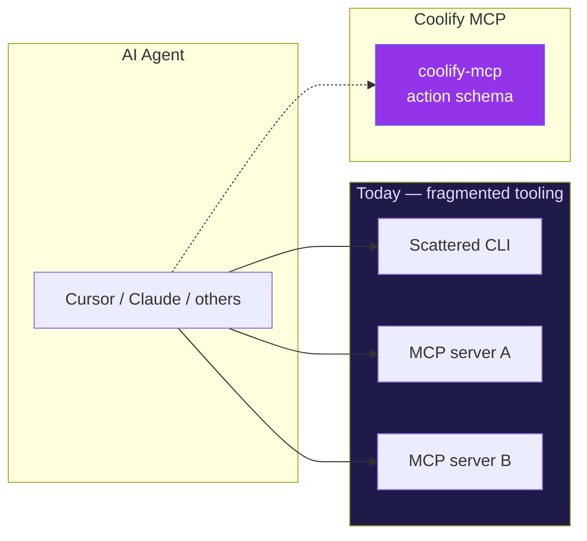
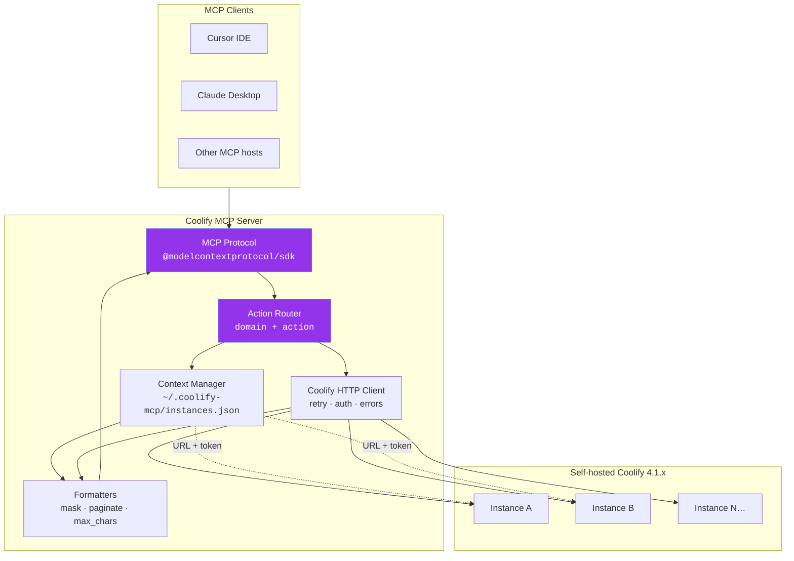
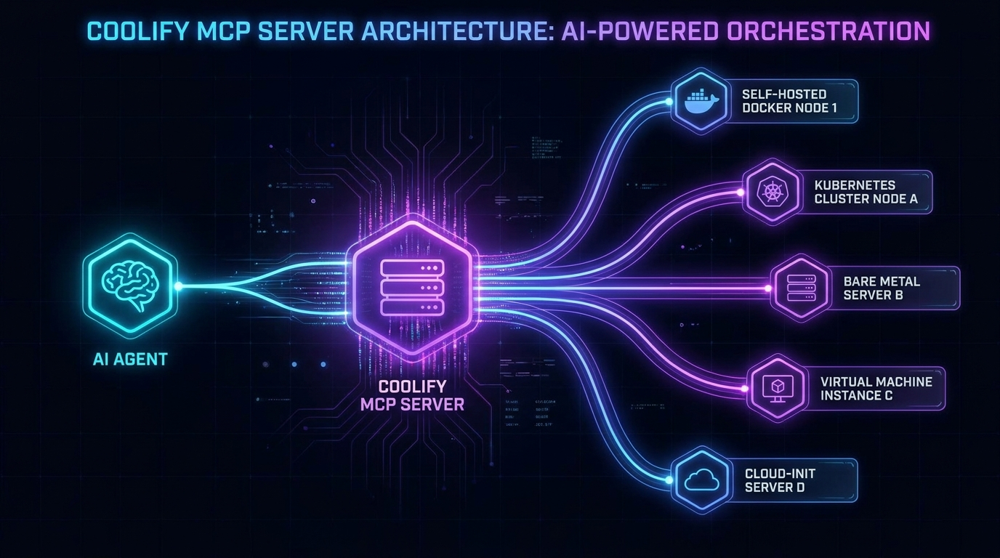
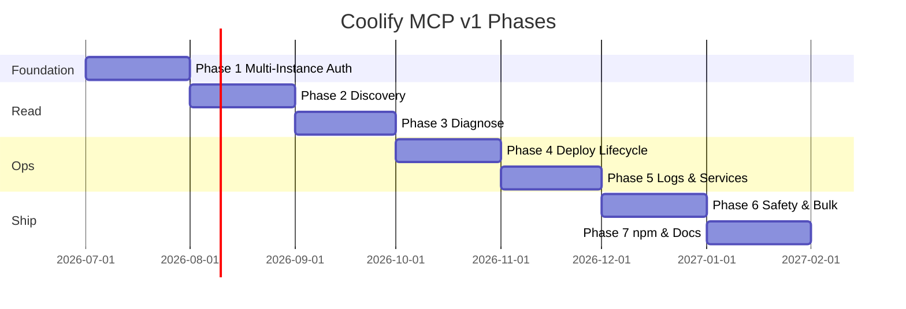

<!-- Generated by docs/readme — run: npm run build --prefix docs/readme -->
<div align="center">

<a href="README.de.md">🌐 Deutsch</a>

<picture>
  <source media="(prefers-color-scheme: dark)" srcset="assets/logo.png">
  
</picture>

# Coolify MCP Server

[](https://github.com/clezcoding/awesome-coolify-mcp)
[](https://github.com/clezcoding/awesome-coolify-mcp)
[](https://github.com/clezcoding/awesome-coolify-mcp)
[](https://github.com/clezcoding/awesome-coolify-mcp)
[](https://github.com/clezcoding/awesome-coolify-mcp)
[](https://github.com/clezcoding/awesome-coolify-mcp)

<br/>

<h3>One MCP server. Multiple Coolify instances. Zero workarounds.</h3>

<p>
  <a href="https://github.com/clezcoding/awesome-coolify-mcp"><strong>GitHub</strong></a> ·
  <a href="#quick-start"><strong>Quick Start</strong></a> ·
  <a href="mcp_features.md"><strong>Feature Catalog</strong></a> ·
  <a href=".planning/ROADMAP.md"><strong>Roadmap</strong></a>
</p>

<p><sub>[Quick Start](#quick-start) · [Features](#features) · [Architecture](#architecture) · [Deutsch](#deutsch) · [English](#english) · [Roadmap](#roadmap) · [Contributing](#contributing)</sub></p>


</div>

---

## Navigation

| | |
|:--|:--|
| **Repository** | [clezcoding/awesome-coolify-mcp](https://github.com/clezcoding/awesome-coolify-mcp) |
| **npm package** | `@clezcoding/coolify-mcp` — *coming soon* |
| **Coolify API** | 4.1.x (self-hosted) |
| **Status** | Planning — v1 in active design |
| **Languages** | [English](README.md) · [Deutsch](README.de.md) |

<details>
<summary><strong>Table of contents</strong></summary>

- [At a glance](#at-a-glance)
- [Why Coolify MCP?](#why-coolify-mcp)
- [Quick Start](#quick-start)
- [Features](#features)
- [Architecture](#architecture)
- [Tool schema](#tool-schema)
- [Multi-instance](#multi-instance)
- [Security](#security)
- [Roadmap](#roadmap)
- [Development status](#development-status)
- [Contributing](#contributing)

</details>

---

## ⚡ At a glance

<table>
<tr>
<td width="55%" valign="top">

### ✨ What you get

- 💻 **One MCP server** for every Coolify ops workflow
- 🌐 **Multi-instance** from a single `~/.coolify-mcp/instances.json`
- 🎯 **Action-based tools** — ~10 domains, not 60+ endpoints
- 🤖 **Agent-first DX** — structured errors, recovery hints, payload caps
- 🔒 **Self-hosted only** — Coolify API **4.1.x**

</td>
<td width="45%" valign="top" align="center">


**Meet Prism** — your agent's new operator.<br/>
<sub>It talks to Coolify so your agent doesn't have to.</sub>

</td>
</tr>
</table>

<details>
<summary><b>🗺️ View Project Milestones (v1 & v2)</b></summary>

| Milestone | Scope | Target |
|-----------|-------|--------|
| **v1** | Deploy, logs, diagnose, multi-instance, safety gates | Ops MVP |
| **v2** | Full CRUD parity, teams, cloud tokens, backups | Feature parity |

</details>

> [!TIP]
> Built for **agents first**, humans second. Every response is structured, every error is recoverable, every secret is masked by default.

---

### 🔗 Quick Links
[⚡ Quick Start](#quick-start) · [🛠 Features](#features) · [📐 Architecture](#architecture) · [🧬 Tool Schema](#tool-schema) · [🌐 Multi-instance](#multi-instance) · [🔐 Security](#security) · [📅 Roadmap](#roadmap)


---

## ❓ Why Coolify MCP?

Three overlapping tools. One confused agent. Maintenance nightmare.



<details>
<summary><b>📊 View Comparison: Fragmented Today vs. Unified Coolify MCP</b></summary>

| Problem today | Coolify MCP answer |
|---------------|-------------------|
| 60+ single-purpose MCP tools | Domain tools + `action` parameter |
| Multi-instance per MCP config entry | Central `instances.json` + switch |
| Unstructured API failures | `COOLIFY_*` codes + recovery hints |
| Secrets leak into context | Mask by default, `reveal` opt-in |
| Destructive ops without guardrails | `confirm: true` required |
| Three docs, three schemas | One README, one source of truth |

</details>

> [!IMPORTANT]
> **Design principle:** optimize for *agent recovery* and *context efficiency*, not API endpoint parity on day one.

---

### 🔗 Quick Links
[⚡ Quick Start](#quick-start) · [🛠 Features](#features) · [📐 Architecture](#architecture) · [🧬 Tool Schema](#tool-schema)


---

## 🚀 Quick Start

> [!NOTE]
> npm package not published yet. Use local dev / `npm link` until Phase 7.

### 1️⃣ Install (soon)

```bash
npx -y @clezcoding/coolify-mcp
```

### 2️⃣ Configure instances

<details>
<summary><b>⚙️ Click to expand configuration instructions (`instances.json`)</b></summary>

Create the configuration file at `~/.coolify-mcp/instances.json`:

```json
{
  "default": "production",
  "instances": {
    "production": {
      "name": "Production",
      "url": "https://coolify.example.com",
      "token": "YOUR_COOLIFY_API_TOKEN",
      "verifySsl": true
    }
  }
}
```

Get your token: **Coolify UI → Keys & Tokens → Create API Token**.

</details>

### 3️⃣ Connect your MCP client

<details>
<summary><b>🔌 Click to expand client setup guides (Cursor, Claude Desktop, etc.)</b></summary>

#### Cursor Setup
Add this to `~/.cursor/mcp.json` (Cursor):

```json
{
  "mcpServers": {
    "coolify": {
      "command": "npx",
      "args": ["-y", "@clezcoding/coolify-mcp"]
    }
  }
}
```

#### Claude Desktop Setup
For Claude Desktop on macOS, drop the same `mcpServers` block into:
`~/Library/Application Support/Claude/claude_desktop_config.json`

</details>

### 4️⃣ Talk to your agent

Reload your client, then ask your agent:

> 💬 *"Verify my Coolify connection and list all applications on production."*

<details>
<summary><b>🛠️ Local development & manual setup</b></summary>

```json
{
  "mcpServers": {
    "coolify": {
      "command": "node",
      "args": ["/absolute/path/to/awesome-coolify/dist/index.js"],
      "env": { "NODE_ENV": "development" }
    }
  }
}
```

</details>

---

### 🔗 Quick Links
[🛠 Features](#features) · [📐 Architecture](#architecture) · [🌐 Multi-instance](#multi-instance) · [🔐 Security](#security)


---

## 🛠 Features

Explore the modular, powerful layout of Coolify MCP.

<details>
<summary><b>🗺️ View Phase-by-Phase Roadmap (v1 — Ops MVP)</b></summary>

### v1 — Ops MVP (52 requirements · 7 phases)

| Phase | Focus | Highlights |
|:-----:|-------|------------|
| **1** | Foundation | stdio MCP, Zod, `instances.json`, structured errors |
| **2** | Discovery | Infrastructure overview, resource lists, docs search |
| **3** | Diagnose | App/server diagnose, global issue scan |
| **4** | Deploy | Start/stop/restart, deploy + wait-mode, batch deploy |
| **5** | Logs | Runtime/build logs, service & DB lifecycle |
| **6** | Safety | Bulk ops, `confirm` gate, secret masking |
| **7** | Ship | npm publish, docs, client setup guides |

</details>

<details>
<summary><b>📊 View Capability Matrix (v1 vs v2)</b></summary>

### Capability matrix

| Area | v1 | v2 |
|------|:--:|:--:|
| Multi-instance auth | ✅ | ✅ |
| Deploy & monitor | ✅ | ✅ |
| Logs (capped / paginated) | ✅ | ✅ |
| Diagnose & issue scan | ✅ | ✅ |
| App/DB/Service CRUD | — | ✅ |
| Teams & cloud tokens | — | ✅ |
| Backups & scheduled tasks | — | ✅ |
| Container exec | — | ⏳ API blocked |

</details>

<details>
<summary><b>🔌 View Domain Tools & Available Actions</b></summary>

### Domain tools (v1)

| Tool | Example actions |
|------|-----------------|
| `instance` | `add`, `list`, `switch`, `verify`, `set-default` |
| `system` | `overview`, `health`, `issues`, `search-docs` |
| `application` | `list`, `deploy`, `logs`, `diagnose`, `restart` |
| `service` | `list`, `start`, `deploy`, `logs` |
| `database` | `list`, `restart`, `logs` |
| `server` | `list`, `diagnose` |
| `deployment` | `get`, `cancel`, `build-logs` |
| `project` | `redeploy-all`, `restart-all` |
| `emergency` | `stop-all-apps` |

</details>

Full catalog: [`mcp_features.md`](mcp_features.md)

---

### 🔗 Quick Links
[📐 Architecture](#architecture) · [🧬 Tool Schema](#tool-schema) · [🌐 Multi-instance](#multi-instance) · [🔐 Security](#security)


---

## 📐 Architecture

Detailed overview of the inner workings of Coolify MCP.



### 🧠 Architecture Mindmap



<details>
<summary><b>🗂️ View Layer Responsibilities Table</b></summary>

### Layer responsibilities

| Layer | Responsibility |
|-------|----------------|
| **Protocol** | JSON-RPC over stdio, tool registration |
| **Router** | `application({ action: 'deploy' })` → handler |
| **Context** | Multi-instance registry, default, active switch |
| **HTTP client** | Token injection, exponential backoff |
| **Formatters** | Summary/full projection, secret masking |

</details>

<details>
<summary><b>⚙️ View Technical Tech Stack Details</b></summary>

### Tech stack

| Component | Choice |
|-----------|--------|
| Language | TypeScript 5.x |
| MCP SDK | `@modelcontextprotocol/sdk` |
| Validation | Zod |
| Transport | stdio |
| Distribution | npm (`npx @clezcoding/coolify-mcp`) |

</details>

---

### 🔗 Quick Links
[🧬 Tool Schema](#tool-schema) · [🌐 Multi-instance](#multi-instance) · [🔐 Security](#security) · [📅 Roadmap](#roadmap)


---

## 🧬 Tool schema

Instead of **60+ granular tools**, Coolify MCP groups operations by **domain** with an **`action`** field.

<details>
<summary><b>🔄 View Legacy Pattern vs. Coolify MCP Design Pattern</b></summary>

### Before vs after

<table>
<tr>
<th>❌ Legacy pattern</th>
<th>✅ Coolify MCP</th>
</tr>
<tr>
<td>

`get_application`<br/>
`deploy_application`<br/>
`list_application_logs`<br/>
`restart_application`<br/>
`get_application_envs`<br/>
… × 40 more

</td>
<td>

```json
{
  "tool": "application",
  "arguments": {
    "action": "deploy",
    "identifier": "my-app",
    "wait": true
  }
}
```

</td>
</tr>
</table>

</details>

### Examples

<details>
<summary><strong>🚀 Deploy with wait-mode</strong></summary>

```json
{
  "tool": "application",
  "arguments": {
    "action": "deploy",
    "identifier": "my-nextjs-app",
    "forceRebuild": false,
    "wait": true,
    "timeoutSeconds": 600
  }
}
```

</details>

<details>
<summary><strong>🔍 Diagnose by domain</strong></summary>

```json
{
  "tool": "application",
  "arguments": {
    "action": "diagnose",
    "identifier": "api.example.com",
    "projection": "summary"
  }
}
```

</details>

<details>
<summary><strong>⚠️ Global issue scan</strong></summary>

```json
{
  "tool": "system",
  "arguments": { "action": "issues" }
}
```

</details>

<details>
<summary><strong>🧱 Structured error response</strong></summary>

```json
{
  "error": {
    "code": "COOLIFY_UNAUTHORIZED",
    "httpStatus": 401,
    "message": "API token invalid or expired",
    "recoveryHints": [
      "Verify token in Coolify UI → Keys & Tokens",
      "Run instance action 'verify'",
      "Check instance id or switch instance"
    ]
  }
}
```

</details>

---

### 🔗 Quick Links
[⚡ Quick Start](#quick-start) · [🛠 Features](#features) · [📐 Architecture](#architecture) · [🌐 Multi-instance](#multi-instance)


---

## 🌐 Multi-instance

All instances live in **`~/.coolify-mcp/instances.json`** — portable across MCP clients.

<details>
<summary><b>⚙️ View Configuration Example (`instances.json`)</b></summary>

```json
{
  "default": "production",
  "instances": {
    "production": {
      "name": "Production",
      "url": "https://coolify.example.com",
      "token": "YOUR_TOKEN",
      "verifySsl": true
    },
    "staging": {
      "name": "Staging",
      "url": "https://staging-coolify.example.com",
      "token": "YOUR_STAGING_TOKEN",
      "verifySsl": true
    },
    "homelab": {
      "name": "Homelab",
      "url": "http://192.168.1.50:8000",
      "token": "YOUR_HOMELAB_TOKEN",
      "verifySsl": false
    }
  }
}
```

</details>

<details>
<summary><b>🛠️ View Available Instance Actions</b></summary>

### Instance actions

| Action | Description |
|--------|-------------|
| `add` | Register new instance |
| `list` | List all instances |
| `get` | Instance details |
| `update` | Change URL, token, or name |
| `delete` | Remove instance |
| `set-default` | Set default instance |
| `switch` / `use` | Switch active instance |
| `verify` | Test connection + API version |

</details>

> [!TIP]
> Per-request **token override** is supported — the override never touches disk.

---

### 🔗 Quick Links
[⚡ Quick Start](#quick-start) · [🛠 Features](#features) · [📐 Architecture](#architecture) · [🔐 Security](#security)


---

## 🔐 Security

Multi-layered security features keep your self-hosted setup safe.

<details>
<summary><b>🛡️ View Security Measures & Safeguards Table</b></summary>

| Measure | Behavior |
|---------|----------|
| **Token storage** | Only in `instances.json` — never echoed in tool responses |
| **Default masking** | Passwords, webhook secrets, env values → `***` |
| **Reveal opt-in** | `reveal: true` / `showSensitive: true` on explicit request |
| **Confirm gate** | Destructive ops require `confirm: true` |
| **Payload limits** | `max_chars` caps large log/output payloads |
| **SSL** | `verifySsl` per instance (homelab-friendly) |

</details>

> [!WARNING]
> Destructive operations are rejected without explicit confirmation.

```json
// Rejected — missing confirm
{ "tool": "emergency", "arguments": { "action": "stop-all-apps" } }

// Allowed
{ "tool": "emergency", "arguments": { "action": "stop-all-apps", "confirm": true } }
```

---

### 🔗 Quick Links
[⚡ Quick Start](#quick-start) · [🛠 Features](#features) · [📐 Architecture](#architecture) · [🌐 Multi-instance](#multi-instance)


---

## Roadmap



### v2 preview

After v1: **full parity** with the broader Coolify ecosystem. Details in [`.planning/REQUIREMENTS.md`](.planning/REQUIREMENTS.md).

| Group | Scope |
|-------|-------|
| **V2-CTX** | Debug mode, shell completion, self-update |
| **V2-TEAM** | Teams, members, invites |
| **V2-PROJ / V2-SRV** | Projects, environments, server CRUD |
| **V2-APP / V2-ENV** | App CRUD (6 create paths), env vars |
| **V2-SVC / V2-DB / V2-BAK** | One-click services, 8 DB types, backups |
| **V2-CICD / V2-TEN** | Webhooks, RBAC, snapshots |

> [!NOTE]
> Container exec is blocked until Coolify 4.1.x API supports it.

Full roadmap: [`.planning/ROADMAP.md`](.planning/ROADMAP.md)


---

## 📈 Development status

Current progress and tooling details for Coolify MCP.

<details>
<summary><b>📋 View Detailed Development Status Table</b></summary>

| Aspect | State |
|--------|-------|
| **Phase** | Planning — greenfield, server code in progress |
| **v1 requirements** | 52 REQ-IDs mapped to 7 phases |
| **Feature catalog** | [`mcp_features.md`](mcp_features.md) |
| **Planning docs** | [`.planning/PROJECT.md`](.planning/PROJECT.md) |
| **npm** | `@clezcoding/coolify-mcp` — **coming soon** |
| **First milestone** | Phase 1 — Foundation & Multi-Instance Auth |

</details>

### 🛠️ Documentation tooling

README is generated from modular sections:

```bash
npm install --prefix docs/readme
npm run build --prefix docs/readme
```

Source: [`docs/readme/sections/`](docs/readme/sections/) (English) · [`docs/readme/sections.de/`](docs/readme/sections.de/) (German)

---

### 🔗 Quick Links
[⚡ Quick Start](#quick-start) · [🛠 Features](#features) · [📐 Architecture](#architecture) · [🌐 Multi-instance](#multi-instance)


---

## 🤝 Contributing

Community OSS — contributions welcome.

1. **Fork** [github.com/clezcoding/awesome-coolify-mcp](https://github.com/clezcoding/awesome-coolify-mcp)
2. **Read** [`mcp_features.md`](mcp_features.md) and [`.planning/`](.planning/)
3. **Open** an issue or draft PR aligned with the current phase
4. **Stack:** TypeScript · `@modelcontextprotocol/sdk` · Zod
5. **Keep** the action-based schema — no new single-purpose tools per API endpoint

**v1 priority:** deploy, logs, diagnose, multi-instance — before CRUD.

### 🔄 Regenerate README

```bash
npm run build --prefix docs/readme
```

This writes both `README.md` (English) and `README.de.md` (German).

<details>
<summary><b>🎨 View Project Design Assets & Sources Table</b></summary>

### Assets

| File | Purpose | Source |
|------|---------|--------|
| `assets/logo.png` | Primary logo (1024×1024) | Higgsfield Recraft v4.1 → resvg |
| `assets/logo.svg` | Vector logo | Higgsfield Recraft v4.1 |
| `assets/hero-banner.png` | README hero banner (1920×640, 3:1) | Higgsfield GPT Image 2 |
| `assets/social-preview.png` | GitHub social preview (1280×640, 1.91:1) | Higgsfield GPT Image 2 |
| `assets/mascot.png` | Project mascot "Prism" (512×512) | Higgsfield GPT Image 2 |
| `assets/mascot-1024.png` | Hi-res mascot variant | Higgsfield GPT Image 2 |
| `assets/logo-legacy.png` | Previous hand-crafted logo (backup) | manual SVG → PNG |
| `assets/logo-legacy.svg` | Previous hand-crafted vector (backup) | manual |

Regenerate Higgsfield assets: see `scripts/fix-higgsfield.sh` and the `higgsfield-generate` skill.

</details>

---

### 🔗 Quick Links
[⚡ Quick Start](#quick-start) · [🛠 Features](#features) · [📐 Architecture](#architecture) · [🌐 Multi-instance](#multi-instance)


---

<p align="center">
  
  <br/><br/>
  <strong>Built for the Coolify community</strong><br/>
  <sub>Coolify API 4.1.x · MCP stdio transport · MIT License</sub>
  <br/><br/>
  <sub>README available in <a href="README.md">English</a> · <a href="README.de.md">Deutsch</a></sub>
</p>

