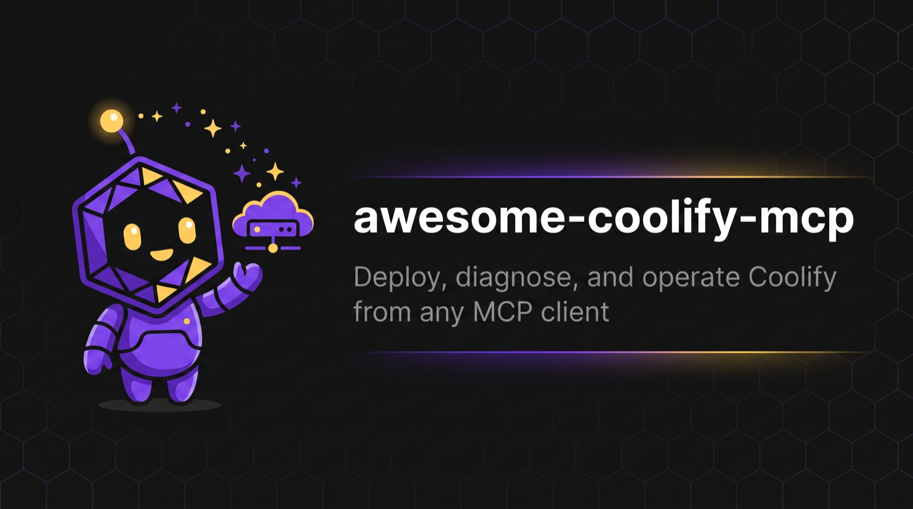
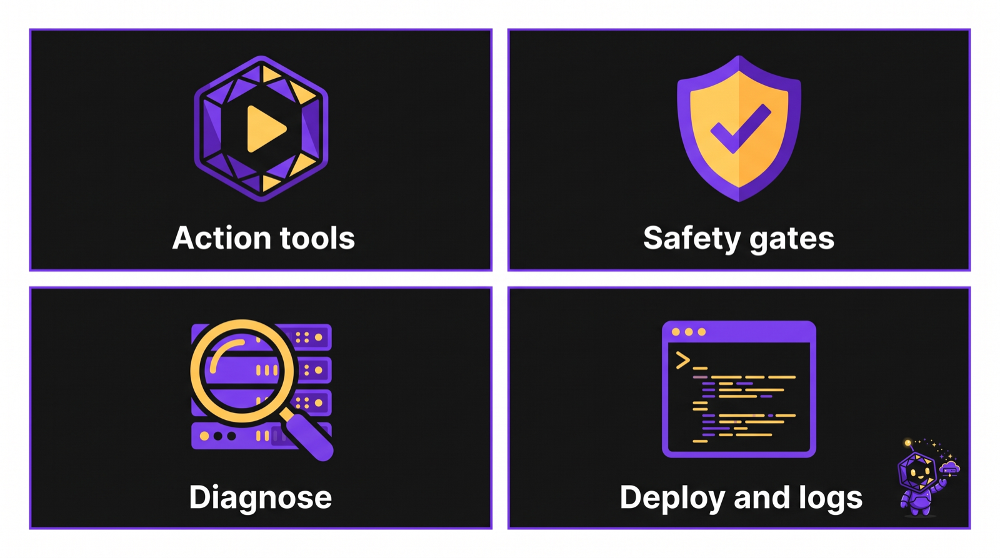
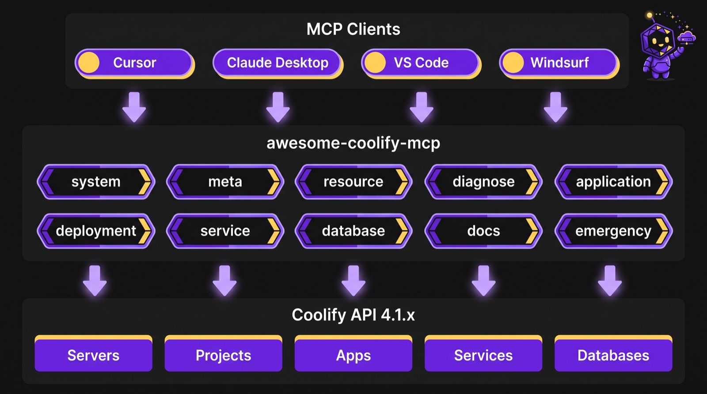

<p align="center">
  
</p>

<h1 align="center">awesome-coolify-mcp</h1>

<p align="center">
  <strong>The open-source MCP server for self-hosted Coolify.</strong><br />
  Deploy, read logs, diagnose fleet issues, and run emergency ops — from Cursor, Claude, VS Code, or any MCP client.
</p>

<p align="center">
  <a href="README.de.md">Deutsch</a>
  ·
  <a href="https://coolify.io">Coolify</a>
  ·
  <a href="https://modelcontextprotocol.io">Model Context Protocol</a>
  ·
  <a href="docs/install.html">Install configurator</a>
</p>

<p align="center">
  <a href="https://www.npmjs.com/package/awesome-coolify-mcp"></a>
  = 20" />
  
  
  
  
</p>

<p align="center">
  <a href="#overview">Overview</a>
  ·
  <a href="#features">Features</a>
  ·
  <a href="#architecture">Architecture</a>
  ·
  <a href="#quick-start">Quick start</a>
  ·
  <a href="#install">Install</a>
  ·
  <a href="#tools-reference">Tools</a>
  ·
  <a href="#safety-model">Safety</a>
  ·
  <a href="#local-development">Development</a>
</p>



---

## Overview

Self-hosted [Coolify](https://coolify.io) is a powerful PaaS alternative — but operating it from an AI coding agent usually means juggling overlapping MCP servers, inconsistent schemas, and 60+ single-purpose tools.

**awesome-coolify-mcp** is one community-focused MCP server that speaks Coolify’s REST API **4.1.x** with an **action-based** tool surface:

| Before | With awesome-coolify-mcp |
|--------|--------------------------|
| Coolify CLI MCP + `user-coolify` + `coolify-backup-mcp` | One server, one schema |
| Dozens of granular tools per resource | **10 domain tools** × `action` discriminators |
| Ad-hoc error strings | Structured codes (`COOLIFY_401`, …) + recovery hints |
| Easy to leak secrets into agent context | Default secret masking + emergency confirm gates |

v1 is **ops-first**: verify connectivity, discover resources, deploy and watch status, pull logs, diagnose apps/servers, scan the fleet, and run gated emergency actions. Create/delete CRUD stays in v2.

> [!NOTE]
> Community project for self-hosted Coolify. **Not affiliated with Coolify Labs.**

---

## Features



- **Action-based tools across 10 domains** — call `application({ action: "deploy", uuid })` instead of memorizing dozens of tool names.
- **Ops workflows that match real incidents** — infrastructure overview, fuzzy `resource.find`, app/server diagnose, fleet `diagnose.scan` by severity.
- **Deploy lifecycle** — start/stop/restart, deploy with optional wait/poll and force rebuild, deployment list/get/cancel, bounded runtime/build logs.
- **Service & database lifecycle** — start/stop/restart/get (and service redeploy with optional image pull).
- **Safety by default** — emergency mutations require `confirm: true`; sensitive keys mask as `***` unless you pass `reveal: true`.
- **Agent-friendly errors** — parseable envelopes with `code`, `message`, `recoveryHints`, and retries on transient 429/5xx/network failures.
- **Broad client coverage** — Cursor, VS Code / Copilot, Claude Desktop, Claude Code, Windsurf, plus 15+ hosts via the [install configurator](docs/install.html).

---

## Architecture



```text
MCP client (Cursor / Claude / VS Code / …)
        │  stdio MCP
        ▼
awesome-coolify-mcp  (10 domain tools + action)
        │  HTTPS Bearer token
        ▼
Coolify REST API 4.1.x  (servers · projects · apps · services · databases)
```

The **host** injects `COOLIFY_URL` and `COOLIFY_TOKEN` through its MCP config `env` block. The server never reads your IDE config file; it only sees process environment (and optional local `.env` for CLI runs).

---

## Quick start

**Prerequisites**

- Node.js **20+**
- A self-hosted Coolify **4.1.x** instance
- An API token from Coolify → **Keys & Tokens** ([authorization docs](https://coolify.io/docs/api-reference/authorization))

```bash
npx -y awesome-coolify-mcp
```

Wire credentials in your MCP host (see [Install](#install)). Minimal smoke after connect:

```js
meta({ action: "version" })
system({ action: "verify" })
system({ action: "infrastructure_overview" })
```

> [!IMPORTANT]
> Emergency actions (`stop_all`, `redeploy_project`, `restart_project`) require `confirm: true`. Call **without** confirm first to get a `would_affect` preview — no mutation runs. Prefer `reveal: true` only when you truly need plaintext secrets.

---

## Install

Three equal paths: one-click deeplink, browser configurator, or manual JSON.

### 1. One-click deeplink

Best when credentials are ready (placeholders are fine — prefer the configurator to fill secrets safely):

| Client | Install |
|--------|---------|
| **Cursor** | [Add awesome-coolify-mcp to Cursor](cursor://anysphere.cursor-deeplink/mcp/install?name=awesome-coolify-mcp&config=eyJhd2Vzb21lLWNvb2xpZnktbWNwIjp7ImNvbW1hbmQiOiJucHgiLCJhcmdzIjpbIi15IiwiYXdlc29tZS1jb29saWZ5LW1jcCJdLCJlbnYiOnsiQ09PTElGWV9VUkwiOiJodHRwczovL2Nvb2xpZnkuZXhhbXBsZS5jb20iLCJDT09MSUZZX1RPS0VOIjoiWU9VUl9DT09MSUZZX0FQSV9UT0tFTiJ9fX0=) |
| **VS Code / GitHub Copilot** | [Install via vscode:mcp/install](vscode:mcp/install?name=awesome-coolify-mcp&config=%7B%22command%22%3A%22npx%22%2C%22args%22%3A%5B%22-y%22%2C%22awesome-coolify-mcp%22%5D%2C%22env%22%3A%7B%22COOLIFY_URL%22%3A%22https%3A%2F%2Fcoolify.example.com%22%2C%22COOLIFY_TOKEN%22%3A%22YOUR_COOLIFY_API_TOKEN%22%7D%7D) |

### 2. Install configurator (GitHub Pages)

Use the **[browser configurator](docs/install.html)** to enter `COOLIFY_URL` / `COOLIFY_TOKEN` and generate per-client snippets (JSON, TOML, YAML, …).

Everything runs **client-side in your browser** — tokens are never posted to a backend.

### 3. Manual MCP config

Paste into your host’s MCP config. Cursor example (`~/.cursor/mcp.json` or project `.cursor/mcp.json`):

```json
{
  "mcpServers": {
    "awesome-coolify-mcp": {
      "command": "npx",
      "args": ["-y", "awesome-coolify-mcp"],
      "env": {
        "COOLIFY_URL": "https://coolify.example.com",
        "COOLIFY_TOKEN": "YOUR_COOLIFY_API_TOKEN",
        "COOLIFY_VERIFY_SSL": "true",
        "COOLIFY_MCP_LOG": "info"
      }
    }
  }
}
```

Copy-paste template: [`docs/mcp.example.json`](docs/mcp.example.json)

---

## Supported clients

| Client | Config location | Notes |
|--------|-----------------|-------|
| **Cursor** | `~/.cursor/mcp.json` | Deeplink or manual JSON |
| **VS Code / GitHub Copilot** | `.vscode/mcp.json` | Native `inputs` for URL/token prompts |
| **Claude Desktop** | `claude_desktop_config.json` | Manual JSON or configurator output (no `.mcpb` in v1) |
| **Claude Code** | `~/.claude.json` or `.mcp.json` | stdio via `npx -y awesome-coolify-mcp` |
| **Windsurf** | `~/.codeium/windsurf/mcp_config.json` | Same npx + env pattern |

**Full 15+ client matrix** (OpenCode, Codex CLI, Gemini CLI, Cline, Hermes, Kimi Code, and more): [install configurator](docs/install.html).

> [!NOTE]
> Claude Desktop ships as manual JSON / configurator output only in this release — no `.mcpb` bundle yet.

---

## Environment variables

| Variable | Required | Default | Description |
|----------|----------|---------|-------------|
| `COOLIFY_URL` | yes | — | Coolify base URL (no trailing slash), e.g. `https://coolify.example.com` |
| `COOLIFY_TOKEN` | yes | — | Bearer API token (team-scoped) |
| `COOLIFY_VERIFY_SSL` | no | `true` | Set `false` only for self-signed certs in local/dev |
| `COOLIFY_MCP_LOG` | no | `info` | `debug` · `info` · `error` |

Tokens come from process env (IDE MCP `env`) or optional `.env` for local CLI. They are **never** echoed in tool responses.

---

## Tools reference

Each domain is **one MCP tool** with an `action` discriminator.

Example:

```js
system({ action: "health" })
application({ action: "deploy", uuid: "<app-uuid>", wait: true })
emergency({ action: "stop_all", confirm: true })
```

### `system` — connectivity & overview

| Action | Purpose |
|--------|---------|
| `health` | Verify Coolify API reachability |
| `version` | Coolify instance version string |
| `verify` | Authenticate; return connectivity + version |
| `infrastructure_overview` | Aggregate counts: servers, projects, applications, services, databases |

### `meta` — server identity

| Action | Purpose |
|--------|---------|
| `version` | awesome-coolify-mcp package name + semver (no Coolify call) |

### `resource` — discovery

| Action | Purpose |
|--------|---------|
| `list` | Applications, services, databases with summary projections + pagination `_meta` |
| `find` | Fuzzy search across servers and resources (ranked, capped) |

### `diagnose` — investigation

| Action | Purpose |
|--------|---------|
| `app` | App status, health, env, recent deployments |
| `server` | Server resources, domains, reachability |
| `scan` | Fleet-wide issues grouped by severity |

### `application` — app ops

| Action | Purpose |
|--------|---------|
| `get` | Detailed application configuration |
| `start` / `stop` / `restart` | Container lifecycle |
| `deploy` | Trigger deploy (optional wait/poll, force rebuild) |
| `logs` | Paginated runtime or build logs (bounded) |

### `deployment` — deploy tracking

| Action | Purpose |
|--------|---------|
| `list` | Deployments for an application |
| `get` | Status, commit, details |
| `cancel` | Cancel an in-flight deployment |

### `service` / `database` — sidecar lifecycle

| Tool | Actions |
|------|---------|
| `service` | `get`, `start`, `stop`, `restart`, `deploy` (optional image pull) |
| `database` | `get`, `start`, `stop`, `restart` |

### `docs` — offline guides

| Action | Purpose |
|--------|---------|
| `search` | Search bundled Coolify guides (local index, not a live web fetch) |

### `emergency` — high-impact ops (gated)

| Action | Purpose |
|--------|---------|
| `stop_all` | Stop all running applications fleet-wide — **`confirm: true`** |
| `redeploy_project` | Redeploy all apps in a project — **`confirm: true`** |
| `restart_project` | Restart all apps in a project — **`confirm: true`** |

---

## Safety model

### Confirmation gate

Destructive **emergency** actions are gated:

1. Call with `confirm` omitted / `false` → receive a `would_affect` preview (`COOLIFY_CONFIRM_REQUIRED`) — **no mutation**.
2. Call again with `confirm: true` → execute.

Regular app/service/database mutations (start/stop/deploy, …) are **not** behind this gate — they follow Coolify’s normal API semantics.

### Secret masking

- Keys matching `password`, `token`, `secret`, `private`, or `env` render as `***` by default.
- Pass `reveal: true` only when you explicitly need plaintext.
- **Log line bodies are not masked** — do not paste raw logs into long-lived agent memory or public tickets.

---

## Structured errors & retries

API failures return a parseable envelope:

```json
{
  "code": "COOLIFY_401",
  "message": "Unauthorized — invalid or expired API token",
  "recoveryHints": [
    "Verify the token in Coolify UI → Keys & Tokens",
    "Ensure the token has the required team permissions"
  ],
  "httpStatus": 401
}
```

| Code | Meaning |
|------|---------|
| `COOLIFY_401` | Invalid or missing token |
| `COOLIFY_404` | Resource not found |
| `COOLIFY_422` | Validation error |
| `COOLIFY_500` | Coolify server error |
| `COOLIFY_NETWORK` | Connection failed |
| `COOLIFY_TIMEOUT` | Request timed out |
| `COOLIFY_CONFIRM_REQUIRED` | Emergency preview — set `confirm: true` to proceed |
| `COOLIFY_AMBIGUOUS_MATCH` | Name matched multiple resources — pick a UUID |

Transient failures (429, 5xx, network) retry up to **3×** with exponential backoff (`1s → 2s → 4s`).

---

## Example agent workflows

**“Is my Coolify reachable and what do I have?”**

```js
system({ action: "verify" })
system({ action: "infrastructure_overview" })
resource({ action: "list" })
```

**“Find the nginx app and deploy it, then show logs.”**

```js
resource({ action: "find", query: "nginx" })
application({ action: "deploy", uuid: "<uuid>", wait: true })
application({ action: "logs", uuid: "<uuid>" })
```

**“Something feels wrong across the fleet.”**

```js
diagnose({ action: "scan" })
diagnose({ action: "app", uuid: "<suspect>" })
diagnose({ action: "server", uuid: "<server>" })
```

**“Emergency stop everything (preview first).”**

```js
emergency({ action: "stop_all" })                 // preview
emergency({ action: "stop_all", confirm: true })  // execute
```

---

## What’s in v1 / what’s next

| In v1 (shipped) | Deferred to v2+ |
|-----------------|-----------------|
| Ops: deploy, logs, diagnose, overview | Create/delete CRUD for apps/services/DBs/servers |
| Action-based 10-tool surface | Full parity with every legacy MCP endpoint |
| Structured errors + retries | Env-var sync workflows |
| Secret masking + emergency confirm | Broader multi-instance runtime UX |
| npm `npx` distribution + install docs | Claude Desktop `.mcpb` packaging |

---

## Local development

```bash
git clone https://github.com/clezcoding/awesome-coolify-mcp.git
cd awesome-coolify-mcp
npm install
npm run build    # tsup → dist/
npm test         # vitest
npm run dev      # watch mode
```

Logs go to **stderr** only — stdout is reserved for the MCP protocol.

Maintainer publish flow (`build` → `pack --dry-run` → `publish`) lives in [CONTRIBUTING.md](CONTRIBUTING.md).

---

## Links

| Resource | URL |
|----------|-----|
| Install configurator | [docs/install.html](docs/install.html) |
| Example MCP JSON | [docs/mcp.example.json](docs/mcp.example.json) |
| Brand assets | [docs/assets/](docs/assets/) |
| Coolify | [coolify.io](https://coolify.io) |
| MCP specification | [modelcontextprotocol.io](https://modelcontextprotocol.io) |
| Issues | [GitHub Issues](https://github.com/clezcoding/awesome-coolify-mcp/issues) |
