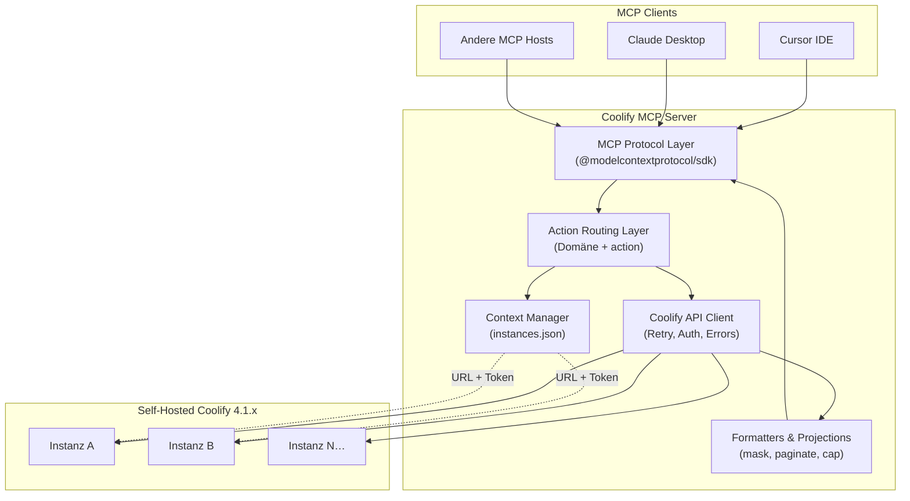
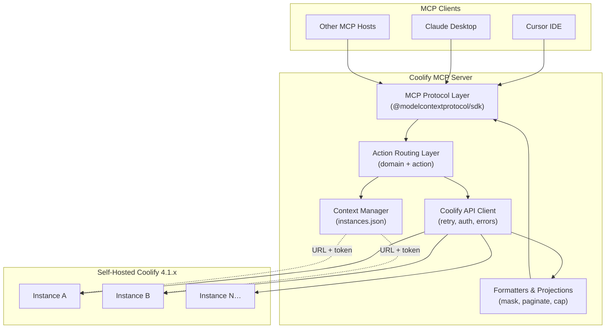

# Coolify MCP Server

[](https://github.com/clezcoding/awesome-coolify-mcp)
[](https://www.typescriptlang.org/)
[](https://modelcontextprotocol.io/)
[](https://coolify.io/)
[](LICENSE)
[](#installation)

> **One MCP server. Multiple Coolify instances. Zero workarounds.**

Open-source [Model Context Protocol](https://modelcontextprotocol.io/) server for self-hosted [Coolify](https://coolify.io/) instances (API **4.1.x**). Lets AI agents in **Cursor**, **Claude Desktop**, and other MCP clients deploy apps, read logs, diagnose issues, and operate infrastructure — without juggling three overlapping MCP implementations.

| | |
|---|---|
| **GitHub** | [github.com/clezcoding/awesome-coolify-mcp](https://github.com/clezcoding/awesome-coolify-mcp) |
| **npm** | `@clezcoding/coolify-mcp` / `coolify-mcp` — *coming soon* |
| **Coolify API** | 4.1.x (self-hosted) |
| **Status** | Planning phase — v1 in active design |

---

## Table of Contents

- [🇩🇪 Deutsch](#-deutsch)
  - [Was ist das?](#was-ist-das)
  - [Warum existiert es?](#warum-existiert-es)
  - [Architektur](#architektur-de)
  - [Features v1](#features-v1-de)
  - [Roadmap v2 (Ausblick)](#roadmap-v2-ausblick)
  - [Multi-Instance Setup](#multi-instance-setup-de)
  - [MCP-Konfiguration](#mcp-konfiguration-de)
  - [Action-basiertes Tool-Schema](#action-basiertes-tool-schema-de)
  - [Sicherheit](#sicherheit-de)
  - [Entwicklungsstatus](#entwicklungsstatus-de)
  - [Mitwirken](#mitwirken-de)
  - [Lizenz](#lizenz-de)
- [🇬🇧 English](#-english)
  - [What Is It?](#what-is-it)
  - [Why Does It Exist?](#why-does-it-exist)
  - [Architecture](#architecture-en)
  - [v1 Features](#v1-features-en)
  - [v2 Roadmap Teaser](#v2-roadmap-teaser)
  - [Multi-Instance Setup](#multi-instance-setup-en)
  - [MCP Configuration](#mcp-configuration-en)
  - [Action-Based Tool Schema](#action-based-tool-schema-en)
  - [Security](#security-en)
  - [Development Status](#development-status-en)
  - [Contributing](#contributing)
  - [License](#license-en)

---

## 🇩🇪 Deutsch

### Was ist das?

**Coolify MCP Server** ist ein Open-Source-MCP-Server für self-hosted Coolify-Instanzen. Er ersetzt langfristig **Coolify CLI**, **user-coolify MCP** und **coolify-backup-mcp** durch eine einzige, gut dokumentierte Implementierung.

Ein AI-Agent (Cursor, Claude Desktop, etc.) kann über **einen** MCP-Server **mehrere** Coolify-Instanzen verwalten:

- Deployments auslösen und überwachen
- Runtime- und Build-Logs lesen
- Apps, Server und Services diagnostizieren
- Notfall- und Bulk-Operationen durchführen

**v1** liefert Ops-fähige Tools (Deploy, Logs, Diagnose, Multi-Instance). Create/Delete und volle Feature-Parität folgen in **v2**.

### Warum existiert es?

Heute existieren drei parallele Implementierungen mit Überlappung, inkonsistentem Schema und **60+ granularen Einzeltools**. Das erschwert Agent-Workflows und Wartung.

| Problem | Lösung in Coolify MCP |
|---------|----------------------|
| Drei MCPs / CLI mit Duplikaten | Ein Server, eine Wahrheit |
| 60+ Einzeltools überfordern LLMs | Action-basiertes Schema pro Domäne |
| Multi-Instance nur pro Config-Eintrag | Zentrale `~/.coolify-mcp/instances.json` |
| Unstrukturierte API-Fehler | Structured Error Codes + Recovery-Hints |
| Secrets in Responses | Default-Maskierung, Reveal opt-in |
| Destructive Ops ohne Gate | `confirm: true` Pflicht |

### Architektur {#architektur-de}



**Schichten:**

| Schicht | Verantwortung |
|---------|---------------|
| MCP Protocol Layer | JSON-RPC, Tool-Registrierung, stdio-Transport |
| Action Routing Layer | `application({ action: 'deploy' })` → Handler |
| Context Manager | Multi-Instance aus `instances.json`, Default, Switch |
| Coolify API Client | HTTP, Token-Injection, Retry + Backoff |
| Formatters | Summary/Full-Projektion, `max_chars`, Maskierung |

### Features v1 {#features-v1-de}

v1 umfasst **52 Anforderungen** in **7 Phasen** — Ops-MVP ohne Create/Delete.

#### Phasen-Übersicht

| Phase | Fokus | Status |
|-------|-------|--------|
| 1 | Foundation & Multi-Instance Auth | Geplant |
| 2 | Discovery & Read Projections | Geplant |
| 3 | Diagnose & Issue Scan | Geplant |
| 4 | App Deploy Lifecycle | Geplant |
| 5 | Logs & Service/DB Ops | Geplant |
| 6 | Bulk, Emergency & Safety | Geplant |
| 7 | Distribution & Docs (npm, README) | Geplant |

#### Feature-Bereiche

| Bereich | v1 Capabilities |
|---------|-----------------|
| **Context & Auth** | Health-Check, Version, Multi-Instance (add/list/get/update/delete), Default setzen, Switch, Verify, Token-Override pro Request |
| **System & Overview** | Infrastructure-Overview, unified Resource-Liste, Global Issue-Scan, App/Server-Diagnose, Resource-Discovery, Docs-Suche |
| **Applications** | List/Get, Start/Stop/Restart, Deploy (inkl. Force Rebuild, Wait-Mode), Deployments, Cancel, Runtime-Logs, Build-Logs |
| **Services & Databases** | List/Get, Start/Stop/Restart, Logs, Deploy/Restart mit Pull Latest Images |
| **Deployments** | Deploy by Name, Batch-Deploy, `logs_available` Hint |
| **Emergency & Bulk** | Stop All Apps, Project Redeploy/Restart (mit Confirm Gate) |
| **Output & DX** | table/JSON/pretty, Pagination, Summary vs Full, `max_chars`, Follow-up Hints, Zod-Validierung |
| **Errors** | Structured codes (401/404/422/500), Recovery-Hints, Retry + Exponential Backoff |

#### Bewusst nicht in v1

| Feature | Grund |
|---------|-------|
| App/Service/DB/Server Create & Delete | v2 — schnelleres Ops-MVP |
| Execute Command in Container | Coolify 4.1.x API fehlt/broken |
| 60+ granulare Einzeltools | Anti-Pattern — Action-Schema stattdessen |
| Cloud-only Coolify Features | Nur self-hosted |

### Roadmap v2 (Ausblick)

Nach v1-Release: **volle Feature-Parität** mit Coolify CLI, user-coolify MCP und coolify-backup-mcp. Detaillierte REQ-IDs in [`.planning/REQUIREMENTS.md`](.planning/REQUIREMENTS.md).

| Gruppe | Scope |
|--------|-------|
| **V2-CTX** | Debug-Modus, Shell-Completion, Self-Update |
| **V2-TEAM** | Teams, Members, Invite |
| **V2-PROJ / V2-SRV** | Projects, Environments, Server CRUD |
| **V2-KEY / V2-CLOUD / V2-GH** | Private Keys, Hetzner/DO, GitHub Apps |
| **V2-APP / V2-ENV / V2-STOR** | App CRUD (6 Create-Pfade), Env Vars, Storage |
| **V2-SVC / V2-DB / V2-BAK** | One-Click Services, 8 DB-Typen, Backups |
| **V2-CRON** | Scheduled Tasks |
| **V2-DX / V2-OBS / V2-SEC** | Idempotency, Metrics, SSL, Firewall |
| **V2-CICD / V2-TEN / V2-DATA** | Webhooks, RBAC, Snapshots, Migration |
| **V2-IAC / V2-INFRA / V2-REL / V2-RT** | Export/Import, Docker Cleanup, Queue, Container Exec* |

*\* Container Exec blockiert bis Coolify API verfügbar*

### Multi-Instance Setup {#multi-instance-setup-de}

Instanzen werden zentral in **`~/.coolify-mcp/instances.json`** verwaltet — portabel, unabhängig von einzelnen MCP-Config-Einträgen.

**Beispiel `~/.coolify-mcp/instances.json`:**

```json
{
  "default": "production",
  "instances": {
    "production": {
      "name": "Production",
      "url": "https://coolify.example.com",
      "token": "YOUR_COOLIFY_API_TOKEN",
      "verifySsl": true
    },
    "staging": {
      "name": "Staging",
      "url": "https://staging-coolify.example.com",
      "token": "YOUR_STAGING_API_TOKEN",
      "verifySsl": true
    },
    "homelab": {
      "name": "Homelab",
      "url": "http://192.168.1.50:8000",
      "token": "YOUR_HOMELAB_TOKEN",
      "verifySsl": false
    }
  }
}
```

**Instance-Aktionen (via `instance`-Tool):**

| Action | Beschreibung |
|--------|--------------|
| `add` | Neue Instanz registrieren |
| `list` | Alle Instanzen auflisten |
| `get` | Details einer Instanz |
| `update` | URL, Token oder Name ändern |
| `delete` | Instanz entfernen |
| `set-default` | Default-Instanz setzen |
| `switch` / `use` | Aktive Instanz wechseln |
| `verify` | Verbindung + Coolify-Version prüfen |

Pro Request kann ein **Token-Override** übergeben werden, ohne Persistenz auf Disk.

### MCP-Konfiguration {#mcp-konfiguration-de}

#### Cursor

Datei: `~/.cursor/mcp.json` (oder projekt-lokal `.cursor/mcp.json`)

```json
{
  "mcpServers": {
    "coolify": {
      "command": "npx",
      "args": ["-y", "@clezcoding/coolify-mcp"],
      "env": {}
    }
  }
}
```

**Lokale Entwicklung** (wenn Repo geklont):

```json
{
  "mcpServers": {
    "coolify": {
      "command": "node",
      "args": ["/absoluter/pfad/zu/awesome-coolify/dist/index.js"],
      "env": {
        "NODE_ENV": "development"
      }
    }
  }
}
```

#### Claude Desktop

Datei: `~/Library/Application Support/Claude/claude_desktop_config.json` (macOS)

```json
{
  "mcpServers": {
    "coolify": {
      "command": "npx",
      "args": ["-y", "@clezcoding/coolify-mcp"]
    }
  }
}
```

> **Hinweis:** npm-Paket ist noch nicht veröffentlicht. Bis zum Release lokale Entwicklung oder `npm link` nutzen.

### Action-basiertes Tool-Schema {#action-basiertes-tool-schema-de}

Statt 60+ Einzeltools (`get_application`, `deploy_application`, `list_application_logs`, …) gruppiert Coolify MCP Tools **pro Domäne** mit einem **`action`**-Parameter.

#### Domänen-Tools (v1)

| Tool | Actions (Auszug) |
|------|------------------|
| `instance` | `add`, `list`, `get`, `update`, `delete`, `set-default`, `switch`, `verify` |
| `system` | `overview`, `health`, `issues`, `search-docs` |
| `application` | `list`, `get`, `diagnose`, `start`, `stop`, `restart`, `deploy`, `deployments`, `logs` |
| `service` | `list`, `get`, `start`, `stop`, `restart`, `deploy`, `logs` |
| `database` | `list`, `get`, `start`, `stop`, `restart`, `logs` |
| `server` | `list`, `get`, `diagnose` |
| `deployment` | `get`, `cancel`, `build-logs` |
| `project` | `redeploy-all`, `restart-all` |
| `emergency` | `stop-all-apps` |

#### Beispiele

**App deployen mit Wait-Mode:**

```json
{
  "tool": "application",
  "arguments": {
    "action": "deploy",
    "identifier": "my-nextjs-app",
    "forceRebuild": false,
    "wait": true,
    "timeoutSeconds": 600
  }
}
```

**App diagnostizieren:**

```json
{
  "tool": "application",
  "arguments": {
    "action": "diagnose",
    "identifier": "api.example.com",
    "projection": "summary"
  }
}
```

**Global Issue-Scan:**

```json
{
  "tool": "system",
  "arguments": {
    "action": "issues"
  }
}
```

**Logs mit Limit und Format:**

```json
{
  "tool": "application",
  "arguments": {
    "action": "logs",
    "identifier": "550e8400-e29b-41d4-a716-446655440000",
    "lines": 100,
    "format": "pretty",
    "max_chars": 8000
  }
}
```

**Instanz wechseln:**

```json
{
  "tool": "instance",
  "arguments": {
    "action": "switch",
    "id": "staging"
  }
}
```

#### Structured Error Response (Beispiel)

```json
{
  "error": {
    "code": "COOLIFY_UNAUTHORIZED",
    "httpStatus": 401,
    "message": "API token invalid or expired",
    "recoveryHints": [
      "Verify token in Coolify UI → Keys & Tokens",
      "Run instance action 'verify' to test connection",
      "Check instance id or use instance action 'switch'"
    ]
  }
}
```

### Sicherheit {#sicherheit-de}

| Maßnahme | Verhalten |
|----------|-----------|
| **Token-Speicherung** | API-Tokens nur in `instances.json` — nie in Tool-Responses |
| **Default-Maskierung** | Passwörter, Webhook-Secrets, Env-Werte als `***` |
| **Reveal opt-in** | `reveal: true` oder `showSensitive: true` nur bei expliziter Anfrage |
| **Confirm Gate** | Destructive Ops (`stop-all`, `redeploy-all`, …) erfordern `confirm: true` |
| **Payload-Limits** | `max_chars` verhindert Context-Bloat |
| **SSL** | `verifySsl` pro Instanz konfigurierbar |

**Beispiel — abgelehnte destructive Operation:**

```json
{
  "tool": "emergency",
  "arguments": {
    "action": "stop-all-apps"
  }
}
```

→ Antwort: Fehler mit Hint `"Set confirm: true to proceed"`.

**Beispiel — mit Confirm:**

```json
{
  "tool": "emergency",
  "arguments": {
    "action": "stop-all-apps",
    "confirm": true
  }
}
```

### Entwicklungsstatus {#entwicklungsstatus-de}

| Aspekt | Stand |
|--------|-------|
| **Phase** | Planning — Greenfield, kein Server-Code yet |
| **v1 REQ-IDs** | 52 definiert, 52 auf 7 Phasen gemappt |
| **Feature-Katalog** | [`mcp_features.md`](mcp_features.md) (Union CLI + beide MCPs) |
| **Planung** | [`.planning/PROJECT.md`](.planning/PROJECT.md), [`.planning/ROADMAP.md`](.planning/ROADMAP.md) |
| **npm** | `@clezcoding/coolify-mcp` — **coming soon** |
| **Erste Phase** | Foundation & Multi-Instance Auth |

### Mitwirken {#mitwirken-de}

Beiträge willkommen — Projekt ist Community-OSS.

1. Repository forken: [github.com/clezcoding/awesome-coolify-mcp](https://github.com/clezcoding/awesome-coolify-mcp)
2. Feature-Katalog in [`mcp_features.md`](mcp_features.md) und v1/v2 Scope in [`.planning/`](.planning/) lesen
3. Issue eröffnen oder Draft-PR für geplante Phase
4. TypeScript + `@modelcontextprotocol/sdk` + Zod als Stack
5. Action-basiertes Schema beibehalten — keine neuen Einzeltools pro API-Endpoint

**Priorität v1:** Ops-Tools (Deploy, Logs, Diagnose, Multi-Instance) vor CRUD.

### Lizenz {#lizenz-de}

MIT License — siehe [LICENSE](LICENSE).

---

## 🇬🇧 English

### What Is It?

**Coolify MCP Server** is an open-source [Model Context Protocol](https://modelcontextprotocol.io/) server for self-hosted [Coolify](https://coolify.io/) instances (API **4.1.x**). It will eventually replace **Coolify CLI**, **user-coolify MCP**, and **coolify-backup-mcp** with a single, well-documented implementation.

An AI agent (Cursor, Claude Desktop, etc.) can manage **multiple** Coolify instances through **one** MCP server:

- Trigger and monitor deployments
- Read runtime and build logs
- Diagnose apps, servers, and services
- Run emergency and bulk operations

**v1** delivers ops-ready tools (deploy, logs, diagnose, multi-instance). Create/delete and full feature parity follow in **v2**.

### Why Does It Exist?

Three parallel implementations exist today — overlapping features, inconsistent schemas, and **60+ granular tools**. That makes agent workflows and maintenance harder than they need to be.

| Problem | Coolify MCP Solution |
|---------|---------------------|
| Three MCPs / CLI with duplication | One server, one source of truth |
| 60+ tools overwhelm LLMs | Action-based schema per domain |
| Multi-instance per config entry only | Central `~/.coolify-mcp/instances.json` |
| Unstructured API errors | Structured error codes + recovery hints |
| Secrets in responses | Masked by default, reveal opt-in |
| Destructive ops without guardrails | Required `confirm: true` gate |

### Architecture {#architecture-en}



**Layers:**

| Layer | Responsibility |
|-------|----------------|
| MCP Protocol Layer | JSON-RPC, tool registration, stdio transport |
| Action Routing Layer | `application({ action: 'deploy' })` → handler |
| Context Manager | Multi-instance from `instances.json`, default, switch |
| Coolify API Client | HTTP, token injection, retry + backoff |
| Formatters | Summary/full projection, `max_chars`, masking |

### v1 Features {#v1-features-en}

v1 covers **52 requirements** across **7 phases** — an ops MVP without create/delete.

#### Phase Overview

| Phase | Focus | Status |
|-------|-------|--------|
| 1 | Foundation & Multi-Instance Auth | Planned |
| 2 | Discovery & Read Projections | Planned |
| 3 | Diagnose & Issue Scan | Planned |
| 4 | App Deploy Lifecycle | Planned |
| 5 | Logs & Service/DB Ops | Planned |
| 6 | Bulk, Emergency & Safety | Planned |
| 7 | Distribution & Docs (npm, README) | Planned |

#### Feature Areas

| Area | v1 Capabilities |
|------|-----------------|
| **Context & Auth** | Health check, version, multi-instance (add/list/get/update/delete), set default, switch, verify, per-request token override |
| **System & Overview** | Infrastructure overview, unified resource list, global issue scan, app/server diagnose, resource discovery, docs search |
| **Applications** | List/get, start/stop/restart, deploy (incl. force rebuild, wait-mode), deployments, cancel, runtime logs, build logs |
| **Services & Databases** | List/get, start/stop/restart, logs, deploy/restart with pull latest images |
| **Deployments** | Deploy by name, batch deploy, `logs_available` hint |
| **Emergency & Bulk** | Stop all apps, project redeploy/restart (with confirm gate) |
| **Output & DX** | table/JSON/pretty, pagination, summary vs full, `max_chars`, follow-up hints, Zod validation |
| **Errors** | Structured codes (401/404/422/500), recovery hints, retry + exponential backoff |

#### Deliberately Not in v1

| Feature | Reason |
|---------|--------|
| App/service/DB/server create & delete | v2 — faster ops MVP |
| Execute command in container | Coolify 4.1.x API missing/broken |
| 60+ granular tools | Anti-pattern — action schema instead |
| Cloud-only Coolify features | Self-hosted only |

### v2 Roadmap Teaser

After v1 release: **full feature parity** with Coolify CLI, user-coolify MCP, and coolify-backup-mcp. Detailed REQ-IDs in [`.planning/REQUIREMENTS.md`](.planning/REQUIREMENTS.md).

| Group | Scope |
|-------|-------|
| **V2-CTX** | Debug mode, shell completion, self-update |
| **V2-TEAM** | Teams, members, invite |
| **V2-PROJ / V2-SRV** | Projects, environments, server CRUD |
| **V2-KEY / V2-CLOUD / V2-GH** | Private keys, Hetzner/DO, GitHub apps |
| **V2-APP / V2-ENV / V2-STOR** | App CRUD (6 create paths), env vars, storage |
| **V2-SVC / V2-DB / V2-BAK** | One-click services, 8 DB types, backups |
| **V2-CRON** | Scheduled tasks |
| **V2-DX / V2-OBS / V2-SEC** | Idempotency, metrics, SSL, firewall |
| **V2-CICD / V2-TEN / V2-DATA** | Webhooks, RBAC, snapshots, migration |
| **V2-IAC / V2-INFRA / V2-REL / V2-RT** | Export/import, docker cleanup, queue, container exec* |

*\* Container exec blocked until Coolify API supports it*

### Multi-Instance Setup {#multi-instance-setup-en}

Instances are managed centrally in **`~/.coolify-mcp/instances.json`** — portable and independent of individual MCP config entries.

**Example `~/.coolify-mcp/instances.json`:**

```json
{
  "default": "production",
  "instances": {
    "production": {
      "name": "Production",
      "url": "https://coolify.example.com",
      "token": "YOUR_COOLIFY_API_TOKEN",
      "verifySsl": true
    },
    "staging": {
      "name": "Staging",
      "url": "https://staging-coolify.example.com",
      "token": "YOUR_STAGING_API_TOKEN",
      "verifySsl": true
    },
    "homelab": {
      "name": "Homelab",
      "url": "http://192.168.1.50:8000",
      "token": "YOUR_HOMELAB_TOKEN",
      "verifySsl": false
    }
  }
}
```

**Instance actions (via `instance` tool):**

| Action | Description |
|--------|-------------|
| `add` | Register a new instance |
| `list` | List all instances |
| `get` | Get instance details |
| `update` | Change URL, token, or name |
| `delete` | Remove an instance |
| `set-default` | Set the default instance |
| `switch` / `use` | Switch active instance |
| `verify` | Test connection + Coolify version |

A **token override** can be passed per request without persisting to disk.

### MCP Configuration {#mcp-configuration-en}

#### Cursor

File: `~/.cursor/mcp.json` (or project-local `.cursor/mcp.json`)

```json
{
  "mcpServers": {
    "coolify": {
      "command": "npx",
      "args": ["-y", "@clezcoding/coolify-mcp"],
      "env": {}
    }
  }
}
```

**Local development** (when repo is cloned):

```json
{
  "mcpServers": {
    "coolify": {
      "command": "node",
      "args": ["/absolute/path/to/awesome-coolify/dist/index.js"],
      "env": {
        "NODE_ENV": "development"
      }
    }
  }
}
```

#### Claude Desktop

File: `~/Library/Application Support/Claude/claude_desktop_config.json` (macOS)

```json
{
  "mcpServers": {
    "coolify": {
      "command": "npx",
      "args": ["-y", "@clezcoding/coolify-mcp"]
    }
  }
}
```

> **Note:** The npm package is not published yet. Until release, use local development or `npm link`.

### Action-Based Tool Schema {#action-based-tool-schema-en}

Instead of 60+ single-purpose tools (`get_application`, `deploy_application`, `list_application_logs`, …), Coolify MCP groups tools **by domain** with an **`action`** parameter.

#### Domain Tools (v1)

| Tool | Actions (selection) |
|------|---------------------|
| `instance` | `add`, `list`, `get`, `update`, `delete`, `set-default`, `switch`, `verify` |
| `system` | `overview`, `health`, `issues`, `search-docs` |
| `application` | `list`, `get`, `diagnose`, `start`, `stop`, `restart`, `deploy`, `deployments`, `logs` |
| `service` | `list`, `get`, `start`, `stop`, `restart`, `deploy`, `logs` |
| `database` | `list`, `get`, `start`, `stop`, `restart`, `logs` |
| `server` | `list`, `get`, `diagnose` |
| `deployment` | `get`, `cancel`, `build-logs` |
| `project` | `redeploy-all`, `restart-all` |
| `emergency` | `stop-all-apps` |

#### Examples

**Deploy an app with wait-mode:**

```json
{
  "tool": "application",
  "arguments": {
    "action": "deploy",
    "identifier": "my-nextjs-app",
    "forceRebuild": false,
    "wait": true,
    "timeoutSeconds": 600
  }
}
```

**Diagnose an app:**

```json
{
  "tool": "application",
  "arguments": {
    "action": "diagnose",
    "identifier": "api.example.com",
    "projection": "summary"
  }
}
```

**Global issue scan:**

```json
{
  "tool": "system",
  "arguments": {
    "action": "issues"
  }
}
```

**Logs with limit and format:**

```json
{
  "tool": "application",
  "arguments": {
    "action": "logs",
    "identifier": "550e8400-e29b-41d4-a716-446655440000",
    "lines": 100,
    "format": "pretty",
    "max_chars": 8000
  }
}
```

**Switch instance:**

```json
{
  "tool": "instance",
  "arguments": {
    "action": "switch",
    "id": "staging"
  }
}
```

#### Structured Error Response (example)

```json
{
  "error": {
    "code": "COOLIFY_UNAUTHORIZED",
    "httpStatus": 401,
    "message": "API token invalid or expired",
    "recoveryHints": [
      "Verify token in Coolify UI → Keys & Tokens",
      "Run instance action 'verify' to test connection",
      "Check instance id or use instance action 'switch'"
    ]
  }
}
```

### Security {#security-en}

| Measure | Behavior |
|---------|----------|
| **Token storage** | API tokens only in `instances.json` — never in tool responses |
| **Default masking** | Passwords, webhook secrets, env values shown as `***` |
| **Reveal opt-in** | `reveal: true` or `showSensitive: true` only on explicit request |
| **Confirm gate** | Destructive ops (`stop-all`, `redeploy-all`, …) require `confirm: true` |
| **Payload limits** | `max_chars` prevents context bloat |
| **SSL** | `verifySsl` configurable per instance |

**Example — rejected destructive operation:**

```json
{
  "tool": "emergency",
  "arguments": {
    "action": "stop-all-apps"
  }
}
```

→ Response: error with hint `"Set confirm: true to proceed"`.

**Example — with confirm:**

```json
{
  "tool": "emergency",
  "arguments": {
    "action": "stop-all-apps",
    "confirm": true
  }
}
```

### Development Status {#development-status-en}

| Aspect | State |
|--------|-------|
| **Phase** | Planning — greenfield, no server code yet |
| **v1 REQ-IDs** | 52 defined, 52 mapped to 7 phases |
| **Feature catalog** | [`mcp_features.md`](mcp_features.md) (union of CLI + both MCPs) |
| **Planning docs** | [`.planning/PROJECT.md`](.planning/PROJECT.md), [`.planning/ROADMAP.md`](.planning/ROADMAP.md) |
| **npm** | `@clezcoding/coolify-mcp` — **coming soon** |
| **First phase** | Foundation & Multi-Instance Auth |

### Contributing

Contributions welcome — this is community OSS.

1. Fork the repository: [github.com/clezcoding/awesome-coolify-mcp](https://github.com/clezcoding/awesome-coolify-mcp)
2. Read the feature catalog in [`mcp_features.md`](mcp_features.md) and v1/v2 scope in [`.planning/`](.planning/)
3. Open an issue or draft PR aligned with the planned phase
4. Stack: TypeScript + `@modelcontextprotocol/sdk` + Zod
5. Keep the action-based schema — no new single-purpose tools per API endpoint

**v1 priority:** Ops tools (deploy, logs, diagnose, multi-instance) before CRUD.

### License {#license-en}

MIT License — see [LICENSE](LICENSE).

---

<p align="center">
  <sub>Built for the Coolify community · Coolify API 4.1.x · MCP stdio transport</sub>
</p>
