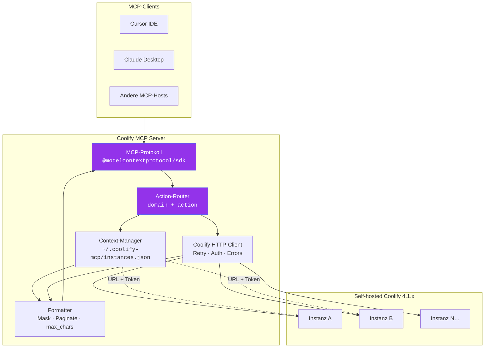

---

## 📐 Architektur

Detaillierter Überblick über die Funktionsweise von Coolify MCP.

### 🧠 Architektur-Mindmap

<b>🗂️ Layer-Verantwortlichkeiten anzeigen</b>

### Layer-Verantwortlichkeiten

| Layer | Verantwortung |
|-------|---------------|
| **Protokoll** | JSON-RPC über stdio, Tool-Registrierung |
| **Router** | `application({ action: 'deploy' })` → Handler |
| **Context** | Multi-Instance-Registry, Default, aktiver Switch |
| **HTTP-Client** | Token-Injection, exponentielles Backoff |
| **Formatter** | Summary/Full-Projektion, Secret-Masking |

<b>⚙️ Technischen Tech-Stack anzeigen</b>

### Tech-Stack

| Komponente | Wahl |
|------------|------|
| Sprache | TypeScript 5.x |
| MCP-SDK | `@modelcontextprotocol/sdk` |
| Validierung | Zod |
| Transport | stdio |
| Distribution | npm (`npx @clezcoding/coolify-mcp`) |

---

### 🔗 Quick Links
[🧬 Tool-Schema](#tool-schema) · [🌐 Multi-Instance](#multi-instance) · [🔐 Sicherheit](#sicherheit) · [📅 Roadmap](#roadmap)

