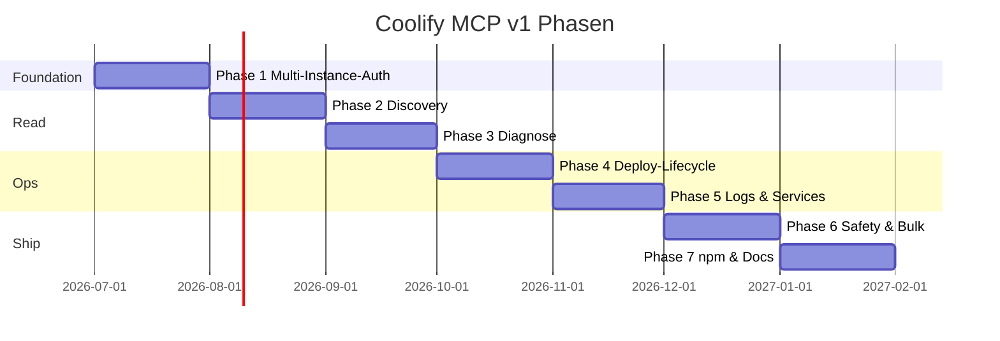

---

## Roadmap

### v2-Vorschau

Nach v1: **volle Parität** mit dem breiteren Coolify-Ökosystem. Details in [`.planning/REQUIREMENTS.md`](.planning/REQUIREMENTS.md).

| Gruppe | Umfang |
|--------|--------|
| **V2-CTX** | Debug-Mode, Shell-Completion, Self-Update |
| **V2-TEAM** | Teams, Members, Invites |
| **V2-PROJ / V2-SRV** | Projects, Environments, Server-CRUD |
| **V2-APP / V2-ENV** | App-CRUD (6 Create-Pfade), Env-Vars |
| **V2-SVC / V2-DB / V2-BAK** | One-Click-Services, 8 DB-Typen, Backups |
| **V2-CICD / V2-TEN** | Webhooks, RBAC, Snapshots |

> [!NOTE]
> Container-Exec ist blockiert, bis Coolify 4.1.x API es unterstützt.

Vollständige Roadmap: [`.planning/ROADMAP.md`](.planning/ROADMAP.md)
