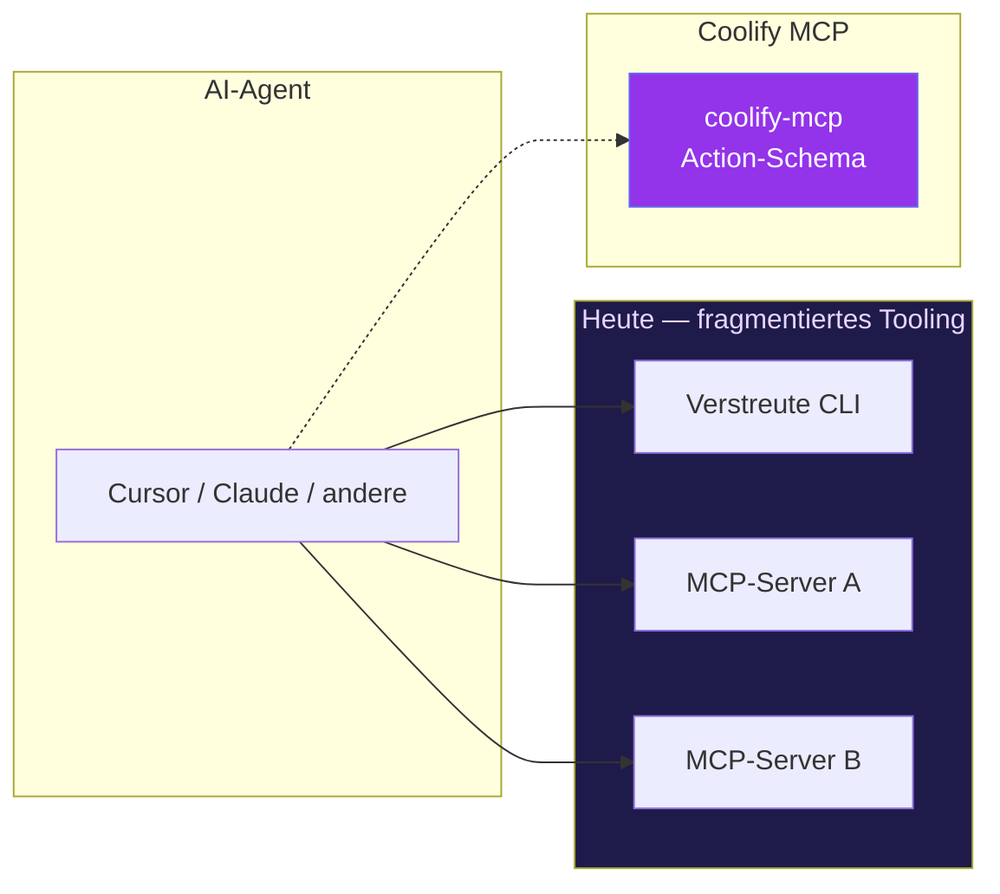

---

## ❓ Warum Coolify MCP?

Drei überlappende Tools. Ein verwirrter Agent. Wartungs-Albtraum.

<b>📊 Vergleich anzeigen: Fragmentiertes Heute vs. Unified Coolify MCP</b>

| Problem heute | Coolify MCP Antwort |
|---------------|---------------------|
| 60+ MCP-Einzeltools | Domänen-Tools + `action`-Parameter |
| Multi-Instance pro Config-Eintrag | Zentrale `instances.json` + Switch |
| Unstrukturierte API-Fehler | `COOLIFY_*` Codes + Recovery-Hints |
| Secrets leaken in den Kontext | Default-Maskierung, `reveal` opt-in |
| Destructive Ops ohne Guardrails | `confirm: true` Pflicht |
| Drei Docs, drei Schemas | Ein README, eine Wahrheit |

> [!IMPORTANT]
> **Design-Prinzip:** optimiere auf *Agent-Recovery* und *Kontext-Effizienz*, nicht auf API-Endpunkt-Parität am Tag eins.

---

### 🔗 Quick Links
[⚡ Schnellstart](#schnellstart) · [🛠 Features](#features) · [📐 Architektur](#architektur) · [🧬 Tool-Schema](#tool-schema)

