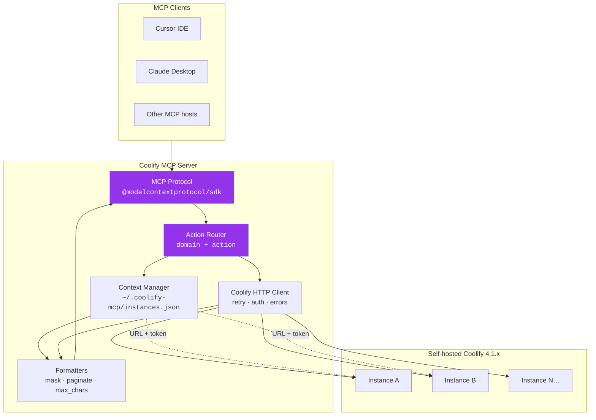

---

## 📐 Architecture

Detailed overview of the inner workings of Coolify MCP.

### 🧠 Architecture Mindmap

<b>🗂️ View Layer Responsibilities Table</b>

### Layer responsibilities

| Layer | Responsibility |
|-------|----------------|
| **Protocol** | JSON-RPC over stdio, tool registration |
| **Router** | `application({ action: 'deploy' })` → handler |
| **Context** | Multi-instance registry, default, active switch |
| **HTTP client** | Token injection, exponential backoff |
| **Formatters** | Summary/full projection, secret masking |

<b>⚙️ View Technical Tech Stack Details</b>

### Tech stack

| Component | Choice |
|-----------|--------|
| Language | TypeScript 5.x |
| MCP SDK | `@modelcontextprotocol/sdk` |
| Validation | Zod |
| Transport | stdio |
| Distribution | npm (`npx @clezcoding/coolify-mcp`) |

---

### 🔗 Quick Links
[🧬 Tool Schema](#tool-schema) · [🌐 Multi-instance](#multi-instance) · [🔐 Security](#security) · [📅 Roadmap](#roadmap)

