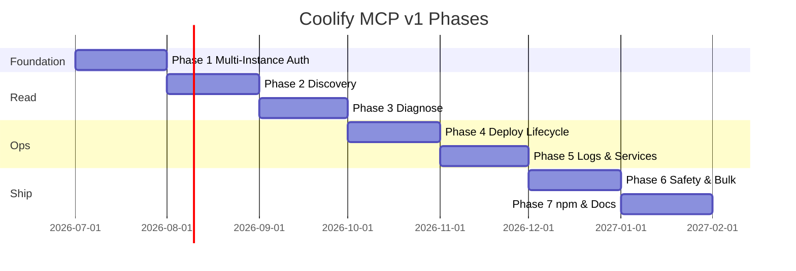

---

## Roadmap

### v2 preview

After v1: **full parity** with Coolify CLI + legacy MCPs. Details in [`.planning/REQUIREMENTS.md`](.planning/REQUIREMENTS.md).

| Group | Scope |
|-------|-------|
| **V2-CTX** | Debug mode, shell completion, self-update |
| **V2-TEAM** | Teams, members, invites |
| **V2-PROJ / V2-SRV** | Projects, environments, server CRUD |
| **V2-APP / V2-ENV** | App CRUD (6 create paths), env vars |
| **V2-SVC / V2-DB / V2-BAK** | One-click services, 8 DB types, backups |
| **V2-CICD / V2-TEN** | Webhooks, RBAC, snapshots |

*Container exec blocked until Coolify 4.1.x API supports it.*

Full roadmap: [`.planning/ROADMAP.md`](.planning/ROADMAP.md)
