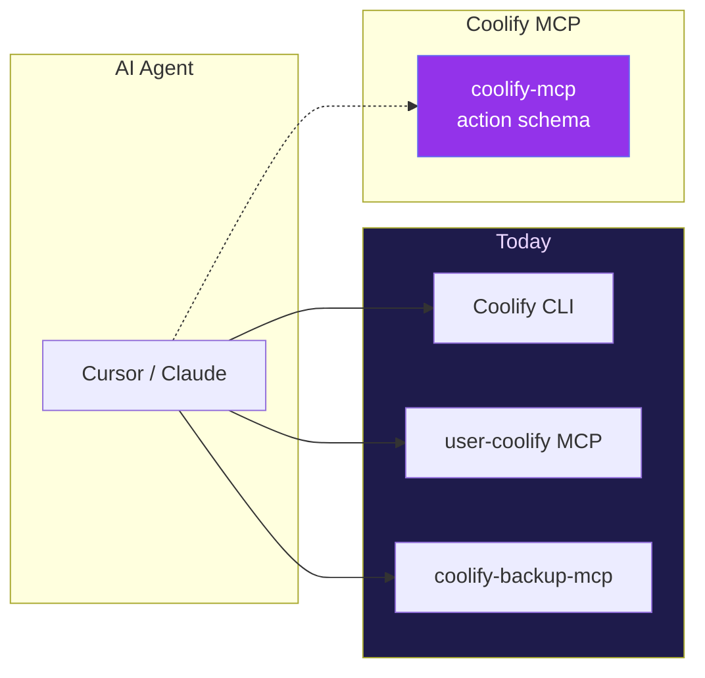

---

## Why Coolify MCP?

Three overlapping tools. One confused agent. Maintenance nightmare.

| Problem today | Coolify MCP answer |
|---------------|-------------------|
| 60+ single-purpose MCP tools | Domain tools + `action` parameter |
| Multi-instance per MCP config entry | Central `instances.json` + switch |
| Unstructured API failures | `COOLIFY_*` codes + recovery hints |
| Secrets leak into context | Mask by default, `reveal` opt-in |
| Destructive ops without guardrails | `confirm: true` required |
| Three docs, three schemas | One README, one source of truth |

> **Design principle:** optimize for *agent recovery* and *context efficiency*, not API endpoint parity on day one.
